# 1. Getting Ready

## 1.1 uHand UNO Introduction

**1.1.1 Product Introduction**

uHand UNO is a robotic hand based on Arduino UNO. Employing Arduino programming with UNO 6 channel knob expansion board and wireless Bluetooth module, it can be quickly controlled by the knobs or app. Powered by 7.4 V lithium battery, uHand UNO can be used at will.

There are IO and I2C interfaces designed for your development. Working with sensor expansion kit, unlock the potential for a wide range of exciting and innovative projects!

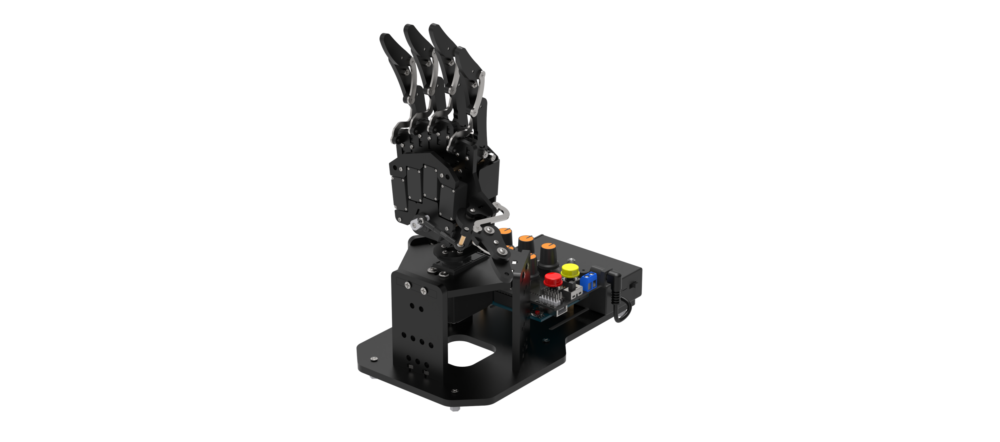

**1.1.2  Notes**

Instructions on the usage and storage of this product:

(1) This product contains small components and sharp pins, making it unsuitable for children under 12 years old.

(2) Minors should use this product under the supervision and guidance of adults.

(3) This product contains small and sharp parts. Do not swallow or press them to avoid injury.

(4) This product includes conductive components. Do not touch them with metal objects when the power is on.

(5) Do not force the robot to move when it is powered on to avoid damage.

(6) If the product is not used for a long time, please charge the battery fully. Then, remove and store it in a cool and dry place.

**1.1.3  Copyright Notice**

This tutorial is the exclusive property of Shenzhen Hiwonder Technology Co., Ltd. No unit or individual is allowed to excerpt, copy, translate or disseminate the contents of this tutorial without permission.

Our company reserves the right to pursue legal responsibility against any unit or individual who infringes the copyright of this reference material.

**1.1.4  Disclaimer**

The product described in this manual, including hardware and software, are provided "**as is**". While every effort has been made to ensure the accuracy of the content, the manual cannot guarantee that there are no errors or omissions. The information will undergo regular checks and any suggestions for improvement from our users are welcome. As the content of the product may change with the product version upgrade, please contact customer service when ordering to obtain the latest product information.

In addition, unless Hiwonder has expressly stated that the product has a certain use, we are not responsible for any damage or loss caused by the malfunction or damage of the product when used in extreme circumstances.

## 1.2 Packing List

(1) uHand UNO Starter Packing List

| **No.** | **Components**                                               | **Quantity** | **Picture**                                                                           |
| :------ | ------------------------------------------------------------ | ------------ |---------------------------------------------------------------------------------------|
| 1       | uhand(right)                                                 | 1            | 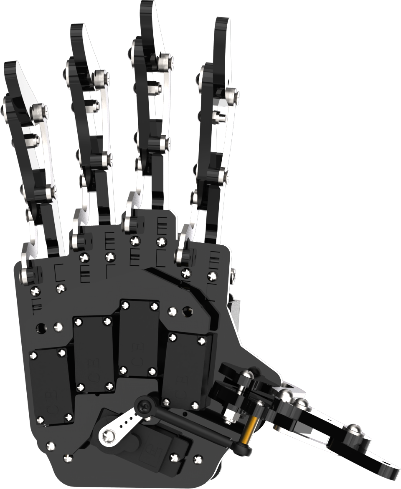  |
| 2       | Acrylic board (Bottom plate * 1 Steering gear board * 1 Square plate * 3) | 5            | 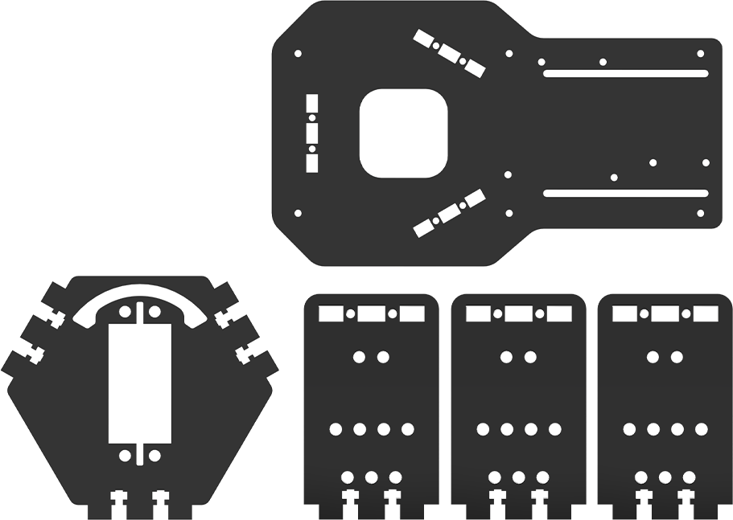  |
| 3       | L-shaped servo bracket                                       | 1            | 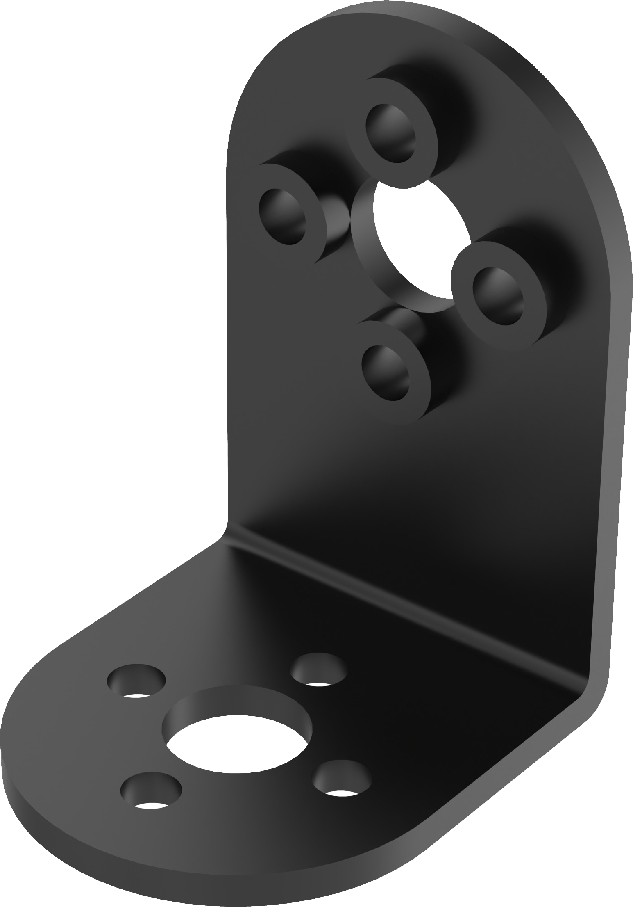   |
| 4       | LFD-06 anti-blocking servo                                   | 1            | 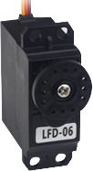   |
| 5       | UNO 6-Channel knob expansion board                           | 1            | 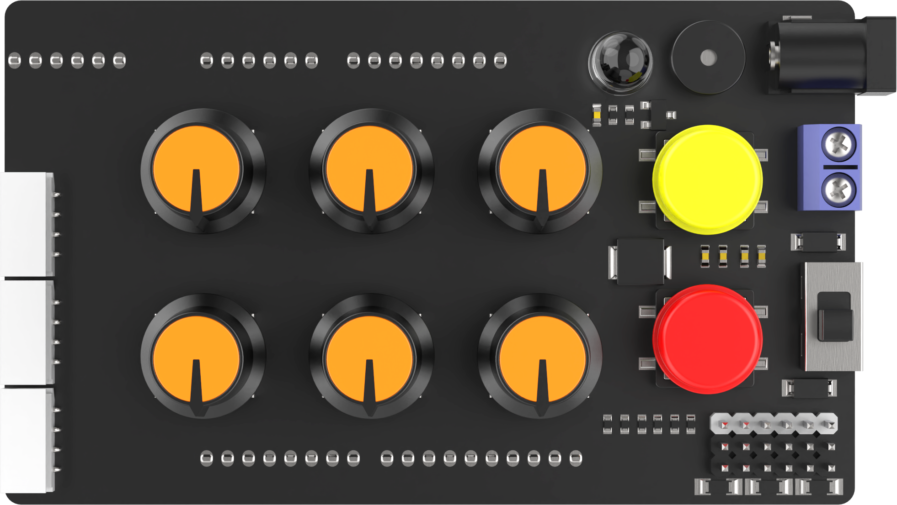  |
| 6       | Arduino UNO                                                  | 1            | 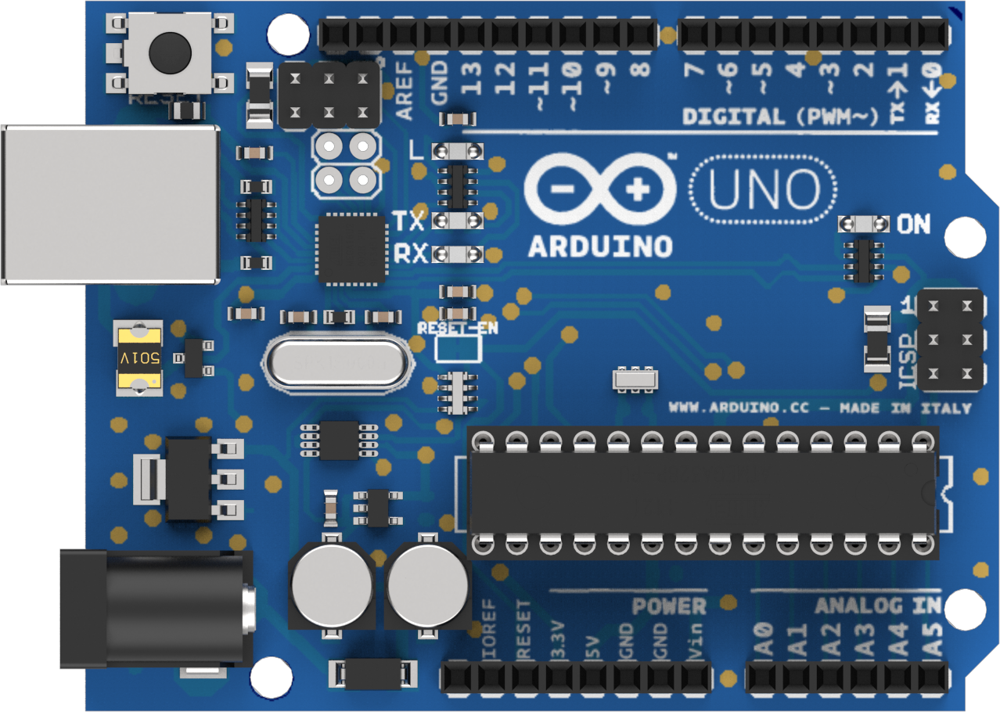  |
| 7       | Battery box                                                  | 1            | 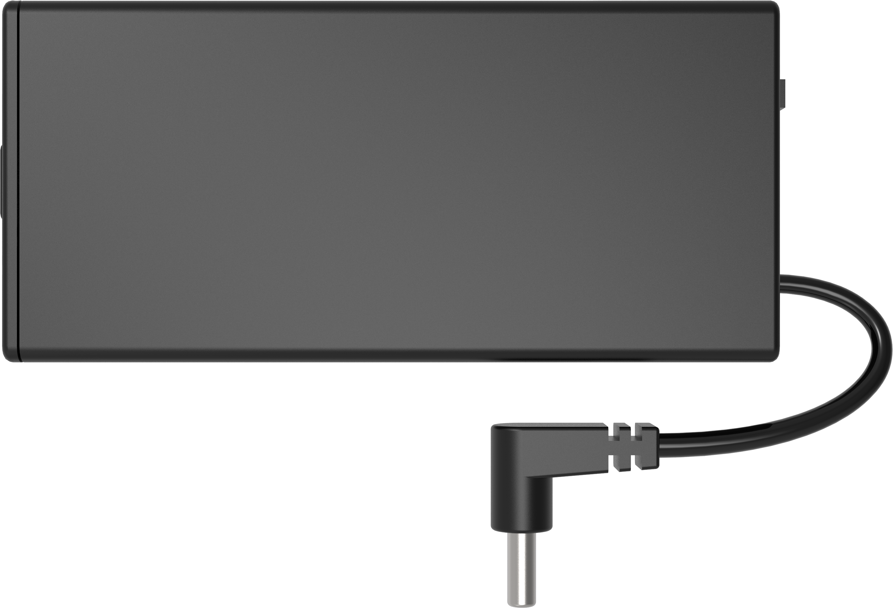  |
| 8       | 18650 LiPo battery                                           | 2            | 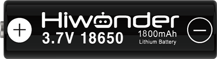  |
| 9       | charger                                                      | 1            | 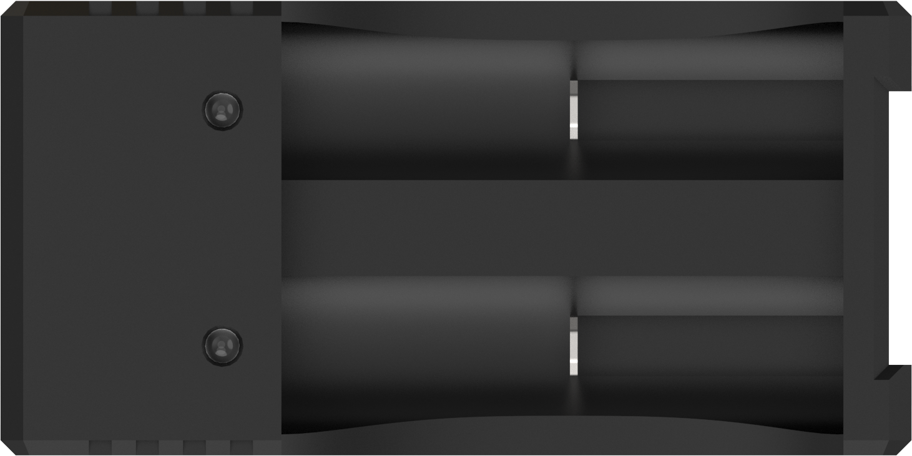  |
| 10      | Bluetooth module                                             | 1            | 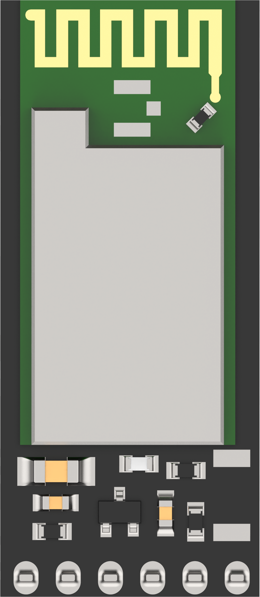  |
| 11      | 40 mm Table tennis (red+blue)                             | 2            | 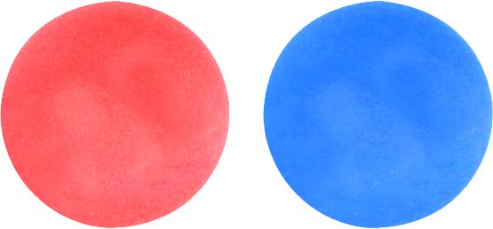 |
| 12      | USB square port                                              | 1            | 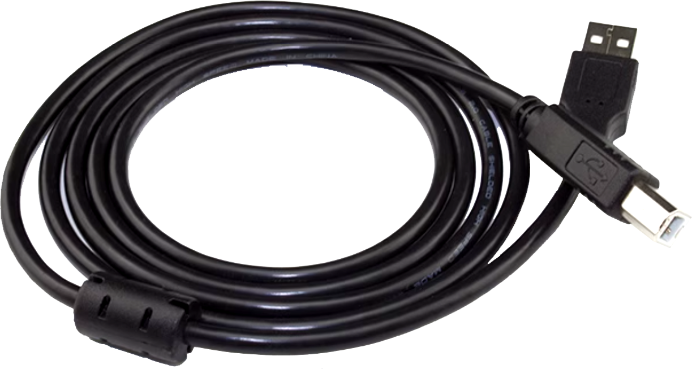 |
| 13      | USB data cable                                               | 1            |  |
| 14      | Accessory bag (screwdriver * 1 M4*14 round head screw * 6 M2.5*6 round head screw * 2 M3*6 round head screw * 10 A2*6 round head self-tapping screw * 6 M3*10 flat head screw * 32 M3*8 Double-pass Copper Column * 8 M3*15  Double-pass Copper Column * 4) | 1            | 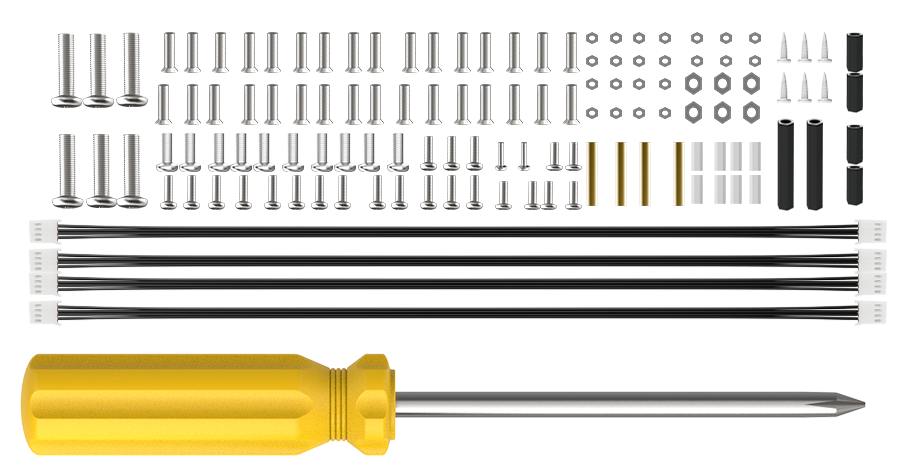 |

(2)  uHand UNO Standard Packing List

| **No.** | **Components**                                               | **Quantity** | **Picture**                                                                           |
| :------ | ------------------------------------------------------------ | ------------ |---------------------------------------------------------------------------------------|
| 1       | uhand(right)                                                 | 1            |   |
| 2       | Acrylic board (Bottom plate * 1 Steering gear board * 1 Square plate * 3) | 5            |   |
| 3       | L-shaped servo bracket                                       | 1            |    |
| 4       | LFD-06 anti-blocking servo                                   | 1            |     |
| 5       | UNO 6-Channel knob expansion board                           | 1            |   |
| 6       | Arduino UNO                                                  | 1            |   |
| 7       | Battery box                                                  | 1            |   |
| 8       | 18650 LiPo battery                                           | 2            |   |
| 9       | charger                                                      | 1            |   |
| 10      | Bluetooth module                                             | 1            |   |
| 11      | 40 mm Table tennis (red+blue)                             | 2            |  |
| 12      | USB square port                                              | 1            |  |
| 13      | USB data cable                                               | 1            |  |
| 14      | Accessory bag (screwdriver * 1 M4*14 round head screw * 6 M2.5*6 round head screw * 2 M3*6 round head screw * 10 A2*6 round head self-tapping screw * 6 M3*10 flat head screw * 32 M3*8 Double-pass Copper Column * 8 M3*15  Double-pass Copper Column * 4 200mm 4Pin wire * 4) | 1            |  |
| 15      | ESP32Cam Module                                              | 1            | 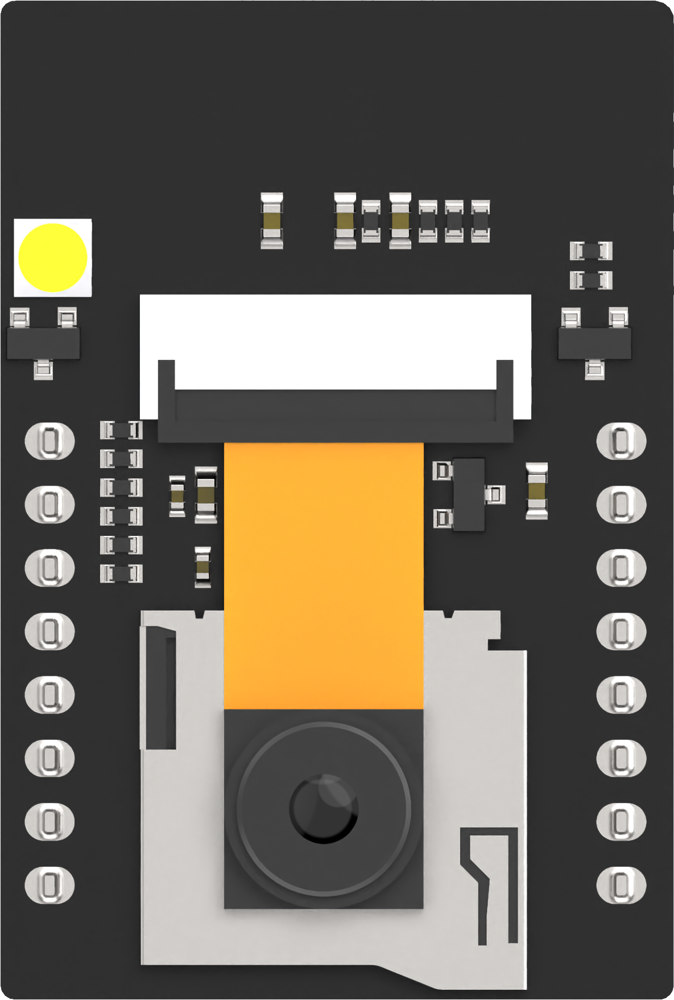 |
| 16      | Glowing ultrasonic sensor                                    | 1            | 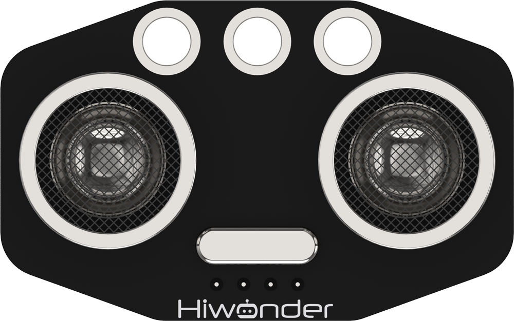 |
| 17      | Acceleration sensor                                          | 1            | 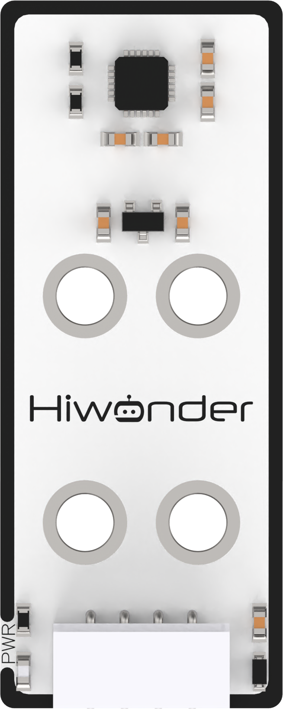 |
| 18      | Touch sensor                                                 | 1            | 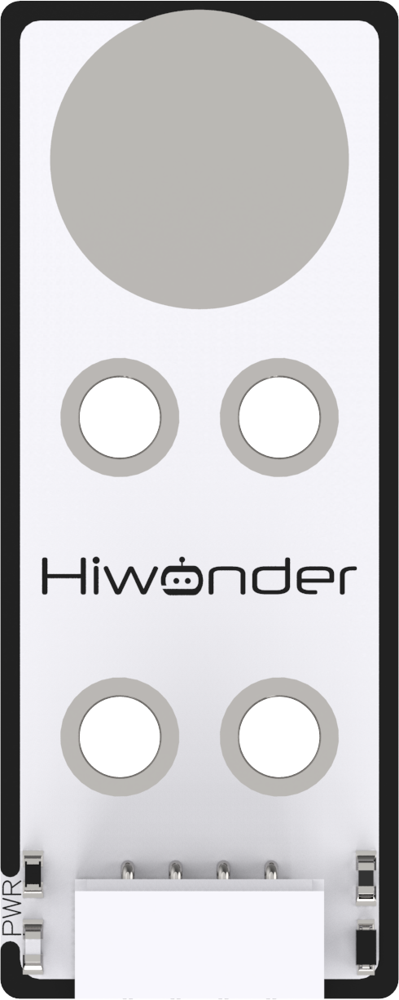 |
| 19      | Type-c data cable                                            | 1            | 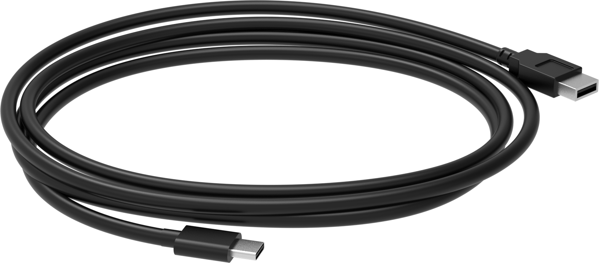 |

(3) uHand UNO Advanced Packing List

| **No.** | **Components**                                               | **Quantity** | **Picture**                                                                           |
| :------ | ------------------------------------------------------------ | ------------ |---------------------------------------------------------------------------------------|
| 1       | uhand(right)                                                 | 1            |   |
| 2       | Acrylic board (Bottom plate * 1 Steering gear board * 1 Square plate * 3) | 5            |   |
| 3       | L-shaped servo bracket                                       | 1            |   |
| 4       | LFD-06 anti-blocking servo                                   | 1            |    |
| 5       | UNO 6-Channel knob expansion board                           | 1            |  |
| 6       | Arduino UNO                                                  | 1            |   |
| 7       | Battery box                                                  | 1            |   |
| 8       | 18650 LiPo battery                                           | 2            |   |
| 9       | charger                                                      | 1            |   |
| 10      | Bluetooth module                                             | 1            |   |
| 11      | 40 mm Table tennis (red+blue)                             | 2            |  |
| 12      | USB square port                                              | 1            |  |
| 13      | USB data cable                                               | 1            |  |
| 14      | Accessory bag (screwdriver * 1 M4*14 round head screw * 6 M2.5*6 round head screw * 2 M3*6 round head screw * 10 A2*6 round head self-tapping screw * 6 M3*10 flat head screw * 32 M3*8 Double-pass Copper Column * 8 M3*15  Double-pass Copper Column * 4 200mm 4Pin wire * 4) | 1            |  |
| 15      | ESP32Cam Module                                              | 1            |  |
| 16      | Glowing ultrasonic sensor                                    | 1            |  |
| 17      | Acceleration sensor                                          | 1            |  |
| 18      | Touch sensor                                                 | 1            |  |
| 19      | Type-c data cable                                            | 1            |  |
| 20      | Somatosensory glove                                          | 1            | 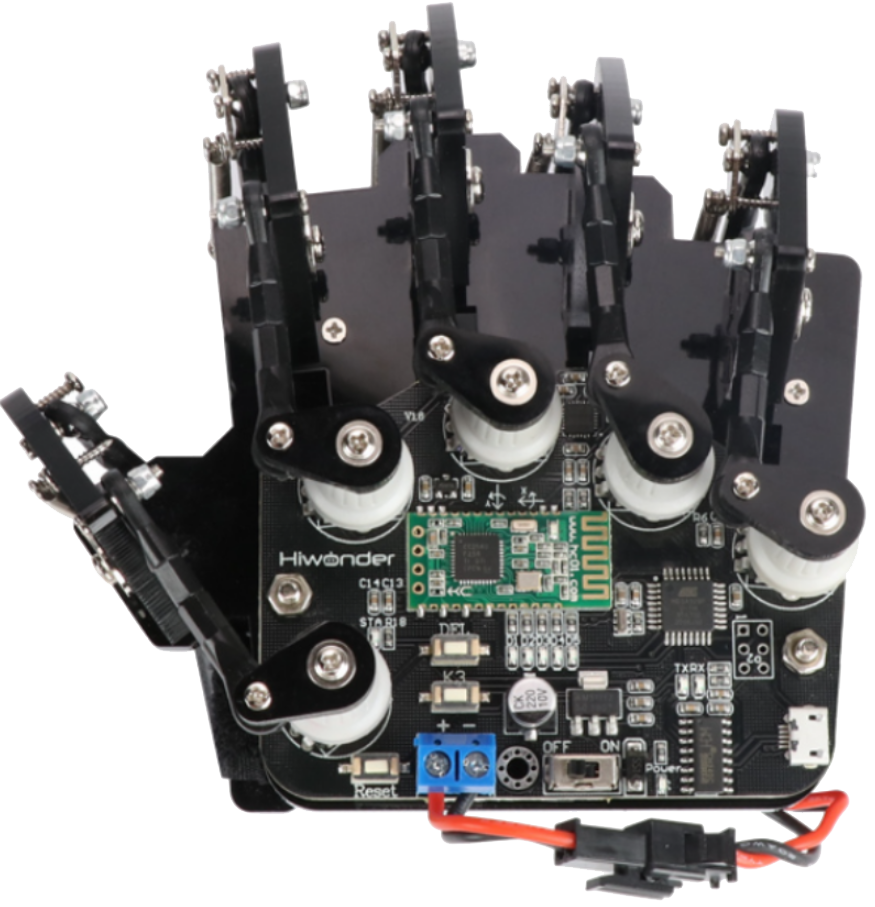 |
| 21      | 7.4V Charger                                                 | 1            | 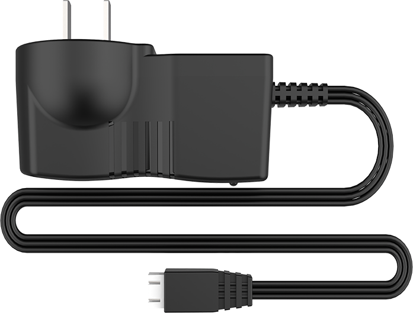 |

## 1.3 Assembly Instruction

This section takes the uHand UNO starter kit as an example for installation, and the installation method is also suitable for other versions. 

(1)  Install the servo to the servo board with four M4*14 round head screws and four M4 nuts.

Please ensure that the servo horn is kept away from the side with the arc-shaped holes.

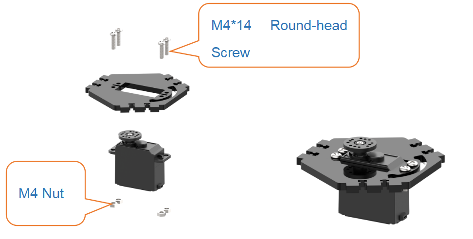

(2) Install the square board to the servo board with 2 M3*10 flat-head screws and 2 M3 nuts.

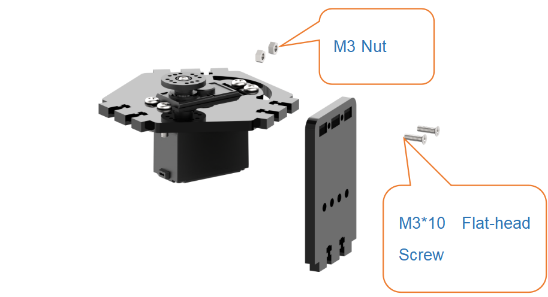

Install the other two square boards in the same way, and the installation is completed as follows:

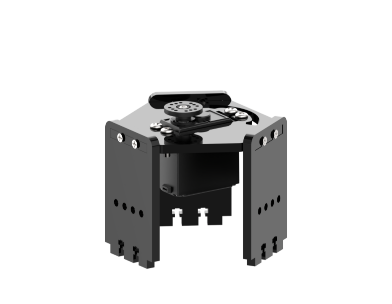

(3) Fix the square boards on the baseboard with 6 M3\*10 flat-head screws and 6 M3 nuts, and fix beneath the baseboard with 6 M3\*10 flat-head screws and 6 M3*8 double-ended nylon columns.

:::{Note}

The side of the baseboard with fewer holes should be located on the right side of the uHand UNO robotic hand (with the robotic hand as the first view).

:::

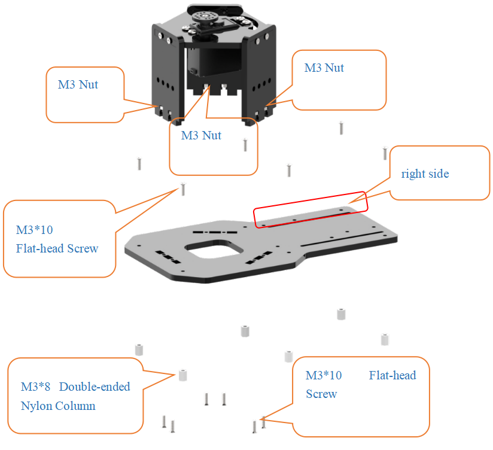

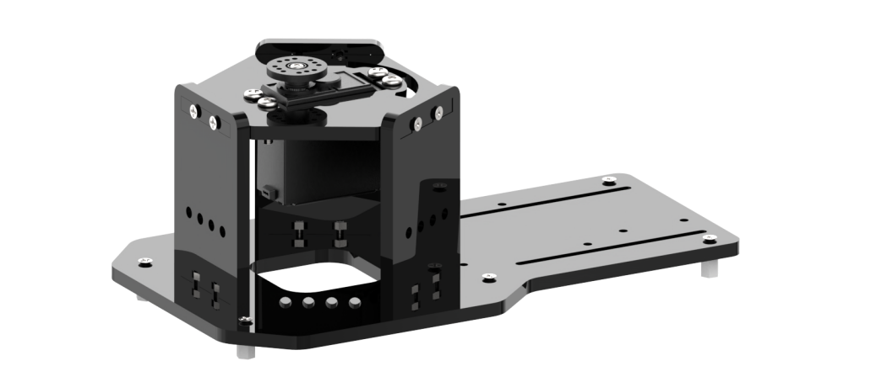

(4) Fix 4 M3\*10 double-ended copper pillars on Arduino UNO with 4 M3\*6 round-head screws, then fix the Arduino UNO on the baseboard with 4 M3*10 flat-head screws.

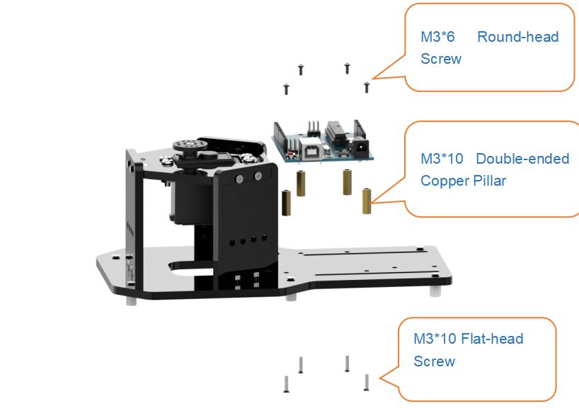

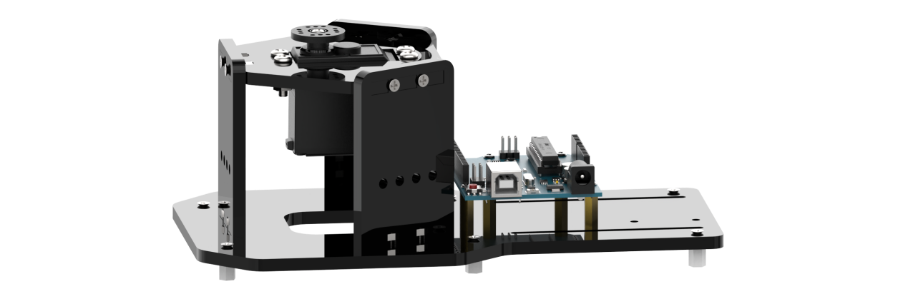

(5) Align the pins on the expansion board with the corresponding pins on the Arduino UNO.

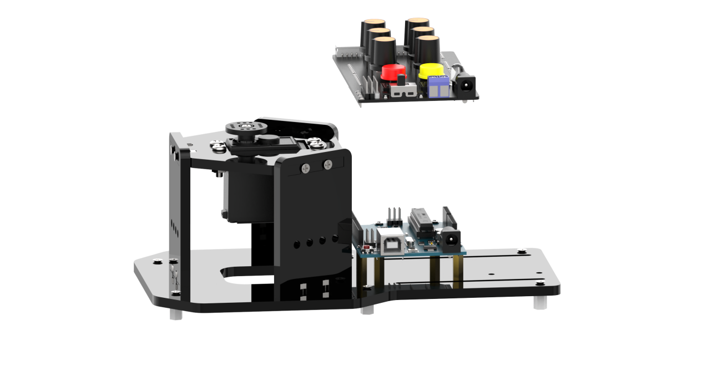

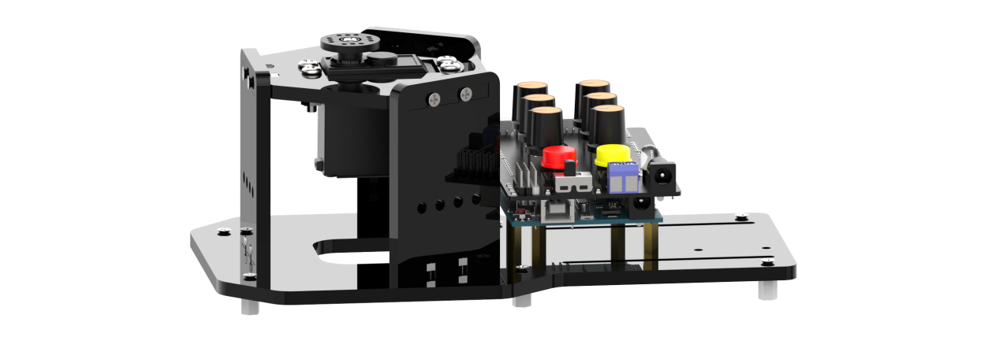

(6) Install the battery box on the baseboard with 4 M3*10 flat-head screws and 4 M3 nuts.

:::{Note}

There are two holes installed in the gap of the baseboard.

:::

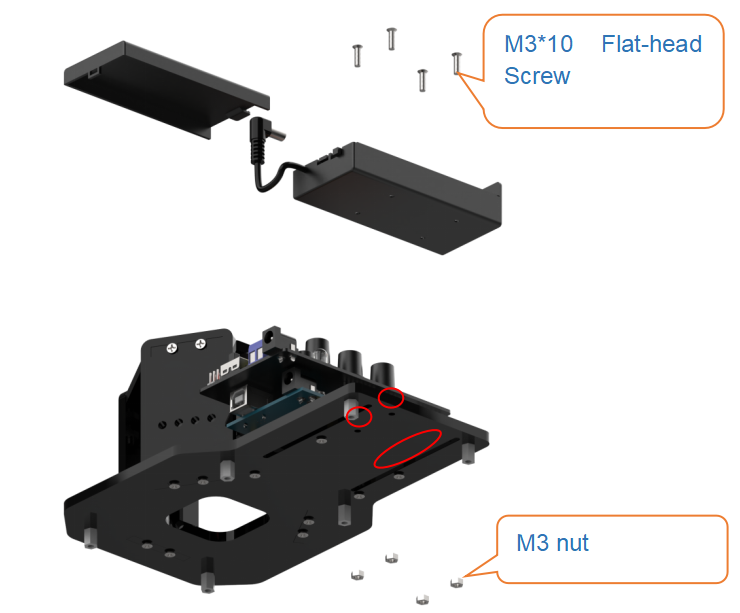

Please switch the battery box to "**OFF**" to put the batteries into it, and connect the power wire to the DC port on the expansion board.

## 1.4 Charging Instruction 

**1.4.1 Charging Instruction**

(1) Place two 18650 batteries into the battery charger according to positive and negative polarity (positive to positive and negative to negative).

(2)  Connect the matching USB cable to the power supply first, then plug it into the USB port of the charger for charging. 

:::{Note}

You need to prepare a charger head with 5V 3A.

:::

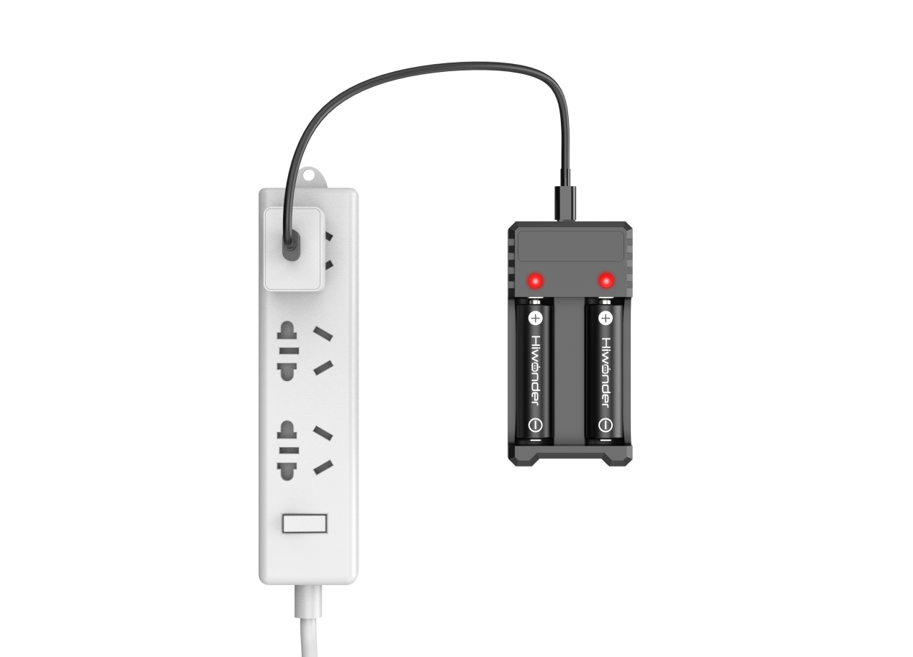

(3)  When charging, the indicator light will be red. When the batteries are fully charged, the indicator turns green. Please unplug the charger in time to avoid overcharging. 

**1.4.2 Battery Usage Guideline**

Due to transplantation restrictions, lithium batteries cannot be fully charged during transit. Please fully charge them for your first usage.

(1) Please use the battery charger and USB cable provided with the uHand UNO to charge the batteries.

(2) The power indicator will turn red during charging, and it will turn green when the batteries are fully charged. Please disconnect the power supply in time to avoid overcharging the batteries. 

(3) If the robotic hand will not be used for an extended period, please fully charge the batteries, switch the battery box to "**OFF**", and unplug the power wire of the battery box. Store it in a cool and dry place. 

(4) Official Statement: Our company hereby declares that we shall not be held responsible for any damages to the product, financial losses, or safety accidents caused by failure to comply with the "**Precaution and Battery Usage Guideline**" of this manual. 

**1.4.3 Precaution**

(1)  Please ensure the correct connection of the servo and power wires. 

(2)  Do not forcefully move the servo after powering on to avoid servo damage. 

(3) Do not keep the servo in a limited position for an extended period to avoid servo blocking. 

(4)  Please ensure that the GPS location and Bluetooth of your phone are turned on when connecting to the app. 

(5)  Please switch the battery box to "**OFF**" when connecting the Type-B cable. This action prevents the cable from accidentally touching the power pins on the expansion board, which may cause a short circuit. 

(6)  Remove the Bluetooth module while downloading the program to avoid program download failure due to serial conflicts. 