# 10. Serial Communication instruction

## 10.1 Master-Slave Device Communication Principles

### 10.1.1 Introduction

This section aims to introduce you to detailed information about the master-slave relationship between the uHand UNO robotic hand and different devices (such as Arduino, PC) during communication. It helps you understand how uHand UNO communicates as a subordinate device with other devices and how other devices control uHand UNO as a master device.

In this chapter, uHand UNO is typically utilized as a subordinate device. It uses the UART serial port to transmit the information to other devices.

### 10.1.2 Master-Slave Relationship

In a master-slave control system, uHand UNO acts as a subordinate device and other devices such as microcontrollers act as master devices.

* **uHand UNO Functions**

(1) Receive and parse signals sent by the master device:

The uHand UNO waits for serial port signals, and upon receiving data, it will parse the received data according to the communication protocol to obtain the data information. Then it uses the obtained information to call corresponding functions.

(2) Call uHand UNO's functions based on received data:

When a signal is parsed, the corresponding function of uHand UNO needs to be called, such as controlling the servo movement, reading the servo angle, controlling the buzzer, and controlling the RGB lights.

(3) Data encapsulation and feedback:

When a read command is received, uHand UNO needs to call the corresponding read function. Encapsulate the read data into a data packet according to the communication protocol, and send it back to the master device.

* **Other Master Devices**

(1) Command packing and sending:

The master device needs to package control commands and data into data packets according to the communication protocol to sends them to uHand UNO.

(2) Control coordination:

The master is responsible for coordinating the entire system, ensuring there are no conflicts in communication and operation between uHand UNO and other devices to maintain a stable working state.

(3) Data reception:

The master sends a read command to read the servo status information data sent by uHand UNO. It verifies the integrity and accuracy of the received data and parses the data packet for extracting useful information.

### 10.1.3 Hardware Connection

Take uHand UNO connected to a PC as an example:

(1) Use DuPont wires to respectively connect the RXD, TXD, and GND of the USB adapter to the IO12, IO10, and GND interfaces on the Arduino UNO. Connect the USB adaptor to the PC.

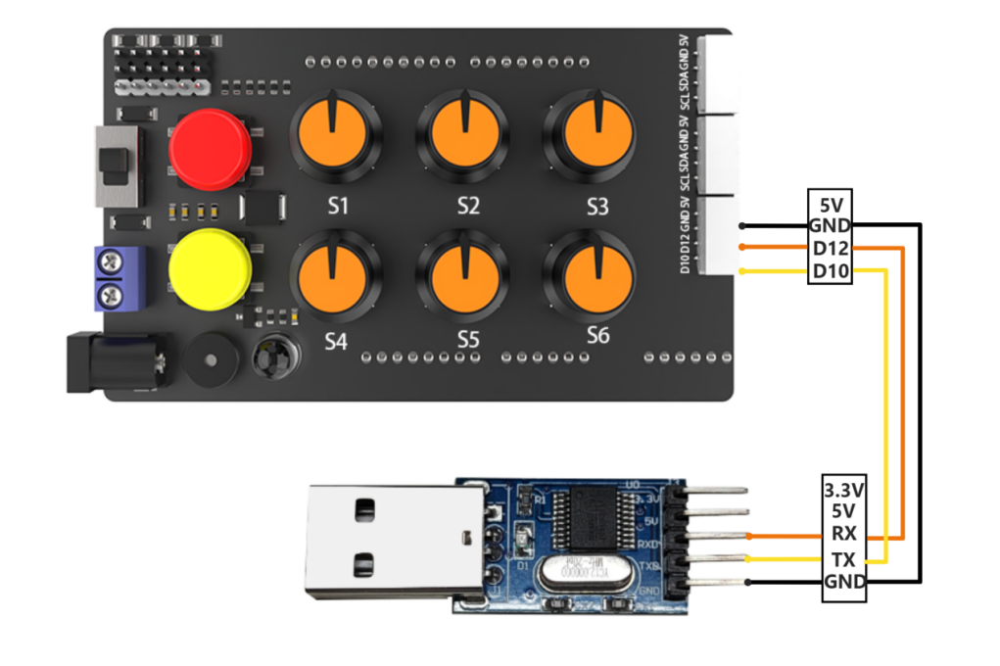

(2) Data Transmission Format

The default UART serial data transmission Format of uHand UNO is as follows:

| Baud rate | 9600 |
| :-------: | :--: |
| Data bits |  8   |
|  Parity   | None |
| Stop bits |  1   |

### 10.1.4 Communication Protocol

|  Header   | Function Code | Data Length | Data Information | Parity |
| :-------: | :-----------: | :---------: | :--------------: | :----: |
| 0xAA 0x77 |     func      |     len     |       data       | check  |

**Header:** When the header is received, it indicates the presence of data transmission, and the header data length is fixed at 2 bytes;  

**Function Code:** It indicates the function of an information frame;  

**Data Length:** It indicates the amount of data that follows;  

**Data Information:** It indicates the transmitted data information;  

**Parity:** (Function Code + Data Length + Data) negated, and the low byte is taken.

### 10.1.5 Note

(1) The host device and the uHand UNO can have different power sources, but they must share a common ground when connected to ensure stable communication voltage.

(2) When you wire the devices, ensure that the TX and RX pins of the UART serial port are crossed, otherwise communication will not be possible.

[uHand UNO Slave Device Program](../_static/source_code/uHand_UNO_arduino.zip)

## 10.2 PC Serial Port Controlling Routine

This article demonstrates how to control the servo, angles, buzzer, RGB lights, and read servo angles, buzzer, RGB lights, and read servo angles of the uHand UNO using the PC serial.

### 10.2.1 Working Principle

(1) By connecting uHand UNO to TTL serial and interfacing it with a PC, serial communication is established to control uHand UNO through the serial port.

(2) communication protocol

There are some communication protocols as examples. The protocol instruction format is as follows:

| Frame Header | Function code | Data length | Data information | Parity |
| :----------: | :-----------: | :---------: | :--------------: | :----: |
|  0xAA 0x77   |     func      |     len     |       data       | check  |

Frame Header: when the header is received, there is data transmitting, and the length of the header data is fixed at 2 bytes;

Function code: used to indicate the purpose of an information frame;

Data length: the amount of subsequent data;

Data information: the transmitting data information;

Parity: reverse and take low byte.

### 10.2.2 Getting Ready

*  **Hardware Preparation**

Make sure that the uHand UNO is properly connected to the PC. Otherwise, it will not communicate properly.

Connect the RXD, TXD, GND of the USB adapter to the IO12, IO10, GND connector of the Arduino expansion board separately through jumper wires. Plug the USB adapter into the computer.

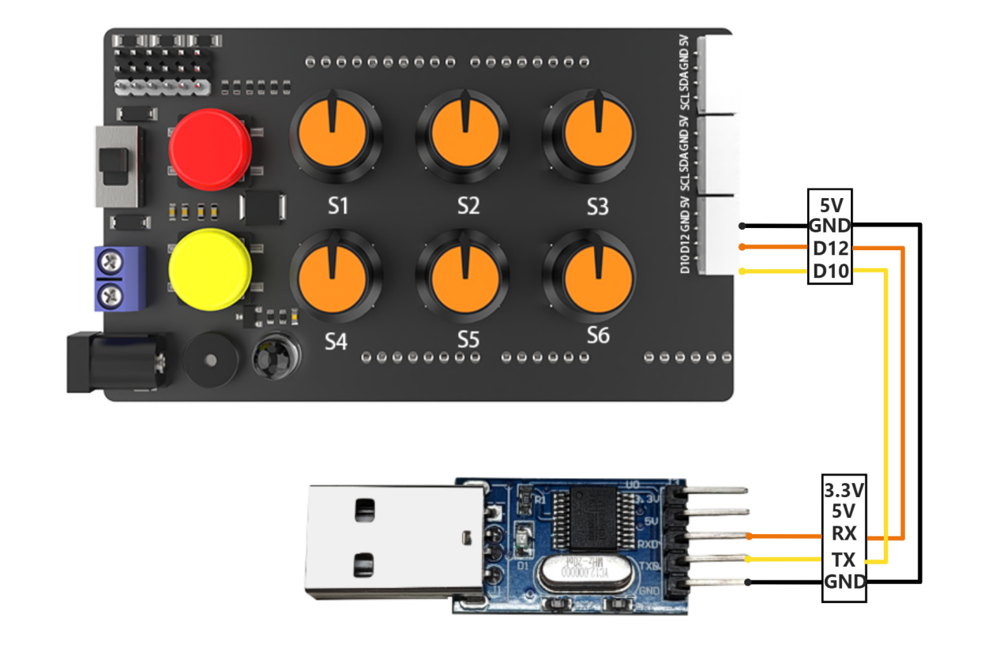

* **Software Preparation**

Make sure the baud rate is set to 9600, parity to NONE, data bits to 8 and the stop bits to 1 in the debugging assistant. Then check the **"hex"** to send. The configuration is shown below:

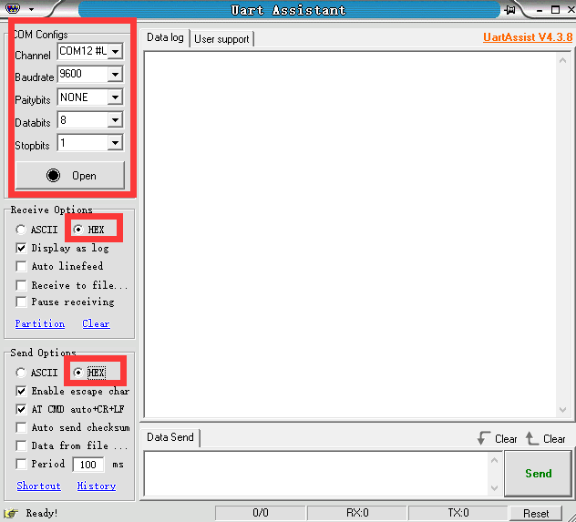

### 10.2.3 Function Implementation

Control the uHand UNO by sending hexadecimal commands.

Command name: "**FUNC_SET_SERVO**" command value 0x01, data length 6:

Instruction: control servo rotation of the uHand UNO. The rotation angle is 0-180 degrees.

Data information: six angles required to be set by servo, a total of six values. Each value corresponds to a servo, with a byte each to indicate the required rotation angle.

Take sending the hex "**AA 77 01 06 49 16 00 39 5A B4 52**" as an example. The data message is "**49 16 00 39 5A B4**", where 49 means rotate the thumb of the servo NO.1 to 73 degrees, 16 means rotate the index finger of the servo NO.2 to 10 degrees, 00 means rotate the middle finger of the servo NO3. to 0 degree, 39 means rotate the ring finger of servo NO.4 to 57 degrees, 5A means rotate the servo NO.5 to 90 degrees, and B4 means rotate the pan-tilt of the servo NO.6 to 180 degrees.

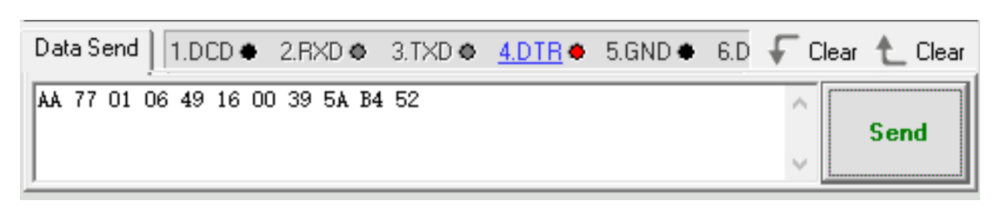

Command name: **"FUNC_SET_BUZZER"** command value 0x02, data length 4:

Instruction: control uHand UNO buzzer, frequency, time range from 0 to 65535.

Data information: first is the buzzer frequency, followed by running time, a total of 4 values. Each value is broken down into 2 bytes, with the low byte first and high byte second.

For example: take sending the hex **"AA 77 02 04 14 02 E8 03 F8"** as an example. The data message is **"14 02 E8 03"**, where the 14 02 means set the buzzer frequency to 532 and the E8 03 means the running time is 1000ms.

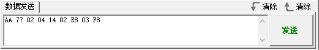

Command name: **"FUNC_SET_RGB"** command value 0x03, data length 3:

Instruction: control the color of the RGB light, where the value range is from 0 to 255.

Data information: there are three parameters in total, representing the R(red), G(green), B(blue) colors in RGB respectively.

For example: take sending the hex **"AA 77 03 03 FF 00 00 FA"** as an example. The data message is **"FF 00 00"**, where the FF means set red to 255, 00 00 means set green and blue to 0 respectively.

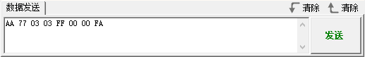

Command name: **"FUNC_READ_ANGLE"** command value 0x11, data length 0.

Instruction: read the current uHand UNO servo angle.

Data information: no data message available since the read operation.

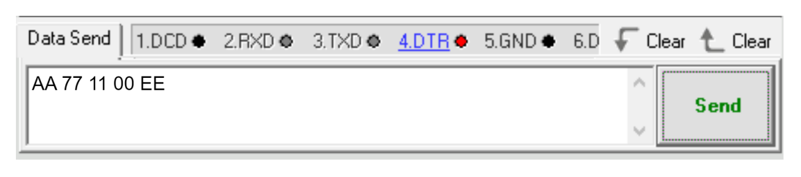

For example: take sending the hex **"AA 77 11 00 EE"** as an example. The uHand UNO returns to the current six servo angles respectively after sending the data. Take received data **"AA 77 11 06 5A 5A 5A 5A 5A 5A CC"** as an example. The data message is **"5A 5A 5A 5A 5A 5A"**, where the 1st to 6th 5A each means the current angle of the 1st and 6th servo is 90 degrees.

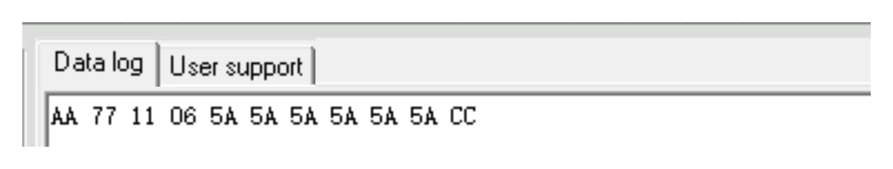

## 10.3 Arduino Control Example 

This section aims to guide you on how to use the PC serial port to control uHand UNO's servo angles, buzzer, and RGB lights, as well as how to use it to read servo angles.

### 10.3.1 Working Principle

[arduino_and_uhand](../_static/source_code/arduino_and_uhand.zip)

The source code of the program is located at: "[**Serial Communication Instruction/arduino_and_uhand/arduino_and_uhand.ino**](../_static/source_code/arduino_and_uhand.zip)". For specific implementation details, please access the file: "[**Serial Communication Instruction/arduino_and _uhand/uhand_ctl.cpp**](../_static/source_code/arduino_and_uhand.zip)".

(1) Set the baud rate of debugging and printing serial port as 115200, and call the `uh_ctl.serial_begin()` function in the `uhand_ctl.h` library to initialize the software serial port for communication with a baud rate of 9600.

{lineno-start=5}

```python
void setup() {
  Serial.begin(115200);
  uh_ctl.serial_begin();
}
```

(2) Call the `uh_ctl.set_angles()` function to control the servo angles. Take the `uh_ctl.set_angles(angles)` code as an example. The first parameter "angles" represents each servo's rotating angle. This parameter is a one-dimensional array with a length of 6 corresponding to 6 servos' required rotation angles respectively, with a rotation range from 0°to 180°.

{lineno-start=11}

```python
  //Set servo angle
  Serial.println("set angles");
  uint8_t angles[6] = {73,10,0,57,90,180};
  //Set the angles of the PWM servo to 73/10/0/57/90180 degrees, with a range of 0-180 degrees
  uh_ctl.set_angles(angles); 
  delay(1500);
```

(3) Call the `uh_ctl.set_buzzer()` function to set the buzzer. Take the `uh_ctl.set_buzzer (532, 1000)` code as an example. The first parameter `532` indicates the buzzer frequency to be set ranging from 0 to 65535. The second parameter "1000" represents the running time (in ms) which is 1000ms.

{lineno-start=18}

```python
  //Set buzzer
  Serial.println("set buzzer");
  //Set the frequency of the buzzer to 532 and the running time to 1000ms
  //The range of values for both parameters is 0-65535
  uh_ctl.set_buzzer(532,1000);
  delay(1500);
```

(4) Call the `uh_ctl.set_rgb()` function to control the color of RGB light. Take the `uh_ctl.set_rgb(rgb)` code as an example. The parameter "rgb" is a one-dimensional array with a length of three, corresponding to red, green, and blue respectively, and ranging from 0 to 255.

{lineno-start=25}

```python
  //Set RGB lights
  Serial.println("set rgb");
  uint8_t rgb[3] = {0,255,0}; 
  //Set the RGB light to green (range 0-255)
  uh_ctl.set_rgb(rgb);
  delay(1500);
```

(5) Call the `uh_ctl.read_angles()` function to obtain the angle information of 6 servos of uHand UNO. The read servo angles can be saved in the `read_a` array and printed via the serial port.

{lineno-start=32}

```python
  //Read and print the servo angle in the current state
  Serial.println("read angles");
  uint8_t read_a[6] = {0,0,0,0,0,0};
  if(uh_ctl.read_angles(read_a))
  {
    Serial.print("angles: ");
    for(int i=0;i<6;i++){
      Serial.print(read_a[i]);
      Serial.print(" ");
    }
    Serial.println("");
  }
  delay(100);
```

### 10.3.2 Getting Ready

* **Hardware**

The interface for uHand UNO serial communication is a 4-pin. It is suitable for devices with pin interfaces for UART communication such as Arduino. Now you need to connect the uHand UNO's 4-pin to its corresponding pin interfaces for communication.

The connection of the 4-pin interface communication is as follows:

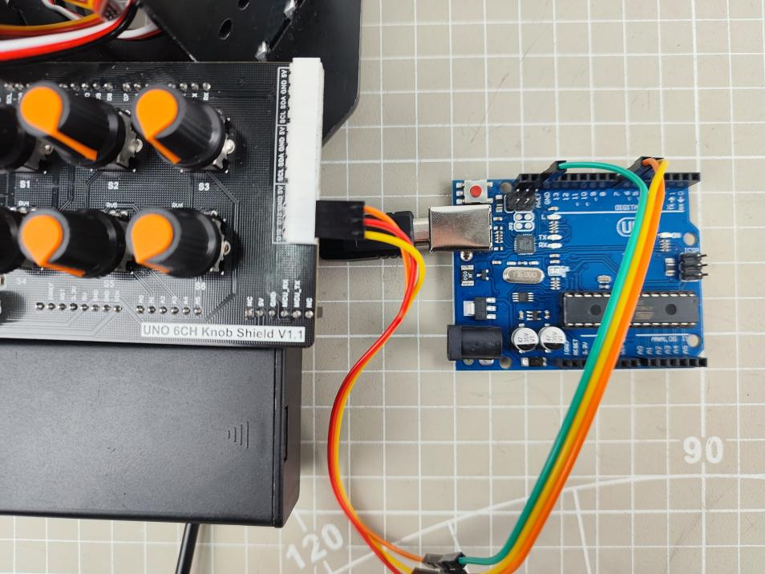

The detailed connection is as follows:

Connect the IO12 pin of uHand UNO used as the TX signal pin to the No.6 pin of Arduino.

Connect the IO10 pin of uHand UNO used as the RX signal pin to the No.7 pin of Arduino.

Connect the GND pins of uHand UNO and Arduino.

* **Software**

Please refer to the instructions in "[**2. Set Arduino Environment**](#https://docs.hiwonder.com/projects/uHand_UNO/en/latest/docs/2.Set_Arduino_Environment.html)" to establish the connection between uHand UNO and Arduino editor.

### 10.3.3 Program Download

(1) Double-click  to open it.

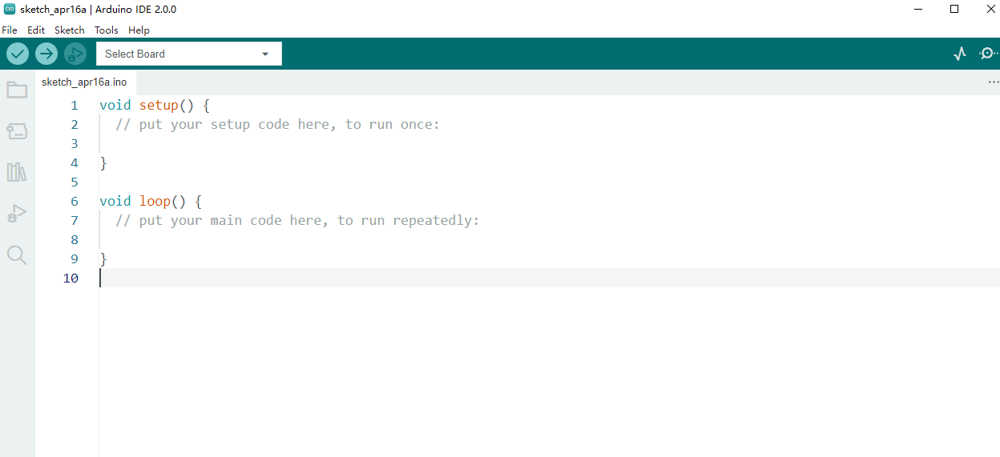

(2) Click **"File -\> Open"**.


(3) Open the source code path in "1. Implementation Principles" to click **"Open"**.

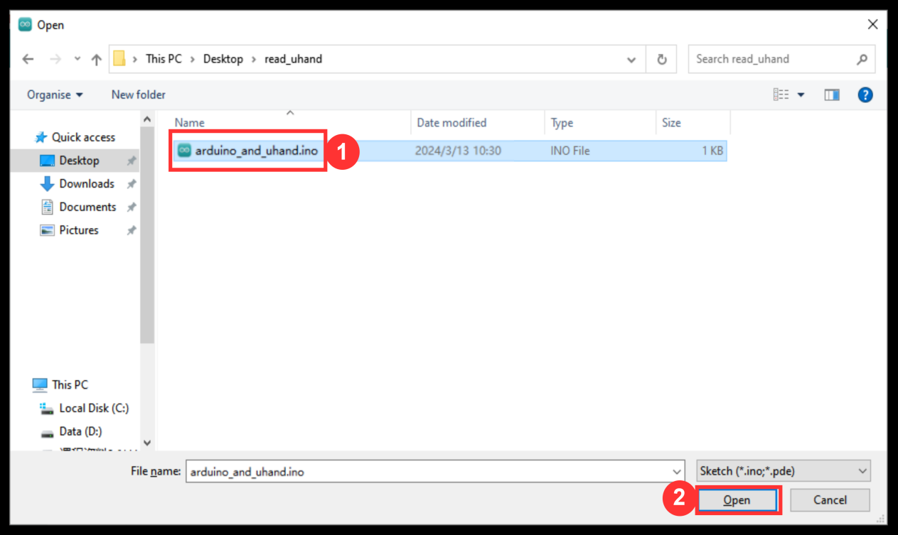

(4) Click **"Tools -\> Development Board"** to select **"Arduino UNO"**. Take COM10 as an example. (If you have already configured the development board model and port number during the setup of the development environment, you can skip this step.)

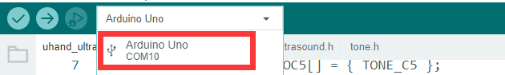

(5) If you are unsure about the port number, you can right-click **"This PC"** and click **"Properties -\> Device Manager"** to view the port number corresponding to the master (the device with CH340 is ours). Once you have found it, you can reselect it in the Arduino.

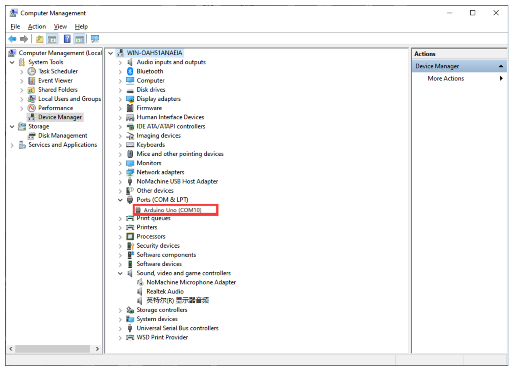

(6) After confirming that everything is correct, click  to verify the program. If the program is correct, the status area shows **"Compiling Project -&gt; Completed"** in turn. Then it displays the number of bytes used by the current project, the program storage space, and etc.


(7) After successful compilation, click  to upload the program to the development board. The status area shows **"Compiling Project -&gt; Uploading -&gt; Upload successfully"** in turn. After that, the status area stops printing and uploading information.


### 10.3.4 Program Outcome

When the program runs:

(1) Five servos respectively rotate to 73, 10, 0, 57, 90, and 180 degrees.

(2) After 1.5 seconds, the buzzer of uHand UNO sounds at 532hz for 1 second.

(3) Then, the color of the LED is set to green.

(4) Finally, the angles of uHand UNO's 6 servos are printed on the serial monitor.