# 2. Set Arduino Environment

## 2.1 Arduino IDE Installation and Introduction

### 2.1.1 Arduino IDE Installation 

Arduino IDE is a powerful software exclusively designed for Arduino microcontrollers. No matter which version it is, the same installation method can be used. This lesson will take the window version of [**Arduino-2.2.1**](https://www.arduino.cc/en/software/) as an example to illustrate:

(1) Locate the Arduino IDE installation package in the same folder as this document, as shown in the below figure, and double click to open it. (If you want to download the latest version of the software, you can download it through the Arduino official website **<u>"<https://www.arduino.cc/en/software>"</u>**.)

(2) Click **"I Agree"** to install.

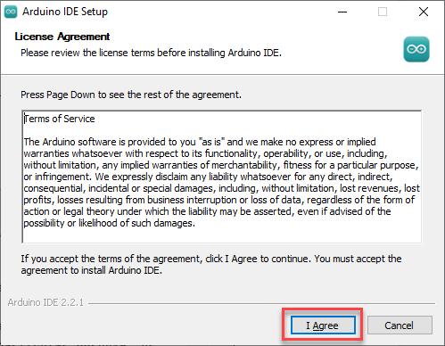

(3) Remain the default option, and click **"Next".**

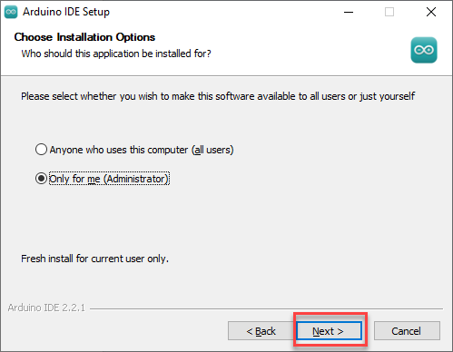

(4) Click **"Browse"** to choose the installation path, and then click **"Install"**.

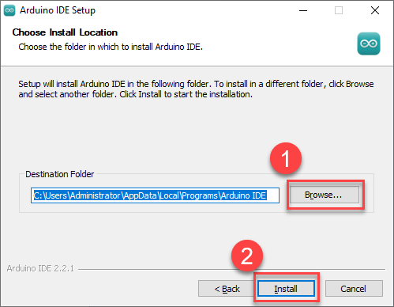

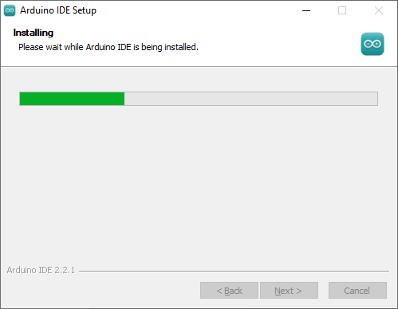

(5) Wait for the installation to complete.

:::{Note}

If you're prompted for the installation of the chip driver during the installation, please check "**Always trust software from Arduino LLC (A)**", then click "**Install**".

:::

(6) After the installation is complete, click **"Finish"**.

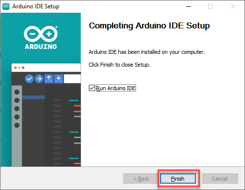

### 2.1.2 Software Instruction

(1) The main interface of Arduino IDE consists of 5 workplaces：

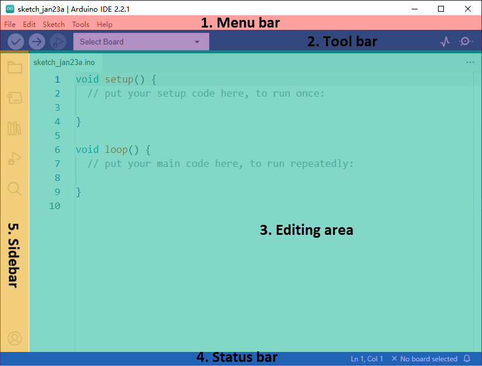

(2) **Menu bar**: it is responsible for Arduino IDE-related settings.

<table  class="docutils-nobg" style="margin:0 auto" border="1">
<colgroup>
<col style="width: 22%" />
<col style="width: 77%" />
</colgroup>
<tbody>
<tr>
<td><strong>Icon</strong></td>
<td><strong>Function</strong></td>
</tr>
<tr>
<td>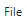</td>
<td>Create or open a project file, and customize preferences for the main interface.</td>
</tr>
<tr>
<td></td>
<td>

Perform text editing such as commenting, indenting or searching for code.
</td>
</tr>
<tr>
<td></td>
<td>Configure the entire project, including compiling, running, and adding the library files.</td>
</tr>
<tr>
<td></td>
<td>Select the development board and port, as well as obtain the board information.</td>
</tr>
<tr>
<td></td>
<td>Assist users with getting ready and offer solutions to common issues.</td>
</tr>
</tbody>
</table>

(1) **Tool bar**: some tools related to the project, including program compilation, programs download, serial monitor, etc.

| **Icon**                                                     | **Function**                                                 |
| ------------------------------------------------------------ | ------------------------------------------------------------ |
|  | Verification. Check if a program is written without errors. If it is fully correct, the compilation process will activate. |
|  | Download the program to the control board.                   |
|  | Debugging. Some development can be debugged through Arduino IDE in real time. |
|  | Select different boards for different development projects.  |
|  | Serial plotter, which can plot data printed to the Arduino serial port into graph. |
|  | Serial monitor, printing serial port information.            |

(3) **Editing area**: the area for editing code.

(4) **Status bar**: display the status of the current editor, such as the line and column of code, information about the development board, etc.

(5) **Sidebar:** the core of Arduino IDE is in charge of displaying the working folders, code debugging, library file installation, etc.

| **Icon**                                                     | **Function**                                                 |
| ------------------------------------------------------------ | ------------------------------------------------------------ |
|  | Management folder, display the files of current project.     |
|  | Development board manager, add the board tool package.       |
|  | Library management, add or delete the library files of the program. |
|  | Debugging, real-time debugging of the project.               |
|  | Search or replace the code or variables.                     |

## 2.2 Arduino IDE Instruction

### 2.2.1 Arduino IDE Interface Setting 

(1) Modify the Chinese interface: select **"File -\> Preferences"** on the Arduino IDE interface. Then, choose Chinese from the **"Language"**, and click **"OK"**.

(2) You can modify the project file path, editor text size, color themes, etc by selecting **"File -\> Preferences"** in the pop-up window.

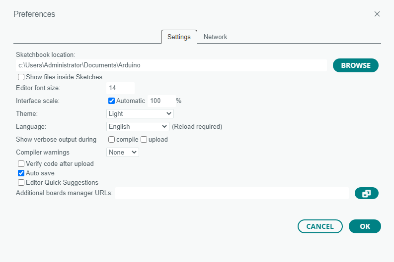

### 2.2.2 Arduino Download Program

[Demo](../_static/source_code/Demo.zip)

(1) In this case, we will use an example that prints **"Hiwonder"** to illustrate. Open the example program Demo.ino .

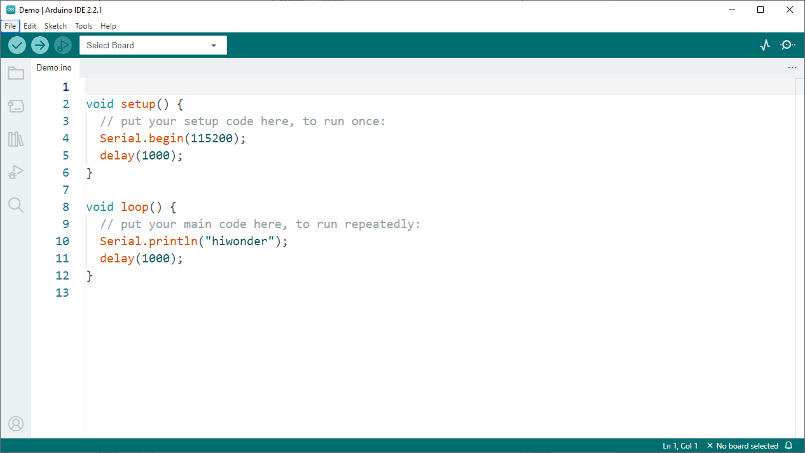

(2) Connect Arduino board to the computer using Type-B cable.

(3) In the **"Select board"** option, find the corresponding Arduino development board. (Take **"Arduino Uno"** and **"COM6"** as en example to demonstrate. The COM port is not unique. You can can check the COM port number in the computer's device manager. )

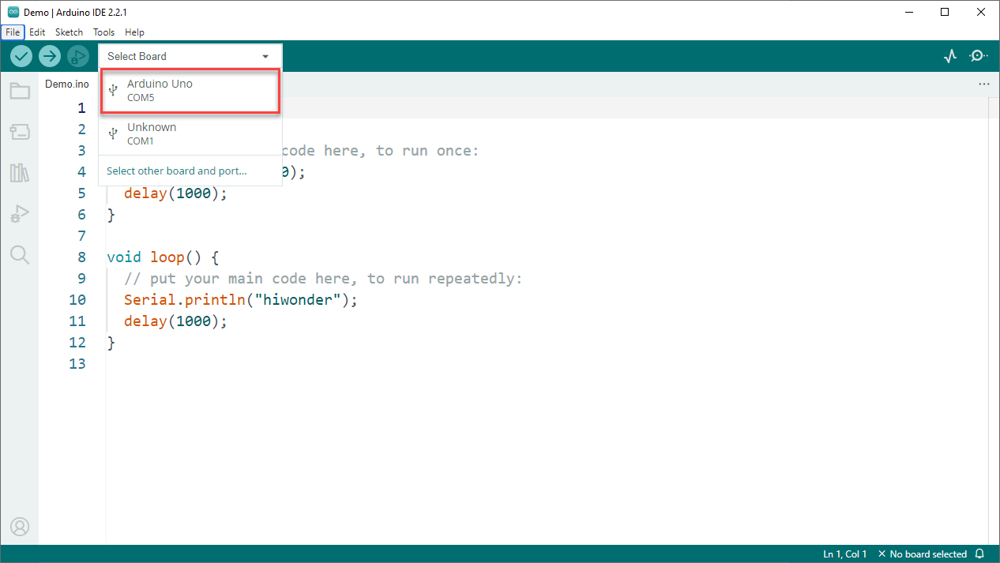

(4) Click  button to compile the program, which can check if the program has syntax errors and other issues.

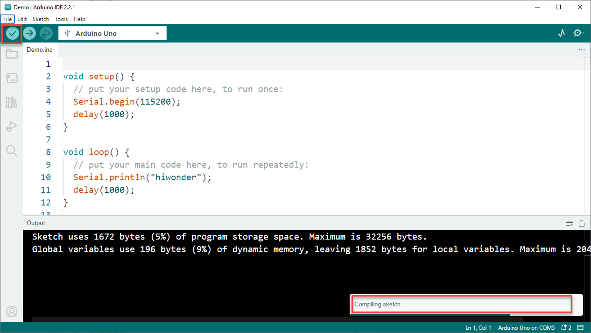

(5) After the compilation is complete, click  to upload the program into the Arduino development board.

(6) When the upload is done, click  to open the serial monitor. The word **"hiwonder"** is printed on the serial monitor.

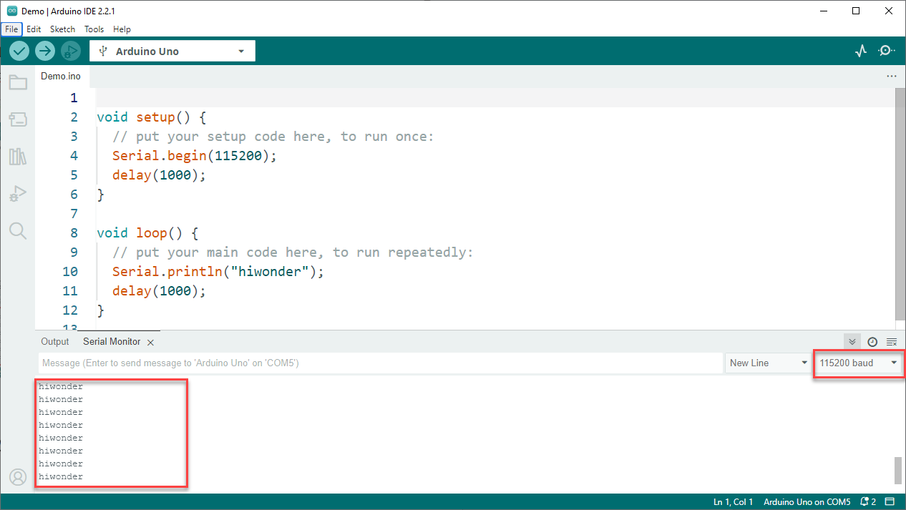

* **Import Library File**

If the program requires importing the library files, you can refer to the following operations:

**Online Importing**

This method is usually used for importing some official Arduino library files. For example, the library file for servo control (Servo), the library file for PID control algorithm (PID), and the library file for driving the RGB light (FastLED).

Take the library file for driving the RGB light (FastLED) as an example to illustrate:

(1) Click  at the sidebar of Arduino IDE interface.

(2) In the pop-up library management bar, enter **"FastLED"** to automatically search for the library files, then click **"install"**.

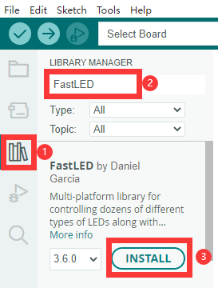

(3) The prompt shown in the red box indicates the successful installation.

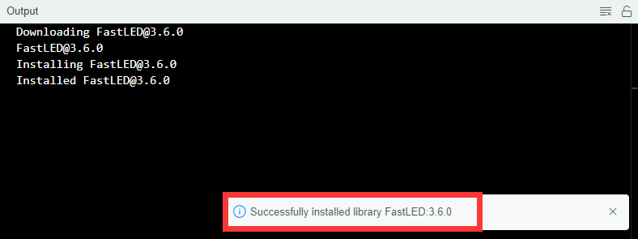

**Local Importing:**

This method is usually used for downloading library file or customizing the library file importing. Here will take the **"FastLED"** library file as an example to illustrate.

(1) Select **"Sketch -\> Import library-\> Add .ZIP library"**.

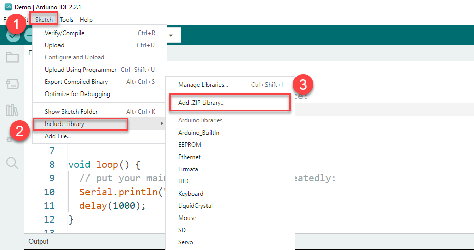

(2) Search for the "**FastLED.zip**" file and open it.

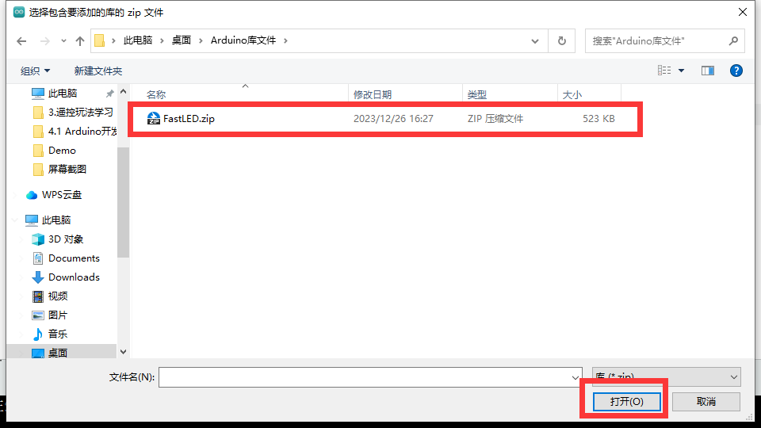

(2) The prompt shown in the below red box indicates that the library file has been installed already.

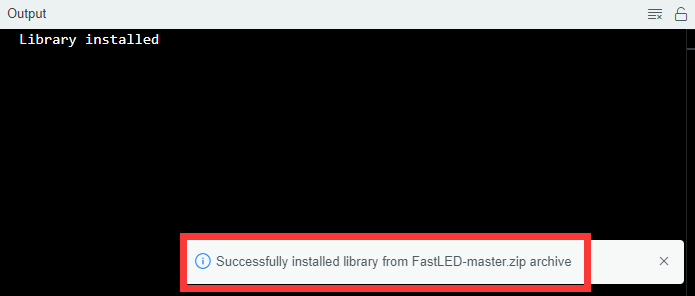

(3) In the process of importing the library file in the local, if you encounter the below error during the process of importing library files locally, you can refer to the following solution.

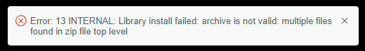

Take the library file **"FastLED"** as example to illustrate. In Arduino IDE versions 1.8.5 and above, the error above may arise when importing this library file. You can solve this problem by extracting the library file and placing it directly into the 'libraries' folder in the path of the project. The specific solution is as follows:

(1) At first, extract the library file **"FastLED"**.

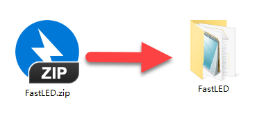

(2) Click **"File-\>Preferences"** in sequence.

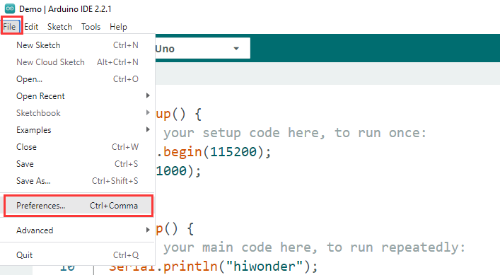

(3) In the opening preferences, copy the path.

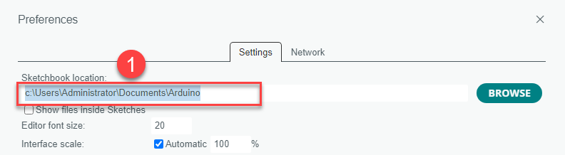

(4) Paste it in my computer, and then press **"Enter"** to access the path.

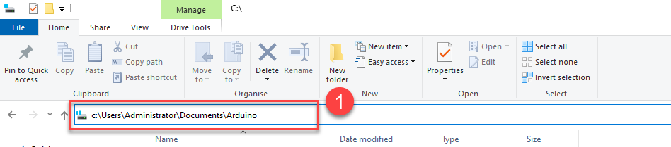

(5) Place the previously extracted library file into the **"libraries"** folder.

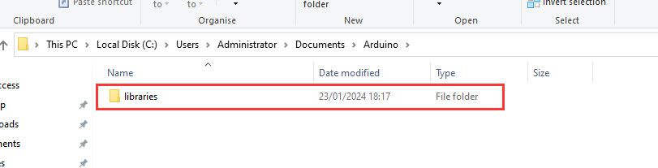

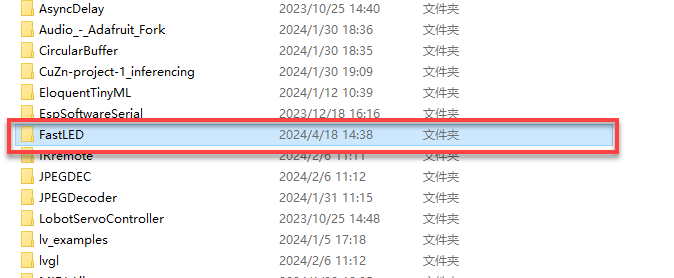

(6) Restart Arduino IDE. The library file has been located in the library of Arduino IDE.