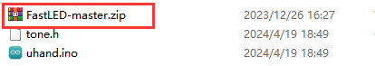
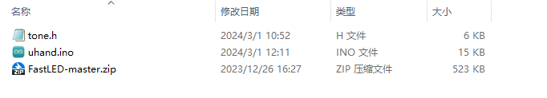
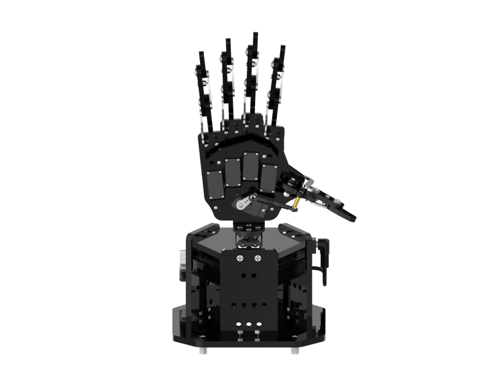
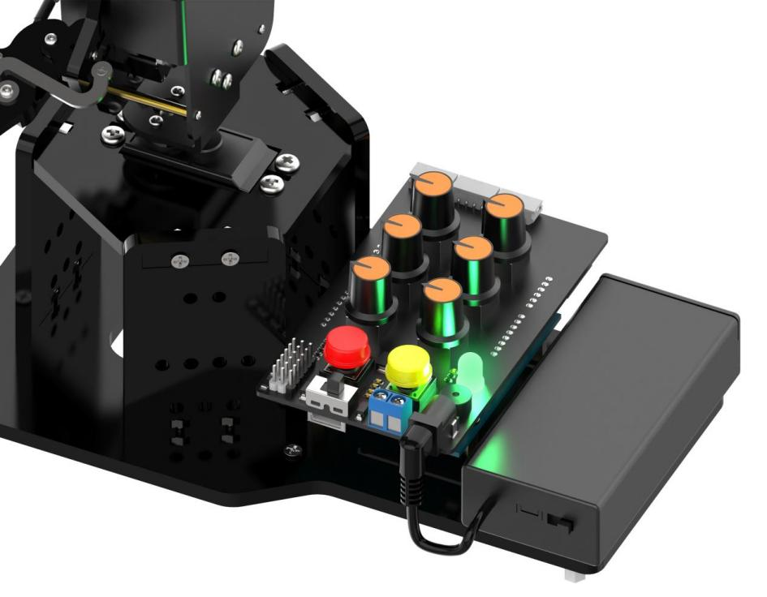
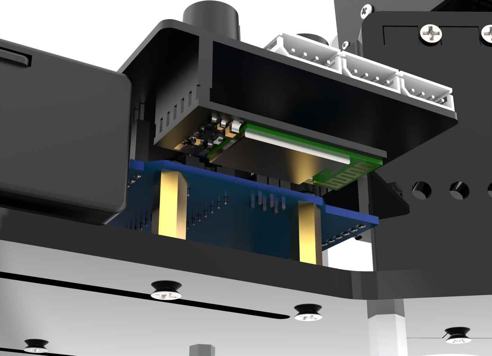

# 3. Default Program Download Instruction

The firmware program is not flashed by default, which includes basic game functions such as "knob control" and "APP control".

## 3.1 Getting Ready 

Follow the instructions in "[**2. Set Arduino Environment\2.2 Arduino IDE Instruction**](https://docs.hiwonder.com/projects/uHand_UNO/en/latest/docs/2.Set_Arduino_Environment.html#arduino-ide-instruction)" to import the **[FastLED-master.zip](../_static/source_code/FastLED-master.zip)** library file  into the Arduino IDE. If the FastLED-master.zip library file has already been imported before, you can skip this step.

## 3.2  Program Download 

[uHand](../_static/source_code/uhand.zip)

:::{Note}

- Remove the Bluetooth module before downloading the program. Or the program will fail to download because of the serial port conflict.

- Please switch the battery box to the 'OFF' when connecting the Type-B download cable. This action prevents the download cable from accidentally touching the power pins of the expansion board, which may cause a short circuit.

:::

(1) Locate and open **"uhand/uhand.ino"** program file .

(2) Connect Arduino to the computer with the UNO data cable (Type-B) .

(3) Click **"Select Board"**, and the software will automatically detect the current Arduino serial port. Next, click to connect.

(3) Click to download the program into Arduino. Then just wait for it to complete.

## 3.3  Program Outcome 

(1) When powered on, the robotic hand will return to the neutral position. Its five fingers spread out, and the RGB light on the expansion board turns white. This is the neutral position program.

(3) Simultaneously press two buttons for one second. When the RGB light turns green, the neutral position function will be unlocked, and the knob control mode will be activated.

(4) Pressing K1 will first clear the previous action group and enter the action group editing mode. Then, use the knob to control the posture of the robotic hand, and press K1 to record the current posture into the action group. Press K1 to exit the action group editing mode and save the edited action group to Flash. Next, simply press K2 to execute the action group.

The button functions are described below:

<table  class="docutils-nobg" style="margin:0 auto" border="1">
    <thead>
        <tr>
            <th>Mode</th>
            <th>Button</th>
            <th>Display</th>
        </tr>
    </thead>
    <tbody>
        <tr>
            <td>Neutral Position Mode</td>
            <td>Automatically enter the mode after powered on, at the same time long press "K1, K2" to exit</td>
            <td>ID1-6 servos are at 90 °.</td>
        </tr>
        <tr>
            <td rowspan="3">Normal mode (green light is steady on)</td>
            <td>Long press the red "K1".</td>
            <td>Enter the editing action group mode to clear the original action group.</td>    
        </tr>
        <tr>
            <td>Short press the yellow "K2".</td>
            <td>Enter the running action group mode to run the saved action group once.</td>
        </tr>
        <tr>
            <td>Long press the yellow "K2".</td>
            <td>Enter the running action group mode and loop run the saved action group.</td>
        </tr>
        <tr>
            <td rowspan="2">Editing action group mode (red light is steady on)</td>
            <td>Short press the red "K1".</td>
            <td>Save action.</td>
        </tr>
        <tr>
            <td>Long press the red "K1".</td>
            <td>Save the editing action group and exit to switch to the normal mode.</td>
        </tr>
        <tr>
            <td>Running action group mode (yellow light is steady on)</td>
            <td>Short press the red "K1".</td>
            <td>Stop the running action group and switch to the normal mode.</td>
        </tr>
    </tbody>
</table>

(5) Upon inserting the Bluetooth module and connecting to the app, the Bluetooth control game will be activated.

