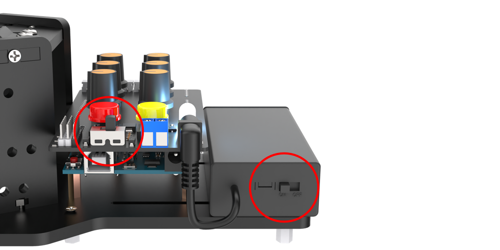
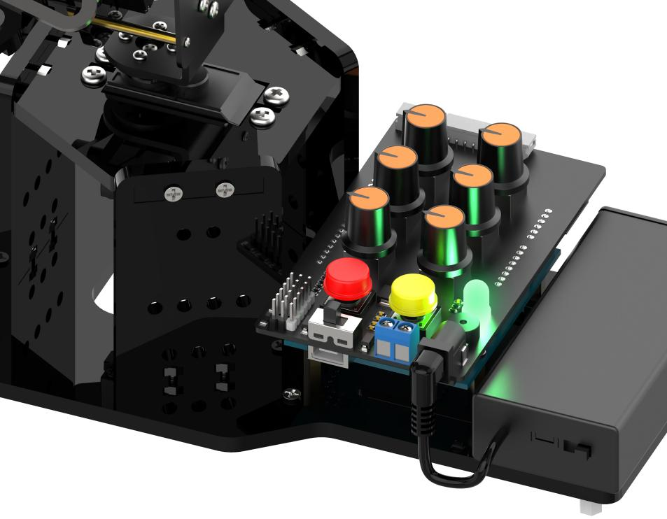
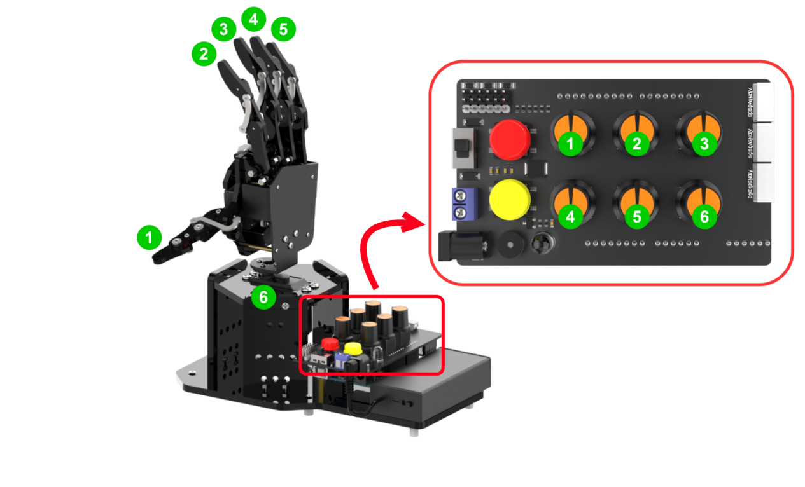
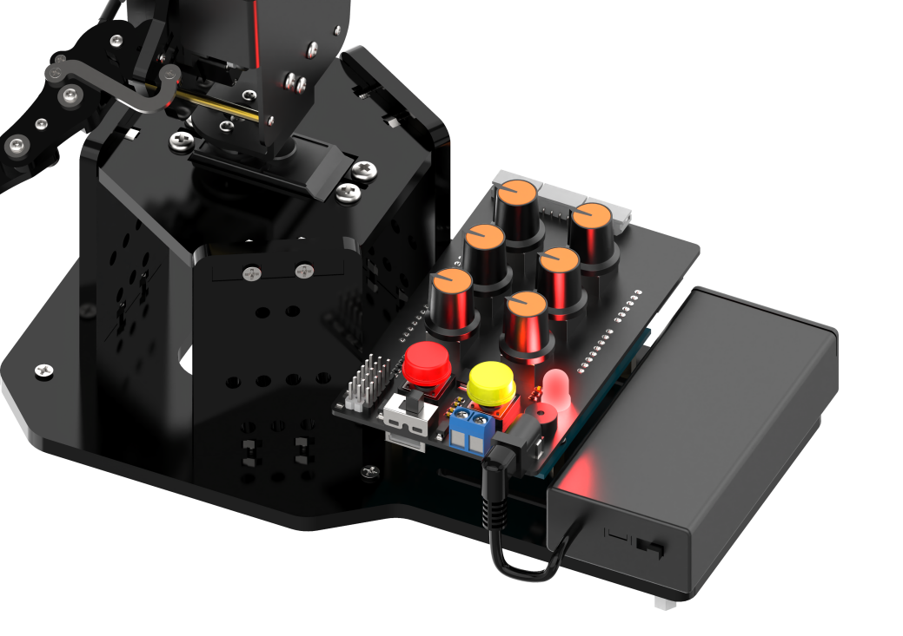
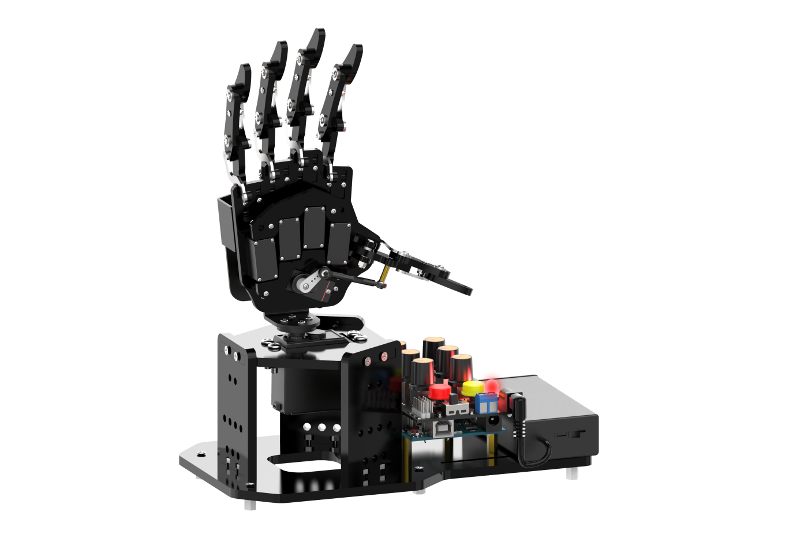
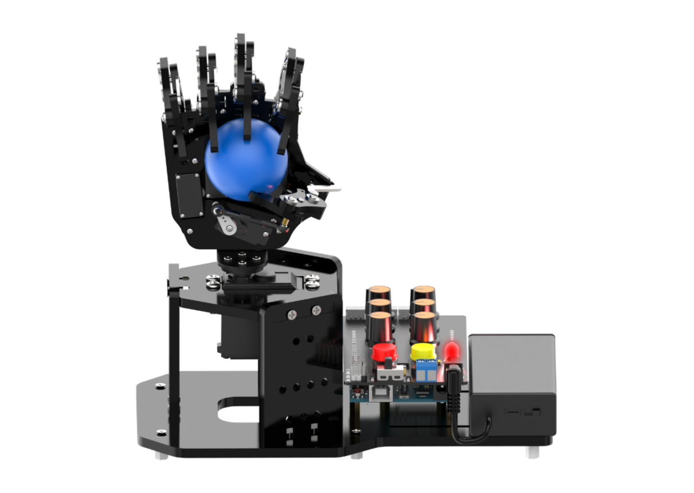
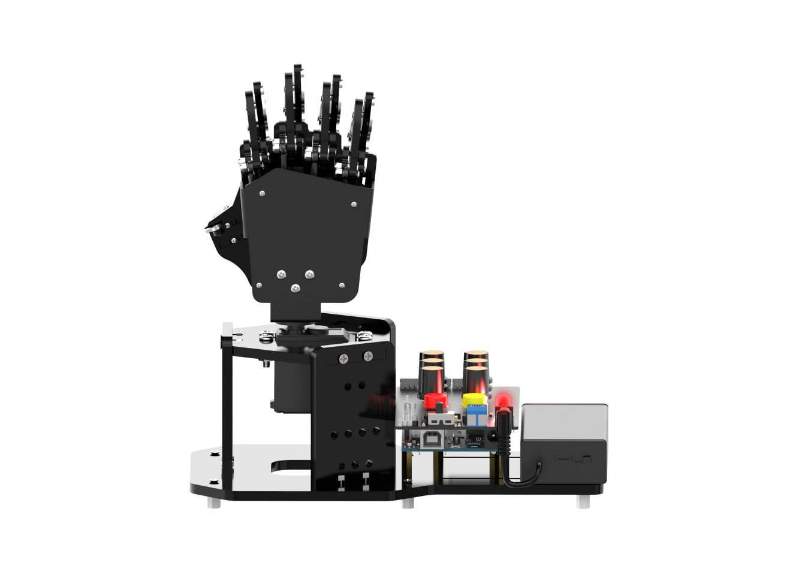
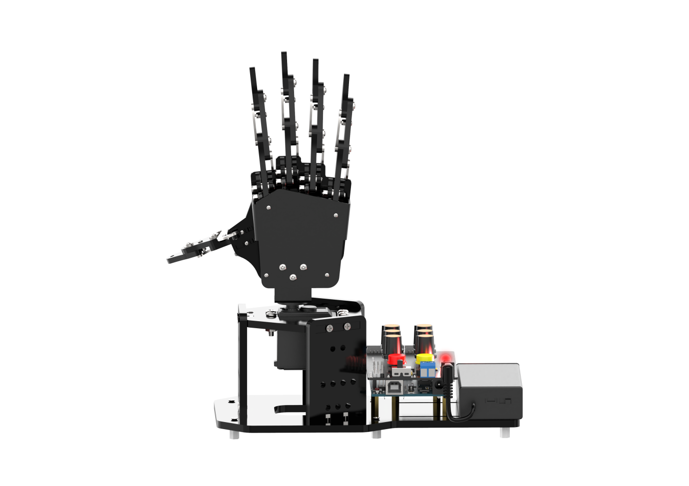
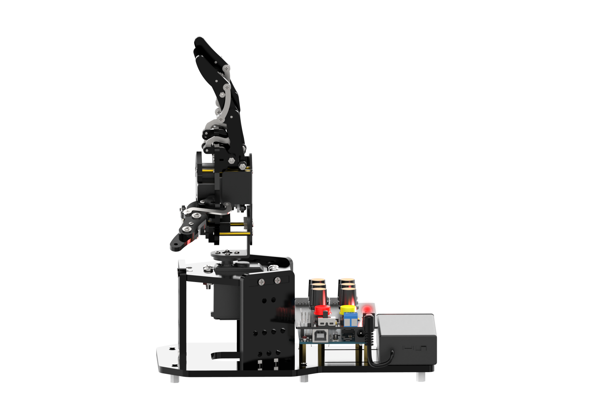

# 4. Knob Control 

## 4.1 Getting Ready

(1) Switch the battery box and the expansion board to **"ON"**.

(2) At this time, the RGB light on the expansion board is on with white, and the robotic hand returns to the neutral position.

(3) Simultaneously Press K1 and K2 buttons on the expansion board. Release them once the RGB light turns green to exit the neutral position mode. If the robotic hand does not exit this mode, you cannot control it by knobs or the app.

## 4.2 Operation Instruction

Two seconds after exiting the neutral position mode, the servo on the robotic hand will rotate to the same direction as the current knobs. You can turn six knobs of S1 to S6 on the expansion board to control the five fingers and the pan-tilt respectively.

(1) The corresponding relationship between the knobs and the servos is shown below:

<table  class="docutils-nobg" style="margin:0 auto" border="1">
    <thead>
    <tr>
        <th>Knob</th>
        <th>Servo</th>
        <th>Control Instructions (hand itself)</th>
    </tr>
    </thead>
    <tbody>
    <tr>
        <td>S1</td>
        <td>No. 1 Servo (Thumb)</td>
        <td rowspan="4">Turn the knob counterclockwise to close the finger, turn the knob clockwise to open the finger.</td>
    </tr>
    <tr>
        <td>S2</td>
        <td>No. 2 Servo (Index Finger)</td>
    </tr>
    <tr>
        <td>S3</td>
        <td>No. 3 Servo (Middle Finger)</td>
    </tr>
    <tr>
        <td>S4</td>
        <td>No. 4 Servo (Ring Finger)</td>
    </tr>
    <tr>
        <td>S5</td>
        <td>No. 1 Servo (Pinky)</td>
    </tr>
    <tr>
        <td>S6</td>
        <td>No. 1 Servo (Pan-Tilt)</td>
        <td>Pan-Tilt rotates in the same direction as the knob</td>
    </tr>
    </tbody>
</table>

(2) In addition to the way mentioned above, you can also control the robotic hand through other modes.

| RGB Light | Mode | Function |
|----|----|----|
| White | Neutral Position Mode | ID1-6 Servos are in the neutral position. |
| Green | Normal Mode | Knob Control |
| Red | Action Group Editing Mode | Edit the action |
| Yellow | Action Group Running Mode | Run an offline action group edited under a red light. |
| Blue | App Mode | Control the hand by APP. |

For example, when you press the red button on the expansion board, the RGB light will turn red and enter into action group editing mode. After editing, the RGB light turns yellow. It indicates that the action group is executing.

When connected with the app, the RGB light will turn blue, and then enter the app control mode.

## 4.3 Edit Action Group

Edit an action to control the robotic hand to grasp the ball on its left side, rotate to the right side, and release the ball. Then, it returns to the neutral position.

### 4.3.1 Button and Mode Introduction

In addition to utilizing the knobs on the expansion board, editing actions also necessitate the use of buttons to achieve functionalities such as saving actions and mode switching. About the button function and mode instruction used in this game, please refer to the following table:

<table  class="docutils-nobg" border="1">
    <thead>
        <tr>
            <th>Mode</th>
            <th>Button</th>
            <th>Display</th>
        </tr>
    </thead>
    <tbody>
        <tr>
            <td>Neutral Position Mode</td>
            <td>Automatically enter the mode after powered on, at the same time long press "<b>K1, K2</b>" to exit</td>
            <td>ID1-6 servos are at 90 °.</td>
        </tr>
        <tr>
            <td rowspan="3">Normal mode (green light is steady on)</td>
            <td>Long press the red "<b>K1</b>".</td>
            <td>Enter the editing action group mode to clear the original action group.</td>
        </tr>
        <tr>
            <td>Short press the yellow "<b>K2</b>".</td>
            <td>Enter the running action group mode to run the saved action group once.</td>
        </tr>
        <tr>
            <td>Long press the yellow "<b>K2</b>".</td>
            <td>Enter the running action group mode and loop run the saved action group.</td>
        </tr>
        <tr>
            <td rowspan="2">Editing action group mode (red light is steady on)</td>
            <td>Short press the red "<b>K1</b>".</td>
            <td>Save action.</td>
        </tr>
        <tr>
            <td>Long press the red "<b>K1</b>".</td>
            <td>Save the editing action group and exit to switch to the normal mode.</td>
        </tr>
        <tr>
            <td>Running action group mode (yellow light is steady on)</td>
            <td>Short press the red "<b>K1</b>".</td>
            <td>Stop the running action group and switch to the normal mode.</td>
        </tr>
    </tbody>
</table>

### 4.3.2 Operation Steps

(1) Turn on the robotic hand by holding down the K1 and K2 buttons on the expansion board. Release once the green light comes on.

(2) After 2 seconds, the servo returns to the knob control position. Then, long-press the red button **"K1"** on the expansion board. The buzzer will emit a prompt sound, and the RGB light color will change from green to red, indicating entry into action group editing mode.

(3) Rotate the knobs of S1 to S5 to open the five fingers of the robotic hand. Then use S6 to rotate the robotic hand to the left. Short press **"K1"** and the buzzer short sounds to save the first action.

(4) Next, you can place the red ball in the center of the robotic hand, and rotate the knobs S1 to S5 to close the fingers and grasp the ball. Short press the red button **"K1"**, and the buzzer will beep shortly to save the action.

(5) Turn the Knob S6 to control the pan-tilt rotating to the right. Short press the red button **"K1"**, and the buzzer makes a short sound to save the action.

(6) Turn the S1 to S5 knobs to open the five fingers and release the ball. Short press the red button **"K1"** and the buzzer makes a short sound to save the action.

(7) Turn the knob S6 to control the pan-tilt back to the initial position, and short press the red button **"K1"** and the buzzer makes a short sound to save the action.

(8) Finally press the red button **"K1"** long enough for the robotic hand to save the current editing action group and exit the mode.

:::{Note}
Entering the action group editing mode by long-press the red button **"K1"** will erase all previously edited action group data.
:::

### 4.3.3 Run Action Group

After editing action groups, you can execute the saved action group by pressing the yellow button **"K2"** on the expansion board. A long press will loop the action group.

:::{Note}
* Edited action group is able to be saved after power-off. Which means it can be run again at the next boot.
* To stop a running action group, you can short press the red button **"K1"** to switch the robotic hand back to normal mode.
:::
