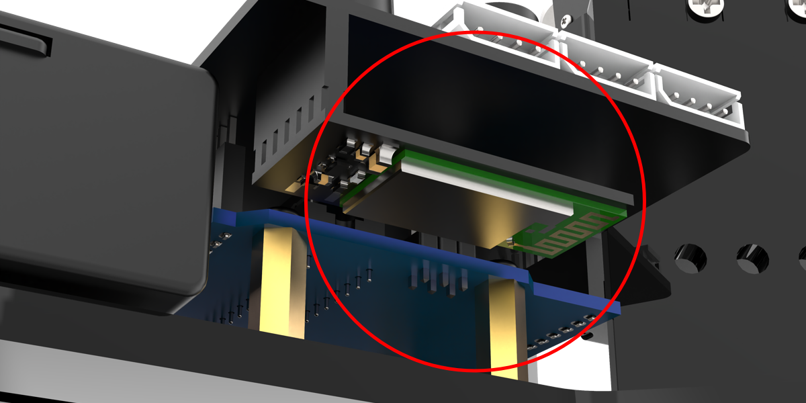
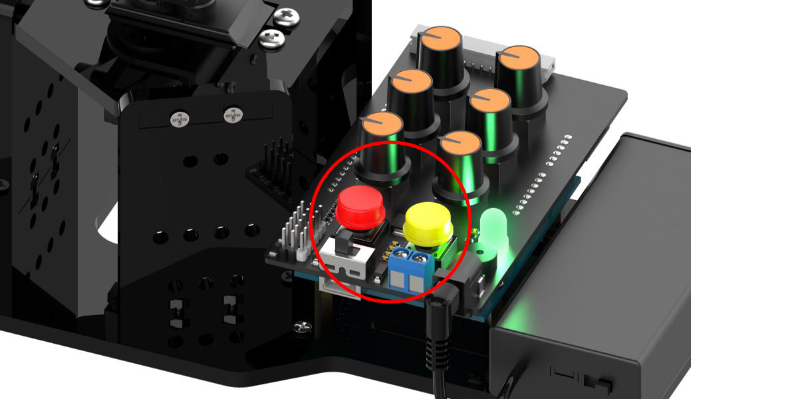
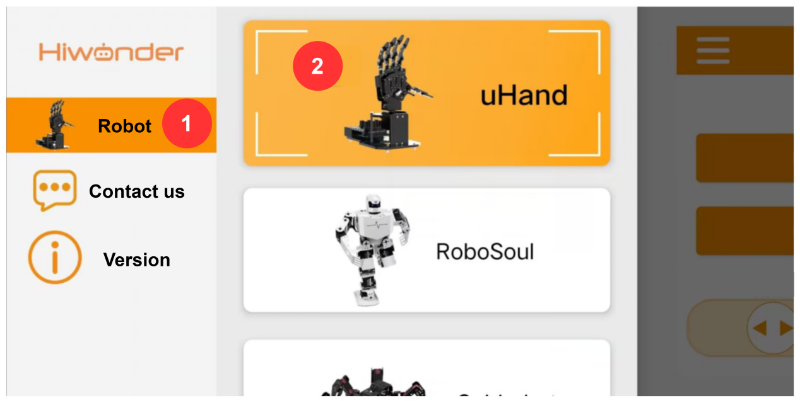
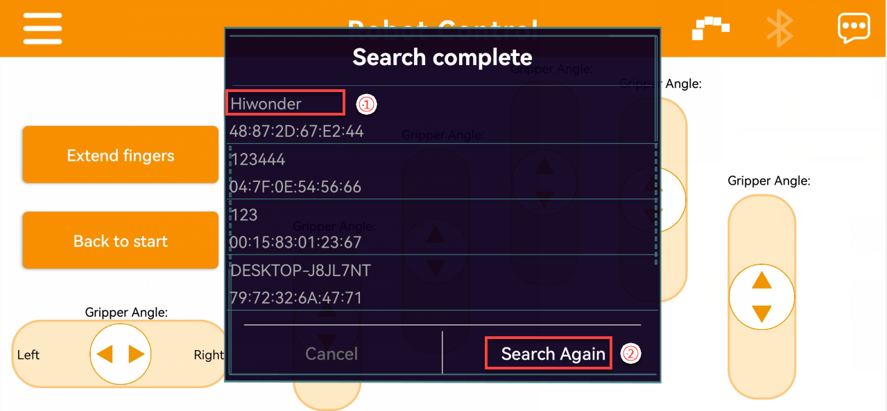
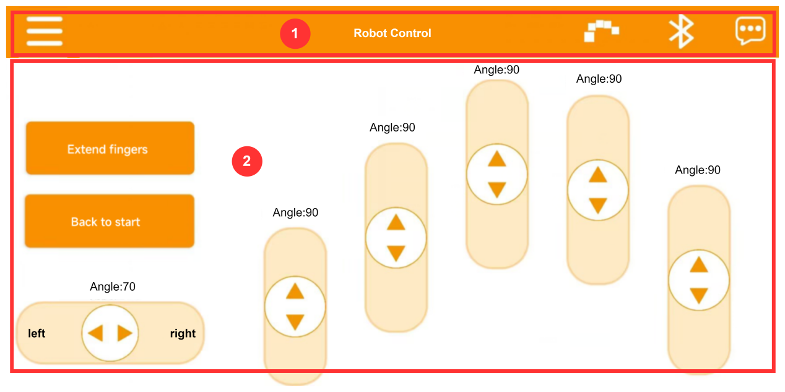
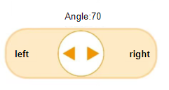
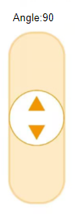
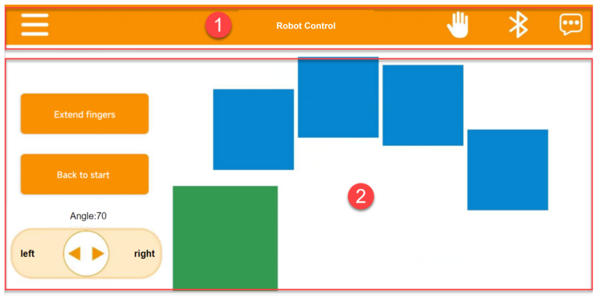
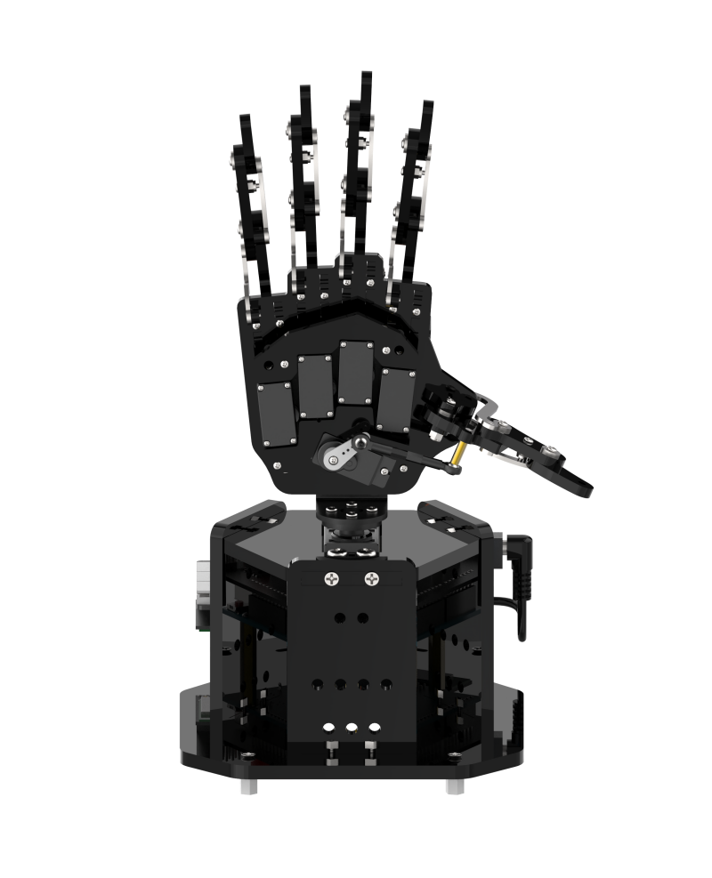
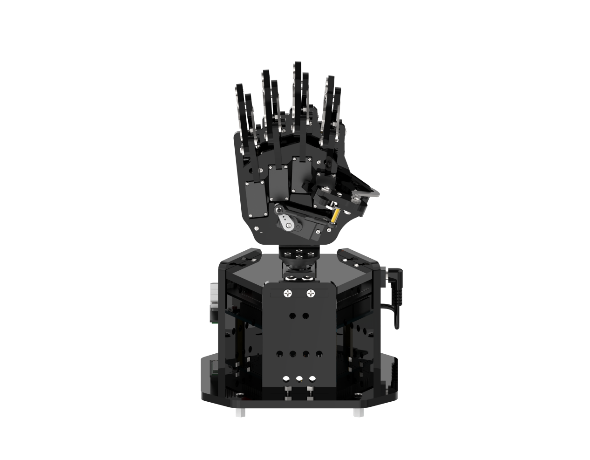

# 5. APP Control

## 5.1 APP Installation

iOS users: search [**Wonderbot**](https://apps.apple.com/us/app/wonderbot-robot/id1519146341) in App Store and download it.

Android users: Click ["**Wonderbot**"](https://play.google.com/store/apps/details?id=com.Wonder.bot)  or refer to the appendix to install it.

## 5.2 Device Connection 

:::{Note}

* Please enable Bluetooth and location services in the phone settings before opening APP.

* Please use the Bluetooth button in the APP to pair and connect with the device. Do not pair with the key in the phone settings.

* Take Android APP as example in this lesson.

:::

Step 1: Make sure the Bluetooth module is installed correctly on the uHand UNO 6 channel knob expansion board by aligning pins one by one, as shown below:

Step 2: Turn on the power switches of the battery case and the expansion board. Press the K1 and K2 buttons on the expansion board at the same time, and release them until the RGB light turns to green. Then it can exit the neutral position mode. (If it does not exit, you can not control by the knob or app.)

Step 3: Open the APP **"Wonderbot"**, and tap on the icon  at the top left corner to select **"uHand"**.

Step 4: In uHand interface, tap on  at the top right corner, and find **"Hiwonder"** in Bluetooth list. Click on the link.

:::{Note}

If the **"Hiwonder"** does not appear immediately after clicking on the Bluetooth icon, you can click "**Search again**" to search it again.

:::

Step 5: After successfully connecting, the Bluetooth icon at the top right corner will switch to a steady mode, and the robotic hand will return to its neutral mode.

## 5.3 Control Instruction 

There are two control modes for the app. The default mode is the slider control mode, where you can drag the slider to control the rotation angle of each servo. And the other is the fingertip control mode. You can open and close the robot hand by pressing buttons.

### 5.3.1 Slider Control

The app interface consists of two parts as shown below:

①：Menu Bar

<table  class="docutils-nobg" style="text-align: center" border="1">
<tbody>
<tr>
<td></td>
<td>Go back to the home screen to select the robot </td>
</tr>
<tr>
<td></td>
<td>Switch to fingertip control mode</td>
</tr>
<tr>
<td> </td>
<td> Bluetooth connection </td>
</tr>
<tr>
<td></td>
<td> More information </td>
</tr>
</tbody>
</table>

②：Control Area

<table  class="docutils-nobg" style="text-align: center" border="1">
<colgroup>
<col style="width: 50%" />
<col style="width: 50%" />
</colgroup>
<tbody>
<tr>
<td></td>
<td>The control pan-tilt (No.6 servo) rotates from 0 ° to 180 °</td>
</tr>
<tr>
<td></td>
<td>Control the opening and closing of the robotic hand (No.1 ~ 5 servo), the angle range is 0 ~ 180 °</td>
</tr>
<tr>
<td></td>
<td>
Control the opening of the hand, that is

the angle of No.1 ~ 5 servo should be 180 °
</td>
</tr>
<tr>
<td></td>
<td>Control all servos back to neutral position</td>
</tr>
</tbody>
</table>

### 5.3.2 Fingertip Control

(1)  Click on the menu bar to switch the mode to fingertip control. The interface in fingertip control mode is shown below:

(2) In this mode, the pan-tilt returns to the neutral position, while all five fingers open. When press the button on the right side of the interface, the corresponding finger will be bent and closed.

(3) To switch back to slider control mode, you can click in the upper right corner.
