# 6. Motion Control Basic Course

## 6.1 Brief Control Course 

This section aims to guide you on how to obtain the action data of uHand UNO via Arduino platform, as well as how to write and execute an action.

<p id="anchor_6_1_1"></p>

### 6.1.1 Read Action Data 

[Read Action Data Program](../_static/source_code/read_uhand.zip)

[ Action Running Program](../_static/source_code/uhand_actions.zip)

* **Program Download**

Remove the Bluetooth module before downloading the program. Or the program will fail to download because of the serial port conflict.

Please switch the battery box to **"OFF"** when connecting Type-B download cable. This action prevents the download cable from accidentally touching the power pins of the expansion board, which may cause a short circuit.

(1) Double click  to open it.


(2) Click **"File -\> Open"**.

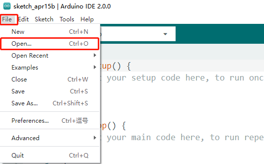

(3) Select [**read_uhand.ino**](../_static/source_code/read_uhand.zip) program and click **"Open"**.


(4) Locate Arduino development board in **"Select Board"**. (Take Arduino Uno as an example. COM ports are not unique, and their numbers can be checked in computer's device management. Take COM6 as an example.)

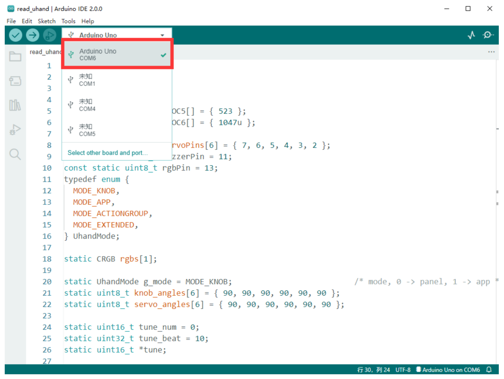

(5) After confirming that everything is correct, click  to verify the program. If the program is correct, the status area shows "**Compiling Project -&gt; Completed**" in turn. Then it displays the number of bytes used by the current project, the program storage space and etc.


(6) After successful compilation, click  to upload the program to the development board. The status area shows "**Compiling Project-&gt; Uploading-&gt; Upload successfully**" in turn. After that, the status area stops printing and uploading information.

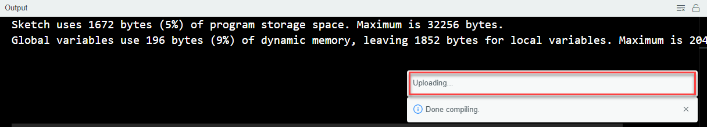

*  Get Action Data

(1) Keep the Type-B cable connected to the computer. Do not unplug it, as it will hinder communication. Power on the robotic hand. Then click  in the upper right corner and select a baud rate of **"115200"**.

(2) Press "**Ctrl+Shift+M**" to open the serial monitor to view real-time servo data. The 0<sup>th</sup> bit in the data tells whether the current action group is a valid data or not. "**1**" is a valid data. "**0**" is an invalid data, which is a stop action. The following six bits correspond to the angles of the six servos, ranging from 0° to 180°.

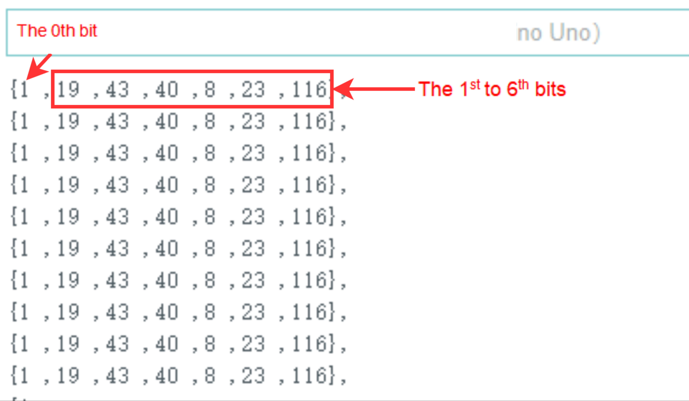

(3) Rotate the knobs S1 to S6 on the uHand UNO to adjust the rotation angles of the corresponding six servos, controlling the robotic hand to move to the desired posture. Then copy the entire row of servo data displayed on the serial port.

* **Program Outcome**

Power on the robotic hand. Keep the Type-B cable connected to the computer. Open the serial monitor, and select a baud rate of **"115200"**.

Once the actions are completed, the serial port monitor displays **"The action group is running successfully!"**, indicating successful execution of the actions.


### 6.1.2 Write Action Data

[Read Action Data Program](../_static/source_code/read_uhand.zip)

[ Action Running Program](../_static/source_code/uhand_actions.zip)

* **Write Action**

(1) Add the acquired action data into Action Running `Program/uhand_actions/actions.h`.

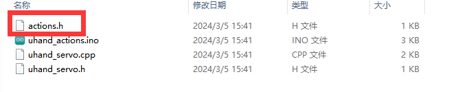

(2) The macro definition **"action_count"** represents the number of current actions. If a new action needs to be added, please add 1 to the original data.

{lineno-start=1}

```python
//Action group file
#include <Arduino.h>
#define action_count 3 //Number of action groups

/*数组成员(array member)：action[action_count][0]--数据有效性(data validity)，=0时不被执行(it is not executed when the value is 0)
           action[action_count][1-6]--该动作各个舵机的位置值(the position values of each servo for the action)
*/
static uint8_t action[action_count][7] = 
    {
      //Action  1
      {1,0,0,0,0,0,90}, 

      //Action  2
      {1,180,180,180,180,180,0},

      //Action  3
      {1,19,43,40,8,23,116}
    };
```

Please make sure that the current action data is a one-dimensional array when adding new action data. In the action data, the 0<sup>th</sup> bit in the data tells whether the current action is a valid data or not. "**1**" is a valid data. "**0**" indicated that the running is completed. The 1<sup>st</sup> to 6<sup>th</sup> bits correspond to the angles of the servos 1 to 6 respectively.  

:::{Note}

Please ensure that the 0<sup>th</sup> bit of the action data you add is 1. Otherwise, the action cannot be executed.  

:::

If the new action is successfully added, it will be displayed as follows:

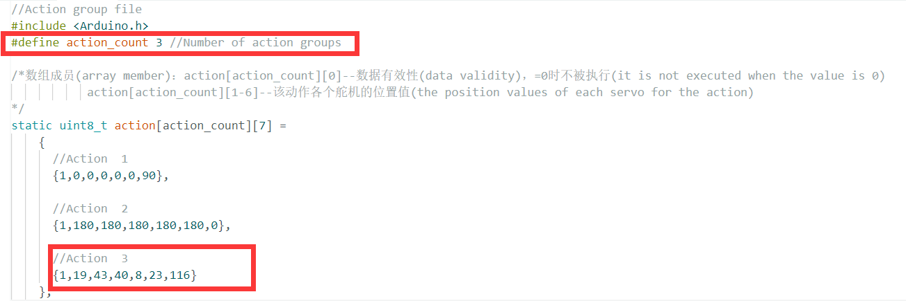

Open the "[**uhand_actions.ino**](../_static/source_code/read_uhand.zip)" file located in the same directory. Modify the "**action_index**" variable representing the action number to the corresponding number of the newly added action.

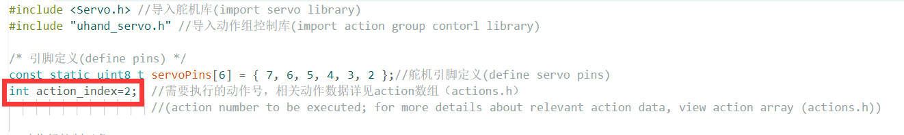

* Program Download

Remove the Bluetooth module before downloading the program. Or the program will fail to download because of the serial port conflict.

Please switch the battery box to "**OFF**" when connecting Type-B download cable. This action prevents the download cable from accidentally touching the power pins of the expansion board, which may cause a short circuit.

(1) Double click  to open it.


(2) Click **"File -\> Open"**.


(3) Access "**6.1.3 Action Running Program**". Select "**[uhand_actions.ino](../_static/source_code/read_uhand.zip)**" program in "**uhand_actions**" folder and click "**Open**".

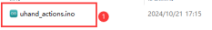

(4) Locate Arduino development board in "**Select Board**". (Take Arduino Uno as an example. COM ports are not unique, and their numbers can be checked in computer's device management. Take COM6 as an example.)


(5) After confirming that everything is correct, click  to verify the program. If the program is correct, the status area shows **"Compiling Project -&gt; Completed"** in turn. Then it displays the number of bytes used by the current project, the program storage space and etc.


(6) After successful compilation, click  to upload the program to the development board. The status area shows **"Compiling Project-&gt; Uploading-&gt; Upload successfully"** in turn. After that, the status area stops printing and uploading information.


* **Program Outcome**

After the uHand UNO is powered on, the action obtained in "[**6.1.1 Read Action Data**](#anchor_6_1_1)" will be executed.

* **Program Analysis**

(1) Initialize the baud rate of the serial port to 115200, and then initialize the servo pins.

{lineno-start=19}

```python
void setup() {
  // put your setup code here, to run once:
  Serial.begin(115200);
  // 设置串行端口读取数据的超时时间(set the timeout for serial port reading data)
  Serial.setTimeout(500);
  
  // 绑定舵机IO口(bind servo IO pin)
  for (int i = 0; i < 6; ++i) {
    servos[i].attach(servoPins[i]);
  }

  delay(2000);
  Serial.println("start");
}
```

(2) In the `user_task()` function, set the current action number to be executed using the `action_ctl.action_set()` function. For example, the code `action_ctl.action_set(1)` sets the current action number to be executed as 1. Use the action_state_get() function to obtain the current action being executed. The return value is the current action number being executed, or 0 if it has already been completed.

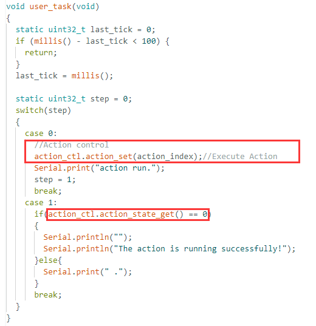

(3) Use the `action_ctl.action_task()` function to set the corresponding servo angle for the current action.

{lineno-start=12}

```python
//执行单一动作时使用(use it when executing a single action)
void HW_ACTION_CTL::action_task(void){
  static uint32_t last_tick = 0;
  static uint8_t step = 0;
  static uint8_t num = 0 , delay_count = 0;
  if(action_num != 0 && action_num <= action_count)
  {

    extended_func_angles[0] = action[action_num-1][1];
    extended_func_angles[1] = action[action_num-1][2];
    extended_func_angles[2] = action[action_num-1][3];
    extended_func_angles[3] = action[action_num-1][4];
    extended_func_angles[4] = action[action_num-1][5];
    extended_func_angles[5] = action[action_num-1][6];

    // 清空动作变量(clear action variable)
    action_num = 0;
  }
}
```

(4) Call the servo_control() function to control the servo to turn to the corresponding angle and achieve the corresponding action. If you want to modify the rotation speed of the servos, make sure the sum of the coefficients of the two items adds up to 1. For example, if you change the coefficient of the actual value to 0.5, then the corresponding actual value of the expected value needs to be changed to 0.5 as well. After modifying the values, download the program, and the subsequent servo speed of the robotic hand will increase significantly.

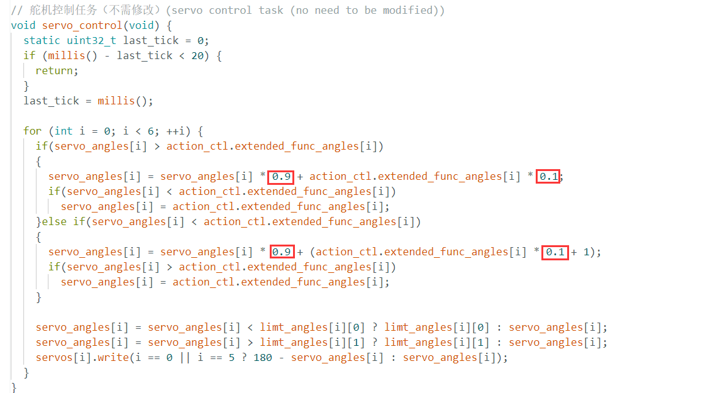

## 6.2 Action Group Control Course 

This section aims to guide you on how to obtain the data of uHand UNO's action group via Arduino platform, as well as how to write and execute the action group.

### 6.2.1 Read Action Group 

[Read Action Data Program](../_static/source_code/read_uhand.zip)

[Action Running Program](../_static/source_code/uhand_actions.zip)

* **Basic Program Download**

Remove the Bluetooth module before downloading the program. Or the program will fail to download because of the serial port conflict.

Please switch the battery box to **"OFF"** when connecting Type-B download cable. This action prevents the download cable from accidentally touching the power pins of the expansion board, which may cause a short circuit.

(1) Double click  to open it.

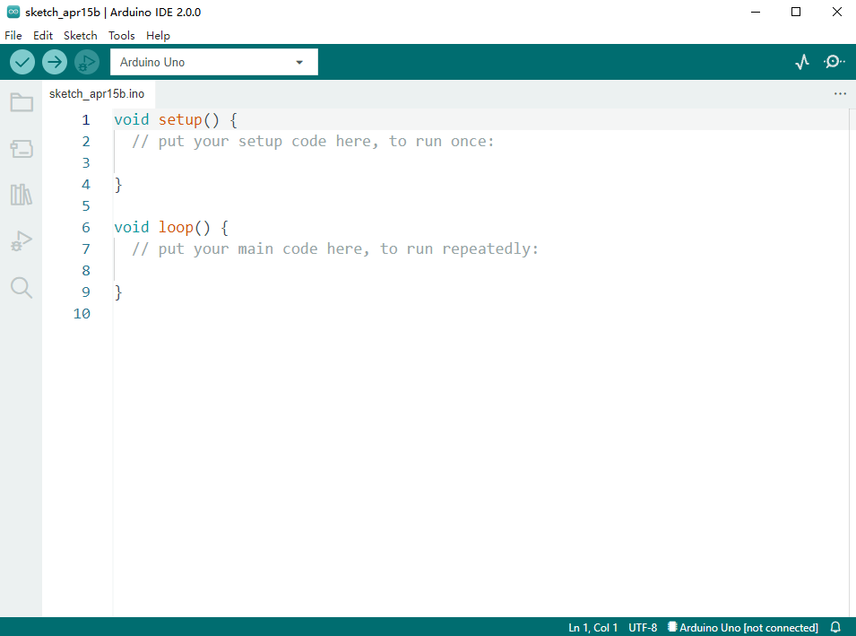

(2) Click **"File -\> Open"**.


(3) Access "[**6.2.2 Read Action Data Program**](#anchor_6_2_2)". Select [**read_uhand.ino**](../_static/source_code/read_uhand.zip) and click "**Open**".

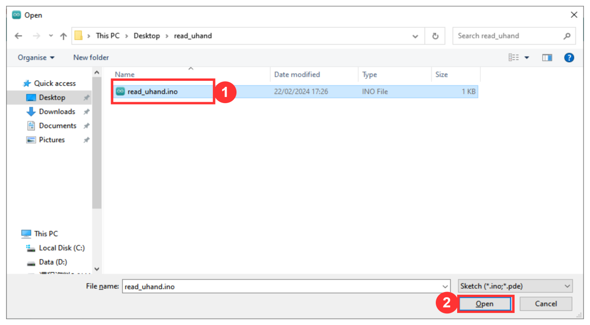

(4) Locate Arduino development board in **"Select Board"**. (Take Arduino Uno as an example. COM ports are not unique, and their numbers can be checked in computer's device management. Take COM6 as an example.)


(5) After confirming that everything is correct, click  to verify the program. If the program is correct, the status area shows **"Compiling Project -&gt; Completed"** in turn. Then it displays the number of bytes used by the current project, the program storage space and etc.


(6) After successful compilation, click  to upload the program to the development board. The status area shows **"Compiling Project-&gt; Uploading-&gt; Upload successfully"** in turn. After that, the status area stops printing and uploading information.


* **Get Action Group Data**

(1) Keep the Type-B cable connected to the computer. Do not unplug it, as it will hinder communication. Power on the robotic hand. Then click  in the upper right corner and select a baud rate of **"115200"**.

(2) Press **"Ctrl+Shift+M"** to open the serial monitor to view real-time servo data. The 0<sup>th</sup> bit in the data tells whether the current action group is a valid data or not. **"1"** is a valid data. **"0"** is an invalid data, which is a stop action. The following six bits correspond to the angles of the six servos, ranging from 0° to 180°.


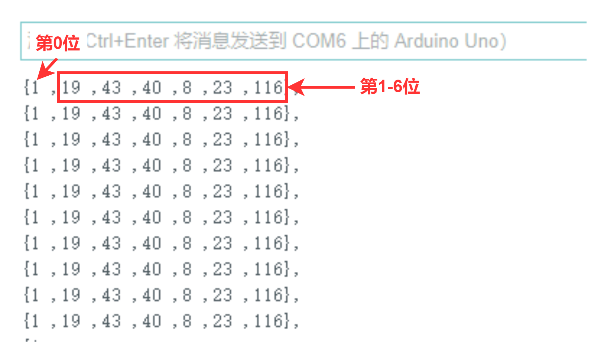

(3) Rotate the knobs S1 to S6 on the uHand UNO to adjust the current rotation angles of the servos. And then save these actions in series to create a new action group.

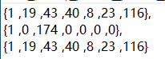

<p id="anchor_6_2_2"></p>

### 6.2.2 Run Action Group

[Read Action Data Program](../_static/source_code/read_uhand.zip)

[ Action Running Program](../_static/source_code/uhand_actions.zip)

* **Write Action Group**

(1) Add the acquired action group data into `Program/uhand_actions/actions.h`.


(2) The macro definition **"action_count"** represents the number of current action groups. If a new action group needs to be added, please add 1 to the original data.

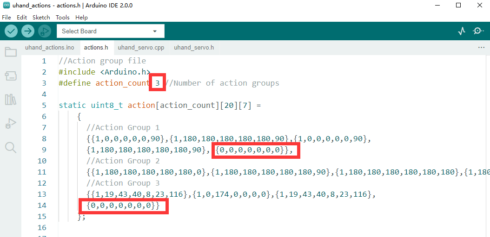

Please make sure that the current action data is a one-dimensional array when adding new action group data. In the action group data, the 0<sup>th</sup> bit in the data tells whether the current action group is a valid data or not. **"1"** represents the action group is running. **"0"** indicates that the running is completed. The 1<sup>st</sup> to 6<sup>th</sup> bits correspond to the angles of the servos 1 to 6 respectively.  

:::{Note}
Each action group data must end with {0,0,0,0,0,0,0,0} to indicate the current action group running has finished.
:::

(3) After adding the action group data, please refer to "**Basic Program Download**" to download the "[**uhand_actions.ino**](../_static/source_code/read_uhand.zip)" program to the Arduino UNO controller board.

(4) Once the download is completed, power on the robotic hand to run the set action group.

* **Program Outcome**

Power on the robotic hand. Keep the Type-B cable connected to the computer. Turn on the serial monitor, and select a baud rate of **"115200"**.

Once the action group is completed, the serial port monitor displays **"The action group is running successfully!"**, indicating successful execution of the action group.

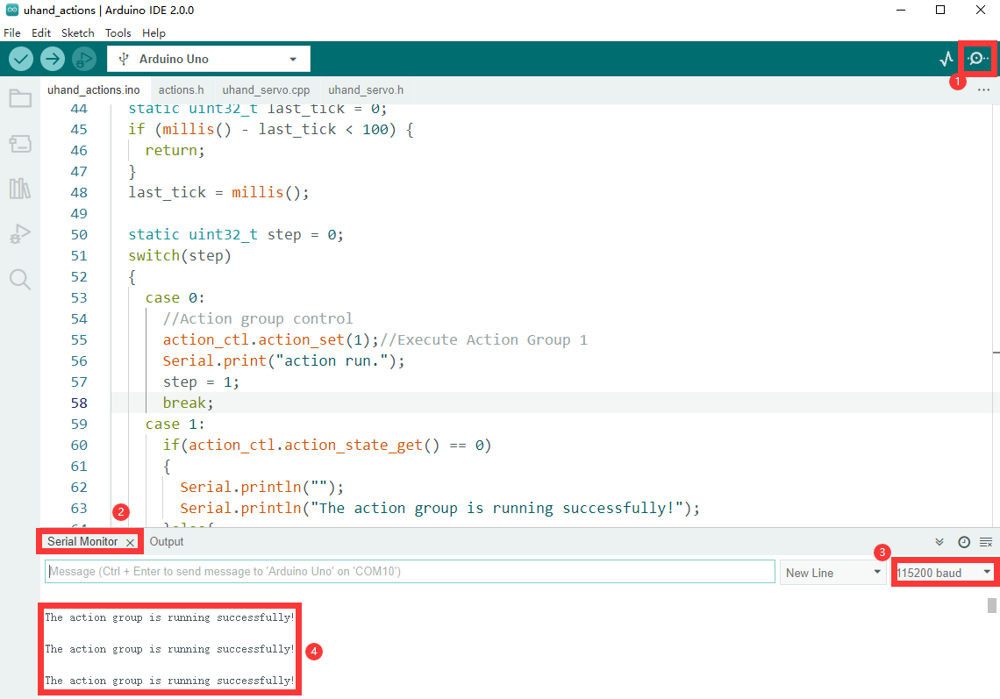

* **Program Analysis**

(1) Initialize the baud rate of the serial port to 115200, and then initialize the servo pins.

{lineno-start=19}

```python
void setup() {
  // put your setup code here, to run once:
  Serial.begin(115200);
  // 设置串行端口读取数据的超时时间(set the timeout for serial port reading data)
  Serial.setTimeout(500);
  
  // 绑定舵机IO口(bind servo IO pin)
  for (int i = 0; i < 6; ++i) {
    servos[i].attach(servoPins[i]);
  }

  delay(2000);
  Serial.println("start");
}
```

(2) In the `user_task()` function, set the current action group number to be executed using the `action_ctl.action_set()` function. For example, the code `action_ctl.action_set(1)` sets the current action group number to be executed as 1. Use the action_state_get() function to obtain the current action group being executed. The return value is the current action group number being executed, or 0 if it has already been completed.

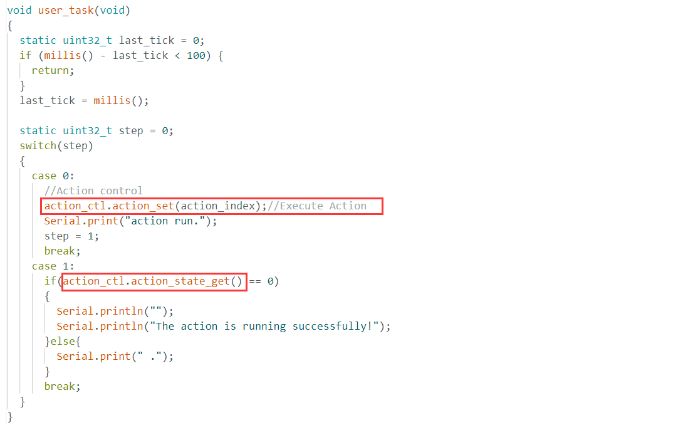

(3) Use the `action_ctl.action_task()` function to set the corresponding servo angle for the current action.

{lineno-start=11}

```python
void HW_ACTION_CTL::action_task(void){
  static uint32_t last_tick = 0;
  static uint8_t step = 0;
  static uint8_t num = 0 , delay_count = 0;
  if(action_num != 0 && action_num <= action_count)
  {
    // 间隔时间(interval)
    if (millis() - last_tick < 100) {
      return;
    }
    last_tick = millis();
    
    switch(step)
    {
      case 0: //运行动作(run action)
        if(action[action_num-1][num][0] != 0)
        {
          extended_func_angles[0] = action[action_num-1][num][1];
          extended_func_angles[1] = action[action_num-1][num][2];
          extended_func_angles[2] = action[action_num-1][num][3];
          extended_func_angles[3] = action[action_num-1][num][4];
          extended_func_angles[4] = action[action_num-1][num][5];
          extended_func_angles[5] = action[action_num-1][num][6];

          step = 1;

        }else{ //若运行完毕(if the running is finished)
          num = 0;
          // 清空动作组变量(clear the action group variable)
          action_num = 0;
          
        }
        break;
      case 1: //等待动作运行(wait for action running)
        delay_count++;
        if(delay_count > 2)
        {
          num++;
          delay_count = 0;
          step = 0;
        }
        break;
      default:
        step = 0;
        break;
    }
  }
}
```

(4) Call the `servo_control()` function to control the servo to turn to the corresponding angle and achieve the corresponding action. If you want to modify the rotation speed of the servos, make sure the sum of the coefficients of the two items adds up to 1. For example, if you change the coefficient of the actual value to 0.5, then the corresponding actual value of the expected value needs to be changed to 0.5 as well. After modifying the values, download the program, and the subsequent servo speed of the robotic hand will increase significantly.

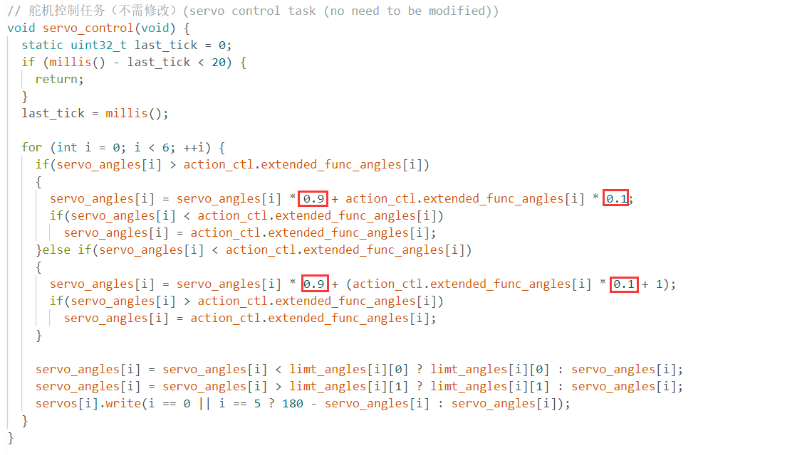