# 7. Secondary Development Instruction

## 7.1 Sensor Installation and Wiring Installation

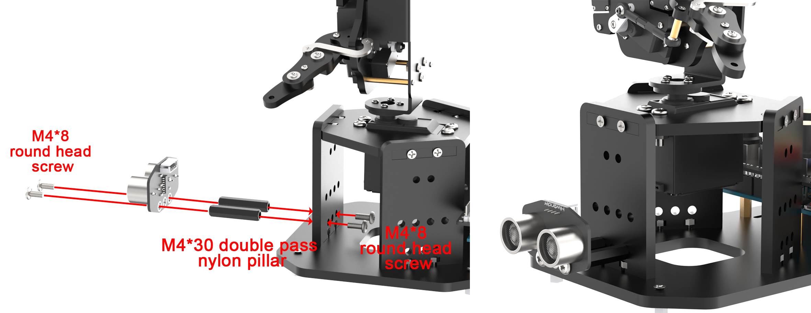

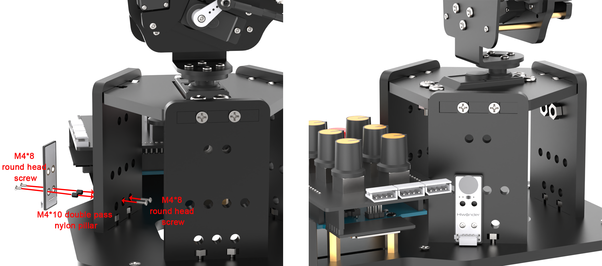


## 7.2 Secondary Development Library File Introduction 

During the process of developing, you can use certain library files to call programs easily, including official Arduino library files `servo` and `tone` and custom library files "**Ultrasound**", "**SparkFun_APDS9960**", and "**FastLED**".

This section explains the custom library files used in uHand UNO's secondary development, as well as the main programs used to call them. The `FastLED` library has been packaged, and it will not be analyzed further in this section.

###  7.2.1 Ultrasound Library File (Ultrasound)

The `Ultrasound` library function is used to control the transmission and reading of information from the glowing ultrasonic module, set the color of the RGB LEDs on the module, and obtain the measured distance. In the subsequent game of ultrasonic ranging and ball grasping, the function is called to detect the distance and control the color change of the LEDs.

Here are some of the frequently used functions in the "**Ultrasound**"：

### 7.2.2 Member Function (Ultrasound:: Color) 

{lineno-start=80}

```
void Ultrasound::Color(uint8_t r1, uint8_t g1, uint8_t b1, uint8_t r2, uint8_t g2, uint8_t b2)
{
  uint8_t RGB[6]; 
  uint8_t value = RGB_WORK_SIMPLE_MODE;
  
  wireWriteDataArray(ULTRASOUND_I2C_ADDR, RGB_WORK_MODE,&value,1);
  RGB[0] = r1;RGB[1] = g1;RGB[2] = b1;//RGB1
  RGB[3] = r2;RGB[4] = g2;RGB[5] = b2;//RGB2
  wireWriteDataArray(ULTRASOUND_I2C_ADDR, RGB1_R,RGB,6);
}
```

The `Ultrasound:: Color` is one of the member functions in the "**Ultrasound**" primarily used to control the color of RGB LEDs on the ultrasonic module. It receives six parameters r1, g1, b1, r2, b2, and g2, which respectively represent the red, green, and blue of the two RGB lights on the left and right sides of the ultrasonic module. Please refer to the table below for more information on the function.

<table  class="docutils-nobg" style="text-align:center;" border="1">
<colgroup>
<col  />
<col  />
<col  />
<col  />
</colgroup>
<tbody>
<tr>
<td colspan="4" >Ultrasound::Color()</td>
</tr>
<tr>
<td >Function Description</td>
<td colspan="3" >To control the color of the RGB lights on the ultrasonic module.</td>
</tr>
<tr>
<td >Parameters</td>
<td >r1, g1, b1, r2, b2, and g2</td>
<td >Return Value</td>
<td >Noun</td>
</tr>
<tr>
<td >Usage Instructions</td>
<td colspan="3" ><ol type="1">
<li><p>Ultrasound ul; (create an ultrasound object)</p>
<p>2) ul.Color(0,0,255,0,0,255);</p></li>
</ol></td>
</tr>
</tbody>
</table>

Use `wireWriteDataArray` in the function to write the date to the I2C address of the glowing ultrasonic sensor. Specifically, it writes a single-byte data which is the value of `RGB_WORK_SIMPLE_MODE` to the address `ULTRASOUND _I2C_ADDR`.

Subsequently, it assigns the transmitted RGB values of the two colors (RGB1 and RGB2) to the first six elements of the RGB array. Finally, it uses the function "**wireWriteDataArray**" again to transmit the RGB values of the two colors set before to the ultrasonic sensor via the I2C protocol.

### 7.2.3 Member Function (Ultrasound::GetDistance)

The `Ultrasound::GetDistance` is one of the member functions in the "**Ultrasound**" class used to obtain the distance data from the ultrasonic sensor.

The function uses the `wireReadDataArray` to read data from the I2C address of the ultrasonic sensor. It reads 2 bytes of data starting from offset 0 of the address `ULTRASOUND_I2C_ADDR`, then stores the data in the variable "**distance**" to obtain the distance data from the sensor.

{lineno-start=92}

```
u16 Ultrasound::GetDistance()
{
  u16 distance;
  wireReadDataArray(ULTRASOUND_I2C_ADDR, 0,(uint8_t *)&distance,2);
  return distance;
}
```

<table  class="docutils-nobg" style="text-align:center;" border="1">
<colgroup>
<col  />
<col  />
<col  />
<col  />
</colgroup>
<tbody>
<tr>
<td colspan="4" >Ultrasound::GetDistance()</td>
</tr>
<tr>
<td >Function Description</td>
<td colspan="3" >To obtain directly the measurement distance from the ultrasonic sensor.</td>
</tr>
<tr>
<td >Parameters</td>
<td >None</td>
<td >Return Value</td>
<td >Return the distance measurement value as u16 type.</td>
</tr>
<tr>
<td >Usage Instructions</td>
<td colspan="3" ><ol type="1">
<li><p>Ultrasound ul; (create an ultrasound object)</p>
<p>ul.GetDistance(); (return to the directly measured distance value, which may be affected by interference)</p></li>
</ol></td>
</tr>
</tbody>
</table>

### 7.2.4 Member Function (Ultrasound::Filter)

The `Ultrasound::Filter` is one of the member functions in the "**Ultrasound**" class used to filter the obtained data via the function "**GetDistance**", which reduces interference to obtain a smoother average value.

Initially, the program defines the filter size as 3 to store the three recently -read ultrasound testing values. A static integer array "**filter_buf**" is declared with the size of FILTER_N + 1 (which is 4). 

 Then the function reads a new testing value from "**GetDistance**" to store it in the last position of the array "**filter_buf**". When the data accumulates to a certain number, all the data in the array "**filter_buf**" is left-shifted one byte (discarding the lowest byte data), and all the new data is added to the variable "**filter_sum**" to calculate the sum of all stored data easily.

 Finally, the function returns the calculated average value which is calculated by dividing the accumulated sum by the filter length. The result is forced to be converted to the integer type and be returned.

{lineno-start=100}

```
#define FILTER_N 3                //递推平均滤波法(recursive averaging filter)
static int filter_buf[FILTER_N + 1];

int Ultrasound::Filter(void) {
  int i;
  int filter_sum = 0;
  filter_buf[FILTER_N] = GetDistance();     //读取超声波测值(read ultrasonic detection value)
  for(i = 0; i < FILTER_N; i++) {
    filter_buf[i] = filter_buf[i + 1];               // 所有数据左移，低位仍掉(shift all data to the left and remove the low bits)
    filter_sum += filter_buf[i];
  }
  return (int)(filter_sum / FILTER_N);
}
```

<table  class="docutils-nobg"  style="text-align:center;" border="1">
<colgroup>
<col  />
<col  />
<col  />
<col  />
</colgroup>
<tbody>
<tr>
<td colspan="4" >Ultrasound::Filter()</td>
</tr>
<tr>
<td >Function Description</td>
<td colspan="3" >To obtain the measurement value after filtering.</td>
</tr>
<tr>
<td >Parameters</td>
<td >Noun</td>
<td >Return Value</td>
<td >Return the distance measurement value after the filtering as int type.</td>
</tr>
<tr>
<td >Usage Instructions</td>
<td colspan="3" >
<p>(1) Ultrasound ul; (create ultrasound object)</p>
<p>(2) ul.GetDistance(); (return to the directly measured distance value to avoid interference)</p>
</td>
</tr>
</tbody>
</table>

## 7.3 Ultrasonic Ranging

In this section, you can learn to detect the distance of obstacle through glowing ultrasonic module. To control the opening and closing of the robotic hand, and the color changing of RGB light.

### 7.3.1 Program Flowchart

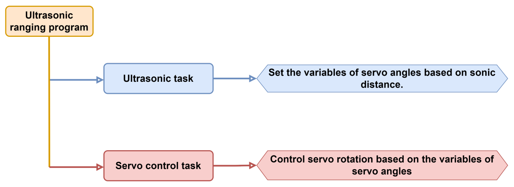

### 7.3.2 Ultrasonic Sensor


This is a glowing ultrasonic ranging module. It adopts an I2C communication interface, which can read the range measured by an ultrasonic sensor through I2C communication.

* **Wiring**

Connect the ultrasonic module to an I2C interface on the expansion board with the 4Pin wire.

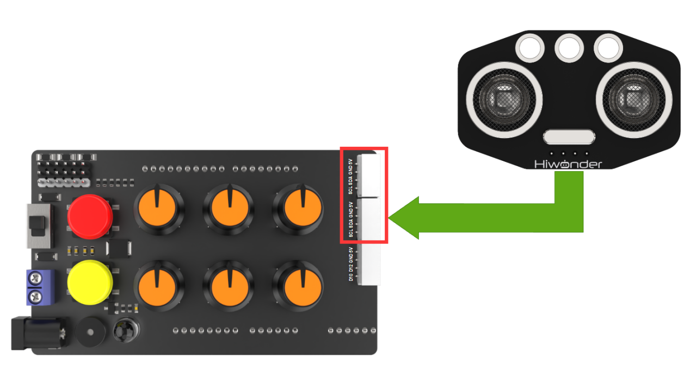

### 7.3.3 Program Download 

[uhand_ultrasonic_ranging](../_static/source_code/uhand_ultrasonic_ranging.zip)

:::{Note}

- Remove the Bluetooth module before downloading the program. Or the program will fail to download because of the serial port conflict.</span>

- Please switch the battery box to the 'OFF' when connecting the Type-B download cable. This action prevents the download cable from accidentally touching the power pins of the expansion board, which may cause a short circuit.

:::

(1) Locate and open [**uhand_ultrasonic_ranging.ino**](../_static/source_code/uhand_ultrasonic_ranging.zip) program file in the same directory of this section.

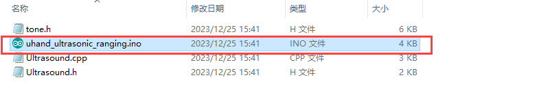

(2) Connect Arduino to the computer with the UNO data cable (Type-B) .


(3) Click **"Select Board"**, and the software will automatically detect the current Arduino serial port. Next, click to connect.


(4) Click  to download the program into Arduino. Then just wait for it to complete.


### 7.3.4 Program Outcome

When powered on, the robotic hand will return to the neutral position first. At the same time, the RGB lights on light-emitting ultrasonic module and the expansion board will turn blue.

Put the obstacle directly in front of the ultrasonic module and move it slowly towards the module.

(1) When the distance is more than 20cm, five fingers of the hand will open. At this time, the RGB lights on the ultrasonic module and the expansion board will turn blue;

(2) When the distance is 10cm to 20cm, the hand will close slowly as the obstacle get closer. At the same time, the RGB lights on the ultrasonic module and the expansion board will turn purple gradually;

(3) When the distance is less than 10 cm, the hand will close. At the same time, the RGB lights on the ultrasonic module and expansion board will turn red.

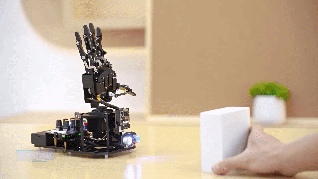

### 7.3.5 Brief Program Analysis 

[uhand_ultrasonic_ranging](../_static/source_code/uhand_ultrasonic_ranging.zip)

* **Import Library File**

Import the necessary library files for RGB control, servo control and the glowing ultrasonic sensor for the game.

{lineno-start=5}

```
#include <FastLED.h> //RGB控制库（需要导入库）(RGB control library(need to import libraries))
#include <Servo.h> //舵机库(servo library)
#include "tone.h" //音调库(tone library)
#include "Ultrasound.h" //发光超声波库(glowy ultrasonic library)
```

* **Pin Definition and Object Creation**

(1) The Arduino pins for hardware connections are defined, primarily including six servo pins, one buzzer pin, and one RGB LED pin.

{lineno-start=17}

```
//按键引脚(button pin)
const static uint8_t keyPins[2] = { 8, 9 };
// 舵机引脚(servo pin)
const static uint8_t servoPins[6] = { 7, 6, 5, 4, 3, 2 };
// 蜂鸣器引脚(buzzer pin)
const static uint8_t buzzerPin = 11;
// RGB灯引脚(RGB LED pin)
const static uint8_t rgbPin = 13;
```

(2) Next, the variables controlling RGB lights and servos are defined. `extended_func_angles` array is used to store expected angles of each servo. And the `servo_angles` array is used to store actual angles of each servo, ranging from 0 to 180.

{lineno-start=26}

```
// RGB灯颜色对象(RGB LED color object)
static CRGB rgbs[1];

// 舵机角度相关变量 （舵机下标对应的位置： 0-大拇指 1-食指 2-中指 3-无名指 4-小指 5-云台）(variables related to servo angles (the corresponding relationship between the servos and the robotic hand: 0-thumb, 1-index finger, 2-middle finger, 3-ring finger, 4-pinky finger, and 5-pan-tilt))
static uint8_t extended_func_angles[6] = { 90, 90, 90, 90, 90, 90 }; /* 二次开发例程使用的角度数值(angle values used for secondary development) */
static float servo_angles[6] = { 90, 90, 90, 90, 90, 90 };  /* 舵机实际控制的角度数值(angle values for actual servo control) */
```

Regarding the desired and actual values, you can check the `servo_control` function called in the 'loop' main function.

If you want the servo to gradually move towards the target position, you need to call `servo_angles[i] = servo_angles[i] * 0.85 + extended_func_angles[i] * 0.15` in the control task function.

This allows the servo to move each time at 85% of the actual value and 15% of the expected value, so that the actual value will gradually approach the expected value. And when it is equal to the expected value, the robotic arm stops moving.

{lineno-start=151}

```
// 舵机控制任务(servo control task)
void servo_control(void) {
  static uint32_t last_tick = 0;
  // 间隔25毫秒(interval 25 microseconds)
  if (millis() - last_tick < 25) {
    return;
  }
  last_tick = millis();
  // 对6个舵机分别赋值(assign values to the six servos individually)
  for (int i = 0; i < 6; ++i) {
    servo_angles[i] = servo_angles[i] * 0.85 + extended_func_angles[i] * 0.15;
    servos[i].write(i == 0 || i == 5 ? 180 - servo_angles[i] : servo_angles[i]);
  }
}
```

(3) Create six servo control objects and an ultrasonic object for subsequent control and data reading. Please note that task functions execute different control tasks. The `servo_control` function controls the servo. The `tune_task` function controls the buzzer. And the `ultrasound_task` function reads the ultrasonic sensor data.

{lineno-start=38}

```
// 创建舵机控制对象(create servo control object)
Servo servos[6];

// 创建超声波对象(create ultrasonic object)
Ultrasound ul;

// 舵机控制任务(servo contorl task)
static void servo_control(void);
// 蜂鸣器鸣响函数(buzzer sound function)
void play_tune(uint16_t *p, uint32_t beat, uint16_t len);
// 蜂鸣器任务(buzzer task)
void tune_task(void);
// 超声波任务(ultrasonic task)
void ultrasound_task(void);
```

* **Initialization Settings**

(1) The `setup ()` function mainly initializes associated hardware devices. Starting with the serial port, which sets baud rate as 9,600 and a read timeout as 500ms.

{lineno-start=55}

```
  // 初始化串口并设置速率(initialize serial port and set velocity)
  Serial.begin(9600);
  // 设置串行端口读取数据的超时时间(set timeout for serial port reading data)
  Serial.setTimeout(500);
```

(2) Set the pin of the buzzer as output mode.

{lineno-start=62}

```
  // 初始化蜂鸣器引脚(initialize buzzer pin)
  pinMode(buzzerPin, OUTPUT);
```

(3) Assign servo IO port and you can control via pins easily.

{lineno-start=64}

```
  // 绑定舵机IO口(bind servo IO port)
  for (int i = 0; i < 6; ++i) {
    servos[i].attach(servoPins[i]);
  }
```

(4) Use FastLED library to initialize the RGB light on the expansion board and connect it to the rgbPin. Set the color of RGB as green by `rgbs[0] = CRGB(0, 255, 0)`. Finally, use `FastLED.show` function to display the set color.

{lineno-start=68}

```
  // 初始化RGB控制对象(initialize RGB control object)
  FastLED.addLeds<WS2812, rgbPin, GRB>(rgbs, 1);
  // 初始化颜色对象(initialize color object)
  rgbs[0] = CRGB(0, 255, 0);
  // 根据颜色发光(light up based on the color)
  FastLED.show();
```

* **Ultrasonic Detection**

(1) After finishing the initialization, call the ultrasonic task function "ultrsound_task" in "loop" main function. It is used for ranging. The function first defines the variable `last_tick` , which is used to calculate the intervals.

(2) Check if 100 milliseconds have passed since the last function "ultrasound_task" calling. If so, it will execute the following code. Or the function returns directly. The function "millis" is the time since starting Arduino board. In this way, the function ensures that the following distance detection tasks are performed every 100 milliseconds.

(3) Next，the ultrasonic distance value after filtering is obtained by "ul. Filter" function, and the result will be stored in variable "dis".

{lineno-start=91}

```
// 超声波任务(ultrasonic task)
void ultrasound_task(void)
{
  static uint32_t last_tick = 0;
  // 间隔100ms(interval 100ms)
  if (millis() - last_tick < 100) {
    return;
  }
  last_tick = millis();

  // 获取超声波距离(obtain the obstacle distance from the ultrasonic sensor)
  int dis = ul.Filter();
  // Serial.println(dis);
```

* **Performance Feedback**

(1) If the obstacle distance is more than 200mm, the program controls No.1 to 5 servos rotating to the position of 180 degrees to open the hand. Control the RGB lights on the glowing ultrasonic module and the expansion board turning to blue by "**rgbs**" and "**ul.color**" functions at the same time.

"**rgbs.r**", "**rgbs.g**", "**rgbs.b**" represents corresponding RGB three primary colors brightness values of the lights on the expansion board, while "**ul.color (0,0,255,0,0,255)**" represents the RGB primary colors brightness values of two lights on the light-emitting ultrasonic.

{lineno-start=105}

```
  // 若大于200mm(if it is greater than 200mm)
  if(dis >= 200)
  {
    //张开手掌(open the robotic hand)
    for(int i = 0 ; i < 5 ; i++)
    {
      extended_func_angles[i] = 180;
    }
    // RGB灯蓝色(RGB LED turns blue)
    rgbs[0].r = 0;
    rgbs[0].g = 0;
    rgbs[0].b = 255;
    FastLED.show();
    // 发光超声波蓝色(ultrasonic sensor turns blue)
    ul.Color(0,0,255,0,0,255);
```

(2) If the obstacle distance is less than 50mm, control the servo No.1 to 5 rotating to the position of 0 degree to the closed hand. Control the RGB lights on the light-emitting ultrasonic module and the expansion board turning to red by "**rgbs**" and "**ul.color**" functions at the same time.

{lineno-start=120}

```
else if(dis <= 50 && dis >= 0) //若小于50mm(if it is less than 50mm)
  {
    //闭合手掌(close the robotic hand)
    for(int i = 0 ; i < 5 ; i++)
    {
      extended_func_angles[i] = 0;
    }
    // RGB红色(RGB turns red)
    rgbs[0].r = 255;
    rgbs[0].g = 0;
    rgbs[0].b = 0;
    FastLED.show();
    // 发光超声波红色(ultrasonic sensor turns red)
    ul.Color(255,0,0,255,0,0);
```

(3)  When the obstacle distance is between 50mm and 200mm, set R and B in RGB elements changing as the change of "**dis**" by map function. For example, `map(dis,50,200,255,0)` maps the obstacle distance of "**dis**" to R element. The range of "**dis**" is from 50mm to 200mm and R ranges from 255 to 0. 

For mapping servo angles, you can follow the same logic as described above. In this case, the obstacle's distance is mapped to the servo's opening and closing angle range, which typically spans from 0 to 180 degrees.

{lineno-start=134}

```
else{
    // 颜色根据距离变化而变化，越靠近R越大B越小，越远则反之(The color changes based on the distance, with the R (red) increasing and the B (blue) decreasing as it gets closer; otherwise, it gets farther)
    int color[3] = {map(dis , 50 , 200 , 255 , 0),0,map(dis , 50 , 200 , 0 , 255)};
    // 各手指随距离越近越弯曲，越远越伸直(the fingers become more bent as the distance gets closer, and straighten out more as the distance gets farther)
    uint8_t angles = map(dis , 50 , 200 , 0 , 180);
    for(int i = 0 ; i < 5 ; i++)
    {
      extended_func_angles[i] = angles;
    }
    rgbs[0].r = color[0];
    rgbs[0].g = color[1];
    rgbs[0].b = color[2];
    FastLED.show();
    ul.Color(color[0],color[1],color[2],color[0],color[1],color[2]);
  }
}
```

### 7.3.6 Function Extension

How to modify the color gradient of an RGB LED from purple to yellow?

Please refer to the following steps:

(1) Find mapping instructions in the program for controlling the RGB lights to change with the change of the distance. Set R and B in RGB elements changing as the change of "**dis**" by "**map**" function. "**map (dis, 50,200,255,0)**" maps the obstacle distance "**dis**" to the R element. And "**map (dis, 50,200,0,255)**" maps the obstacle distance "**dis**" to the B element.

Therefore, as the distance decreases, the proportion of red increases while the proportion of blue decreases, resulting in a gradient color displayed as purple

{lineno-start=136}

```
    int color[3] = {map(dis , 50 , 200 , 255 , 0),0,map(dis , 50 , 200 , 0 , 255)};
```

(2)  Change the B element in RGB to the G element. Note that the range of color elements is 0 to 255. Next, download the program again. The closer the obstacle is, the more the proportion of red and the less proportion of green. The RGB light displays yellow. 

{lineno-start=}

```
    int color[3] = {map(dis , 50 , 200 , 255 , 0),0,map(dis , 50 , 200 , 0 , 255),0};
```

(3) About the RGB color table, you can access :<https://www.bchrt.com/tools/rgbcolor/>to research. 

### 7.3.7 FAQ

Q:since the code was upload, the distance measured by the ultrasound is always 0.

A:please check that you have connected the 4-pin cable to the I2C interface and turn the knobs on the expansion board to the initial position.

Q:the distance measured by the ultrasonic sensor is sometimes accurate, and sometimes inaccurate.

A:please use a smooth and flat object for distance measurement, and avoid prolonged close-range detection of the obstacle.

## 7.4 Ultrasonic Ball Grasping

In this section, you can learn how to use a glowing ultrasonic module to detect obstacle's distance, and control the robotic hand to grasp and release a ball.

### 7.4.1 Program Flowchart


### 7.4.2 Ultrasonic Sensor


This is a glowing ultrasonic ranging module. It adopts an I2C communication interface, which can read the range measured by an ultrasonic sensor through I2C communication.

* **Wiring**

<span class="mark">Connect the ultrasonic module to an I2C interface on the expansion board with the 4Pin wire.</span>


### 7.4.3 Program Download 

[uhand_ultrasonic_grasp](../_static/source_code/uhand_ultrasonic_grasp.zip)

:::{Note}

- Remove the Bluetooth module before downloading the program. Or the program will fail to download because of the serial port conflict.

- Please switch the battery box to the "**OFF**" when connecting the Type-B download cable. This action prevents the download cable from accidentally touching the power pins of the expansion board, which may cause a short circuit.

  :::

(1) Locate and open "[**uhand_ultrasonic_grasp.ino**](../_static/source_code/uhand_ultrasonic_grasp.zip)" program file in the same directory of this section.

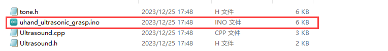

(2) Connect Arduino to the computer with the UNO cable (Type-B) .


(3) Click **"Select Board"**, and the software will automatically detect the current Arduino serial port. Next, click to connect.


(4) Click  to download the program into Arduino. Then just wait for it to complete.


### 7.4.4 Program Outcome

(1) When the glowing ultrasonic module does not detect an obstacle, the pan-tilt of the robotic hand remains in the neutral position mode.

(2) The buzzer on the expansion board makes a sound when the obstacle is recognized, while the RGB lights on the ultrasonic module and the expansion board turn green. At this time, if you put the ball in the center of the robotic hand, it will close to grasp the ball and rotate to the left side releasing the ball (from the robotic hand's perspective). Next, it will return to the neutral position mode.

Note: After putting the ball, you need to move the ball out of the detection range of the glowing ultrasonic module. Or the robotic hand can not return to the neutral position mode.

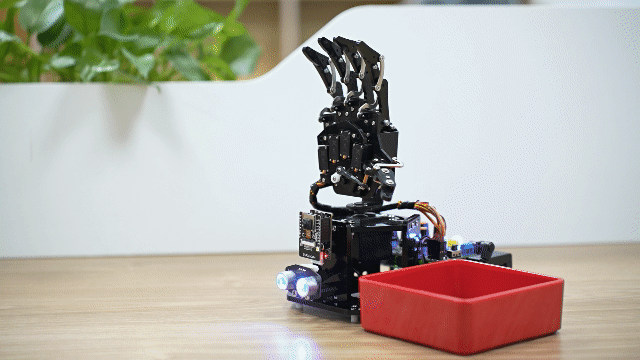

### 7.4.5 Brief Program Analysis 

[uhand_ultrasonic_grasp](../_static/source_code/uhand_ultrasonic_grasp.zip)

* **Import Library File**

Import the necessary library files for RGB control, servo control and the glowing ultrasonic sensor for the game.

{lineno-start=1}

```
#include <FastLED.h> //RGB控制库（需要导入库）(RGB control library(need to import libraries))
#include <Servo.h> //舵机库(servo library)
#include "tone.h" //音调库(tone library)
#include "Ultrasound.h" //发光超声波库(glowy ultrasonic library)
```

* **Pin Definition and Object Creation**

(1) Initially, the Arduino pins for hardware connections are defined, primarily including six servo pins, one buzzer pin, and one RGB LED pin.

{lineno-start=13}

```
//按键引脚(button pin)
const static uint8_t keyPins[2] = { 8, 9 };
// 舵机引脚(servo pin)
const static uint8_t servoPins[6] = { 7, 6, 5, 4, 3, 2 };
// 蜂鸣器引脚(buzzer pin)
const static uint8_t buzzerPin = 11;
// RGB灯引脚(RGB LED pin)
const static uint8_t rgbPin = 13;
```

(2) Next, the variables controlling RGB lights and servos are defined. `extended_func_angles` array is used to store desired angles of each servo. And the `servo_angles` array is used to store actual angles of each servo, ranging from 0 to 180.

{lineno-start=22}

```
// RGB灯颜色对象(RGB LED color object)
static CRGB rgbs[1];

// 舵机角度相关变量 （舵机下标对应的位置： 0-大拇指 1-食指 2-中指 3-无名指 4-小指 5-云台）(variables related to servo angles (the corresponding relationship between the servos and the robotic hand: 0-thumb, 1-index finger, 2-middle finger, 3-ring finger, 4-pinky finger, and 5-pan-tilt))
static uint8_t extended_func_angles[6] = { 90, 90, 90, 90, 90, 90 }; /* 二次开发例程使用的角度数值(angle values used for secondary development) */
static float servo_angles[6] = { 90, 90, 90, 90, 90, 90 };  /* 舵机实际控制的角度数值(angle values for actual servo control) */
```

Regarding the desired and actual values, you can check the `servo_control` function called in the `loop` main function.

If you want the servo to gradually move towards the target position, you need to call `servo_angles[i] = servo_angles[i] * 0.85 + extended _func_ a ngles[i] * 0.15` in the control task function.

This allows the servo to move each time at 85% of the actual value and 15% of the expected value, so that the actual value will gradually approaches the expected value. And when it is equal to the expected value, uHand UNO stops moving.

{lineno-start=209}

```
// 舵机控制任务(servo control task)
void servo_control(void) {
  static uint32_t last_tick = 0;
  // 间隔25毫秒(interval 25 microseconds)
  if (millis() - last_tick < 25) {
    return;
  }
  last_tick = millis();
  // 对6个舵机分别赋值(assign values to the six servos individually)
  for (int i = 0; i < 6; ++i) {
    servo_angles[i] = servo_angles[i] * 0.85 + extended_func_angles[i] * 0.15;
    servos[i].write(i == 0 || i== 5 ? 180 - servo_angles[i] : servo_angles[i]);
  }
}
```

(3) Create six servo control objects and an ultrasonic object for subsequent control and data reading. Please note that task functions execute different control tasks. The `servo_control` function controls the servo. The `ultrasound_task` function controls the buzzer. And the `ultrasound_task` function reads the ultrasonic sensor data.

{lineno-start=209}

```
// 舵机控制任务(servo control task)
void servo_control(void) {
  static uint32_t last_tick = 0;
  // 间隔25毫秒(interval 25 microseconds)
  if (millis() - last_tick < 25) {
    return;
  }
  last_tick = millis();
  // 对6个舵机分别赋值(assign values to the six servos individually)
  for (int i = 0; i < 6; ++i) {
    servo_angles[i] = servo_angles[i] * 0.85 + extended_func_angles[i] * 0.15;
    servos[i].write(i == 0 || i== 5 ? 180 - servo_angles[i] : servo_angles[i]);
  }
}
```

* **Initialization Setting**

(1) The `setup ()` function mainly initializes associated hardware devices. Starting with the serial port, which sets baud rate as 9,600 and a read timeout as 500ms.

{lineno-start=51}

```
  // 初始化串口并设置速率(initialize serial port and set velocity)
  Serial.begin(9600);
  // 设置串行端口读取数据的超时时间(set timeout for serial port reading data)
  Serial.setTimeout(500);
```

(2) Set the pin of the buzzer to output mode.

{lineno-start=58}

```
  // 初始化蜂鸣器引脚(initialize buzzer pin)
  pinMode(buzzerPin, OUTPUT);
```

(3) Assign servo IO port and you can control via pins easily.

{lineno-start=60}

```
  // 绑定舵机IO口(bind servo IO port)
  for (int i = 0; i < 6; ++i) {
    servos[i].attach(servoPins[i]);
  }
```

(4) Use `FastLED` library to initialize the RGB light on the expansion board and connect it to the `rgbPin`. Set the color of RGB as green by `rgbs[0] = CRGB(0, 255, 0)`. Finally, use `FastLED.show` function to display the set color.

{lineno-start=64}

```
  // 初始化RGB控制对象(initialize RGB control object)
  FastLED.addLeds<WS2812, rgbPin, GRB>(rgbs, 1);
  // 初始化颜色对象(initialize color object)
  rgbs[0] = CRGB(0, 255, 0);
  // 根据颜色发光(light up based on the color)
  FastLED.show();
```

(5) Set the buzzer off after making a short sound of the 1000Hz frequency by `tone` and `noTone` functions.

{lineno-start=70}

```
  // 蜂鸣器鸣响，频率1000Hz(the buzzer sounds at the frequency of 1000Hz)
  tone(buzzerPin, 1000);
  // 延时(delay)
  delay(100);
  // 蜂鸣器停止(the buzzer stops)
  noTone(buzzerPin);
}
```

* **Loop Call Sub-function**

After finishing the initialization, enter the `loop` main function. First call `ultrsound _task` function. It is used for ranging between the ultrasonic sensor and the obstacle to execute grasping and putting. Then, call "**tune_task**" function to execute the buzzer task. Finally, call `servo_control` function to control the servos.

{lineno-start=78}

```
void loop() {
  // 超声波任务(ultrasonic task)
  ultrasound_task();
  // 蜂鸣器鸣响任务(buzzer sound task)
  tune_task();
  // 舵机控制任务(servo control task)
  servo_control();
}
```

* **Ultrasonic Detection**

Define `ultrsound_task` function to execute ultrasonic detection. If the obstacle is detected, The robotic hand will grasp the ball. And it will put down the ball once detecting the obstacle again.

{lineno-start=88}

```
// 超声波任务(ultrasonic task)
void ultrasound_task(void)
{
  static uint32_t last_tick = 0;
  static int posi = 100;
  static uint8_t step = 0;
  static uint8_t delay_count = 0;
  static uint8_t temp = 0;
```

(1) The `last_tick` variable is defined, mainly used for calculate the time intervals. The "**posi**" is the neutral position of the servo with the initial value 90. The "**step**" variable is used to track current task's phrase. The "**delay_count =0**" is the delay count value. And the "**temp**" variable is the mark bit of putting the ball. Put down the ball with 1 and grasp with 0. 

{lineno-start=89}

```
void ultrasound_task(void)
{
  static uint32_t last_tick = 0;
  static int posi = 100;
  static uint8_t step = 0;
  static uint8_t delay_count = 0;
  static uint8_t temp = 0;
```

(2) Check if 100 milliseconds have passed since the last function "**ultrasound_task**" calling. If so, it will execute the following code. Or the function returns directly. The function `millis()` is the time since starting Arduino board. In this way, the function ensures that the following distance detection tasks are performed every 100 milliseconds.

{lineno-start=88}

```
// 超声波任务(ultrasonic task)
void ultrasound_task(void)
{
  static uint32_t last_tick = 0;
  static int posi = 100;
  static uint8_t step = 0;
  static uint8_t delay_count = 0;
  static uint8_t temp = 0;

  // 间隔100ms(interval 100ms)
  if (millis() - last_tick < 100) {
    return;
  }
  last_tick = millis();

  // 获取超声波距离(obtain the obstacle distance from the ultrasonic sensor)
  int dis = ul.Filter();
  Serial.println(dis);
```

(3) Next, the ultrasonic distance value after filtering is obtained by `ul.Filte r` function, and the result will be stored in variable "**dis**".

{lineno-start=103}

```
  // 获取超声波距离(obtain the obstacle distance from the ultrasonic sensor)
  int dis = ul.Filter();
  Serial.println(dis);
```

(4) Access the following control process, when the distance detected by the ultrasonic module is obtained

"**case 0**": judge the current obstacle distance is more than or equal to 100mm. The RGB lights on the expansion board and the glowing ultrasonic module turn blue, if the obstacle distance is more than 100mm.

{lineno-start=109}

```
    case 0: //判断超声波距离(determine the ultrasonic distance)
      // 大于100mm(if it is greater than 100mm)
      
      if(dis >= 100)
      {
        extended_func_angles[5] = posi;
        // 蓝色(blue)
        rgbs[0].r = 0;
        rgbs[0].g = 0;
        rgbs[0].b = 255;
        FastLED.show();
        // 发光超声波蓝色(ultrasonic sensor turns blue)
        ul.Color(0,0,255,0,0,255);
```

If the obstacle distance is less than 100mm, enter "**case1**" to control the RGB lights on the expansion board and the glowing ultrasonic module turning green. And the buzzer makes a short sound.

{lineno-start=122}

```
      }else if(dis >= 0){ // 若小于100mm且大于等于0，则跳入状态2(If the value is less than 100mm and greater than or equal to 0, then proceed to state 2)
        step++;
        // 绿色(green)
        rgbs[0].r = 0;
        rgbs[0].g = 255;
        rgbs[0].b = 0;
        FastLED.show();
        ul.Color(0,255,0,0,255,0);
        delay_count = 0;
        // 鸣响一声(make a sound)
        play_tune(DOC6, 300u, 1u);
      }
      
      
      break;
```

**"case 1":** At this time, `delay_count` starts calculating and each unit is 100ms. After the hand waiting for 1000ms, the program judges whether the "**temp**" is 1. If it is 1, jump to "**case 4**". If it isn't 1, jump to **"case 2"**.

{lineno-start=137}

```
    case 1:  //递小球与接小球的延时时间(the delay time for passing the ball and catching the ball)
      delay_count++;
      if(delay_count > 10)
      {
        step++;
        delay_count = 0;
      }
      break;
```

**"case 2":** Grasp the ball entering **"case 3"**.

{lineno-start=145}

```
    case 2://抓取(grasping)
      extended_func_angles[0] = 11;
      extended_func_angles[1] = 31;
      extended_func_angles[2] = 56;
      extended_func_angles[3] = 43;
      extended_func_angles[4] = 29;
      delay_count = 0;
      step++;
      break;
```

**"case 3":** After waiting for 500ms (The hand has enough time to grasp the ball.), enter **"case 4"**.

{lineno-start=154}

```
    case 3: //等待一小会儿(wait for a while)
      delay_count++;
      if(delay_count > 5)
      {
        step++;
        temp = 1;
        delay_count = 0;
      }
      break;
```

**"case 4":** The pan-tilt servo of the robotic hand rotates and waits for 500ms before entering **"Case 5"**.

{lineno-start=163}

```
    case 4:
      extended_func_angles[5] = 0;
      delay_count = 0;
      step++;
```

**"case 5":** The robotic hand releases the ball and waits for 500ms, then the pan-tilt servo rotates to 90 degrees.

{lineno-start=167}

```
    case 5: //等待一小会儿(wait for a while)
      delay_count++;
      if(delay_count > 7)
      {
        step++;
        temp = 1;
        delay_count = 0;
      }
      break;
```

**"case 6":** Wait until there are no obstacles in front of the ultrasonic sensor before returning to **"case 0"**. This prevents the obstacle from constantly obstructing the ultrasonic sensor, resulting in effectiveness of the program.

{lineno-start=176}

```
    case 6: //放开(release)
      for(int i=0;i<5;i++)
        extended_func_angles[i] = 120;
      step++;
    break;
```

* **Servo Control**

If you want the servo to gradually move towards the target position, you need to call `servo_angles\[i\] = servo_angles\[i\] \* 0.85 + extended \_func\_ a ngles\[i\] \* 0.15` in the control task function.

This allows the servos always move according to 85% actual value and 15% desired value. So, the actual value gradually closes to the desired value. And the hand will stop moving once the former equals to the latter.

{lineno-start=209}

```
// 舵机控制任务(servo control task)
void servo_control(void) {
  static uint32_t last_tick = 0;
  // 间隔25毫秒(interval 25 microseconds)
  if (millis() - last_tick < 25) {
    return;
  }
  last_tick = millis();
  // 对6个舵机分别赋值(assign values to the six servos individually)
  for (int i = 0; i < 6; ++i) {
    servo_angles[i] = servo_angles[i] * 0.85 + extended_func_angles[i] * 0.15;
    servos[i].write(i == 0 || i== 5 ? 180 - servo_angles[i] : servo_angles[i]);
  }
}
```

* **Buzzer Control**

Control the buzzer to play the melody according to the specified rhythm and tone arrays.

{lineno-start=225}

```
void tune_task(void) {
  static uint32_t l_tune_beat = 0;
  static uint32_t last_tick = 0;
  // 若未到定时时间 且 响的时间跟上一次的一样(if it is not yet the scheduled time and the ringing duration is the same as the previous time)
  if (millis() - last_tick < l_tune_beat && tune_beat == l_tune_beat) {
    return;
  }
```

(1) Note that the "**l_tune_beat**" variable used to store the intervals (in milliseconds) between the previous and current playing tones. The "**last_tick**"variable is used to store the timestamp of last function executing. And control the buzzer to sound in the specified rhythm and tone arrays.

{lineno-start=226}

```
  static uint32_t l_tune_beat = 0;
  static uint32_t last_tick = 0;
```

(2) Determine if it is needed to play the tone, and use the `millis ()` function to get the current timestamp and compare it to `last_tick`. If the interval between the current and the previous playing is less than "**l_tune_beat**", and the value of `tune_beat` has no change (that is, "**tune_beat**" equals to `l_tune_beat`), the function returns without doing anything. This prevents repeating the same tone at the same interval.

{lineno-start=229}

```
  if (millis() - last_tick < l_tune_beat && tune_beat == l_tune_beat) {
    return;
  }
```

(3) Update the variable. Assign the value of the `tune_beat` to the `l_tune_beat` to update the `last_tick` to the current timestamp.

{lineno-start=232}

```
  l_tune_beat = tune_beat;
  last_tick = millis();
```

(4) If the `tune_num` is more than 0, there are more tones need to play. Use the `tone ()` function to play the current tone on the `buzzerPin`.

{lineno-start=235}

```
  if (tune_num > 0) {
    tune_num -= 1;
    tone(buzzerPin, *tune++);
```

(5) If the `tune_num` is less than 0, all tones finish playing. Use `noTone ()` function to stop the buzzer sounding. And reset the "**tune_beat**" and the "**l_tune_beat**" as 10 (probably the default interval) to prepare for the next tune.

{lineno-start=238}

```
} else { //无则暂停(If no, stop)
    noTone(buzzerPin);
    tune_beat = 10;
    l_tune_beat = 10;
  }
```

* **Buzzer Sound Control**

Specify the tones of the array, the interval and the number needed to play.

{lineno-start=246}

```
void play_tune(uint16_t *p, uint32_t beat, uint16_t len) {
  tune = p;
  tune_beat = beat;
  tune_num = len;
}
```

`tune = P` sets the "**tune**" variable (a pointer points to the array of tones) as the value of P. In this way, "**tune**" points to the user-provided tone array.

`tune_beat = beat` sets the "**tune_beat**" variable (the interval between the playing tones) as the value of "**beat**" to determine the rhythm of the tone.

`tune_num = len` sets the "**tune_num**" variable (the number of tones to be played) as the value of "**len**" to determine the length of the playlist.

### 7.4.6 Function Extension

How to modify the color gradient of an RGB LED from purple to yellow？

Please refer to the following steps:

(1) Find mapping instructions in the program for controlling the RGB lights to change with the change of the distance. Set R and B in RGB elements changing as the change of "**dis**" by "**map**" function. `map (dis, 50,200,255,0)` maps the obstacle distance `dis` to the R element. And "**map (dis, 50,200,0,255)**" maps the obstacle distance "**dis**" to the B element.

Therefore, as the distance decreases, the proportion of red increases while the proportion of blue decreases, resulting in a gradient color displayed as purple.

```
    int color[3] = {map(dis , 50 , 200 , 255 , 0),0,map(dis , 50 , 200 , 0 , 255)};
```

(2)  Change the B element in RGB to the G element. Note that the range of color elements is 0 to 255. Next, download the program again. The closer the obstacle is, the more the proportion of red and the less proportion of green. The RGB light displays yellow. 

```
    int color[3] = {map(dis , 50 , 200 , 255 , 0),0,map(dis , 50 , 200 , 0 , 255),0};
```

About the RGB color table, you can access ：<u><https://www.bchrt.com/tools/rgbcolor/></u> to research.

### 7.4.7 FAQ

Q:since the code was upload, the distance measured by the ultrasound is always 0.

A:please check that you have connected the 4-pin cable to the I2C interface and turn the knob on the expansion board to the initial position.

Q:the distance measured by the ultrasonic sensor is sometimes accurate, and sometimes inaccurate.

A:please use a smooth and flat object for distance measurement, and avoid prolonged close-range detection of the obstacle.

## 7.5 Finger Counting

In this section, you will know how to control the number of fingers opened on the robotic hand by counting the number of times the touch sensor is pressed.

### 7.5.1 Program Flowchart

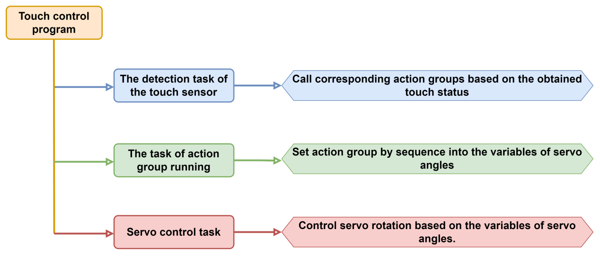

### 7.5.2 Touch Sensor

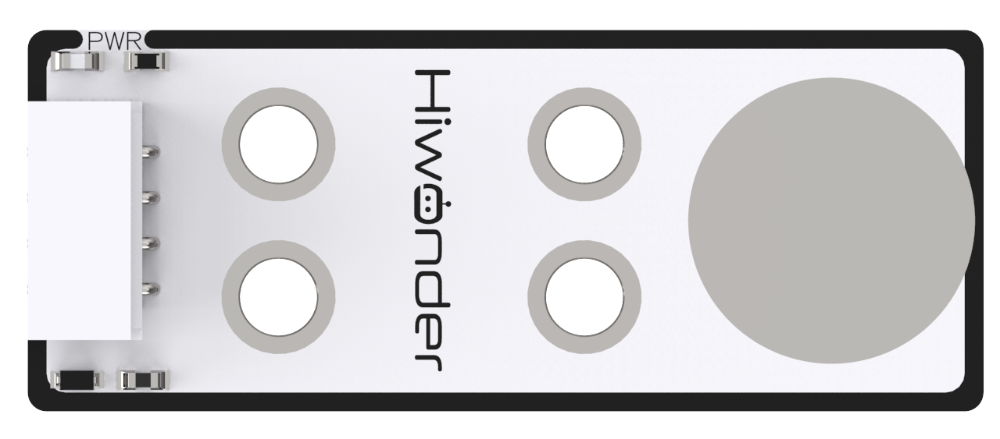

Based on the capacitive sensing principle, the touch sensor senses the touch from the human body or metal via its gold-plated contact surface.

* **Wiring**

Connect the touch sensor to the D10 and D12 interfaces on the expansion board with the 4Pin wire, as shown below:

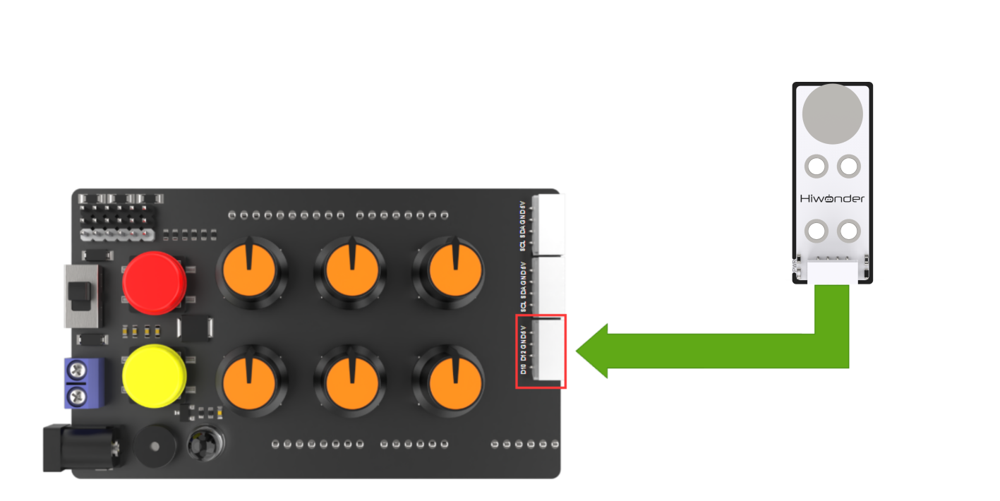

### 7.5.3 Program Download

[uhand_count_finger](../_static/source_code/uhand_count_finger.zip)

:::{Note}

- Remove the Bluetooth module before downloading the program. Or the program will fail to download because of the serial port conflict.

- Please switch the battery box to 'OFF' when connect the Type-B download cable. This action prevents the download cable from accidentally touching the power pins of the expansion board, which may cause a short circuit.

:::

(1) Locate and open [uhand_count_finger.ino](../_static/source_code/uhand_count_finger.zip) at the same directory of this section.

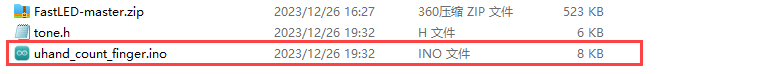

(2) Connect Arduino to the computer with the UNO data cable（Type-B）.


(3) Click **"Select Board"**, and the software will automatically detect the current Arduino serial port. Next, click to connect.


 
(4) Click  to download the program into Arduino. Then just wait for it to complete.


### 7.5.4 Program Outcome

(1) When powered on, the robotic hand clenches and its pan-tilt returns to the initial position. At the same time, the RGB light on the expansion board turns green.

(2) When you touch the touch sensor's metal surface, its blue LED briefly lights up and the thumb of the robotic hand opens. Then the index finger opens if you touch the sensor again. Subsequent presses result in each finger opening one by one.

(3) When all the fingers open, touch the touch sensor once again. The uHand UNO returns to the initial posture and the program newly counts.

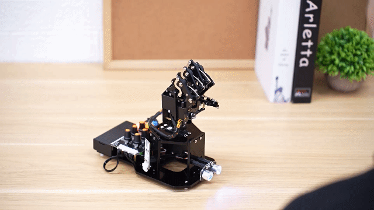

### 7.5.5 Brief Program Analysis 

[uhand_count_finger](../_static/source_code/uhand_count_finger.zip)

* **Import Library File**

Import the necessary library files for RGB control, servo control and the tone of buzzer for the game.

{lineno-start=5}

```
#include <FastLED.h> //RGB控制库（需要导入库）(RGB control library(need to import libraries))
#include <Servo.h> //舵机库(servo library)
#include "tone.h" //音调库(tone library)
```

* **Pin Definition and Object Creation**

(1) The Arduino pins for hardware connections are defined, primarily including six servo pins, one buzzer pin, and one RGB LED pin.

{lineno-start=9}

```
#define Touch_pin 12  //定义触摸传感器的信号端接控制板的数字口2(define the signal terminal of the touch sensor to be connected to the digital pin 2 on the controller board)

```

{lineno-start=18}

```
//按键引脚(button pin)
const static uint8_t keyPins[2] = { 8, 9 };
// 舵机引脚(servo pin)
const static uint8_t servoPins[6] = { 7, 6, 5, 4, 3, 2 };
// 蜂鸣器引脚(buzzer pin)
const static uint8_t buzzerPin = 11;
// RGB灯引脚(RGB LED pin)
const static uint8_t rgbPin = 13;
```

(2) Following that, variables for controlling RGB lights and servos are defined. The `extended_func_angles` array is used to store expected angles of each servo. And the `servo_angles` array is used to store actual angles of each servo, ranging from 0 to 180. The uHand UNO's initial position is set to close in the following code.

{lineno-start=28}

```
static CRGB rgbs[1];

// 舵机角度相关变量 （舵机下标对应的位置： 0-大拇指 1-食指 2-中指 3-无名指 4-小指 5-云台）(variables related to servo angles (the corresponding relationship between the servos and the robotic hand: 0-thumb, 1-index finger, 2-middle finger, 3-ring finger, 4-pinky finger, and 5-pan-tilt))
static uint8_t extended_func_angles[6] = { 0,0,0,0,0,90 }; /* 二次开发例程使用的角度数值(angle values used for secondary development) */
static float servo_angles[6] = { 0,0,0,0,0,90 };  /* 舵机实际控制的角度数值(angle values for actual servo control) */
```

Regarding the desired and actual values, you can check the `servo_control` function called in the "**loop**" main function.

If you want the servo to gradually approach the target position, you need to call `servo_angles[i] = servo_angles[i] * 0.85 + extended_func_angles[i] * 0.15` in the control task function.

This allows the servo to move each time at 85% of the actual value and 15% of the expected value, so that the actual value will gradually approaches the expected value. And when it is equal to the expected value, uHand UNO stops moving.

{lineno-start=155}

```
// 舵机控制任务(servo control task)
void servo_control(void) {
  static uint32_t last_tick = 0;
  // 间隔25毫秒(interval 25 microseconds)
  if (millis() - last_tick < 25) {
    return;
  }
  last_tick = millis();
  // 对6个舵机分别赋值(assign values to the six servos individually)
  for (int i = 0; i < 6; ++i) {
    servo_angles[i] = servo_angles[i] * 0.85 + extended_func_angles[i] * 0.15;
    servos[i].write(i == 0 || i == 5 ? 180 - servo_angles[i] : servo_angles[i]);
  }
}
```

(3) Create six servo control objects for subsequent control and data reading. Please note that task functions execute different control tasks. The "**servo_control**" function controls the servo. The "**play_tune**" controls the buzzer sounding. The "**tune_task**" function controls the buzzer. And the "**touch_task**" function control the task of the touch sensor.

{lineno-start=39}

```
// 创建舵机控制对象(create servo control object)
Servo servos[6];

// 舵机控制任务(servo contorl task)
static void servo_control(void);
// 蜂鸣器鸣响函数(buzzer sound function)
void play_tune(uint16_t *p, uint32_t beat, uint16_t len);
// 蜂鸣器任务(buzzer task)
void tune_task(void);
// 触摸传感器任务(touch sensor task)
void touch_task(void);
```

* **Initialization Setting**

(1) The `setup ()` function mainly initializes associated hardware devices. Starting with the serial port, which sets communication baud rate as 9,600 and a read timeout as 500ms.

{lineno-start=54}

```
  // 初始化串口并设置速率(initialize serial port and set velocity)
  Serial.begin(9600);
  // 设置串行端口读取数据的超时时间(set timeout for serial port reading data)
  Serial.setTimeout(500);
```

(2) Set the pin of the buzzer as output mode.

{lineno-start=61}

```
  // 初始化蜂鸣器引脚(initialize buzzer pin)
  pinMode(buzzerPin, OUTPUT);
```

(3) Assign servo IO port and you can control via pin easily.

{lineno-start=64}

```
  for (int i = 0; i < 6; ++i) {
    servos[i].attach(servoPins[i],500,2500);
  }
```

(4) Use `FastLED` library to initialize the RGB light on the expansion board and connect it to the "**rgbPin**". Set the color of RGB as green by `rgbs[0] = CRGB(0, 255, 0)`. Finally, use `FastLED.show` function to display the set color.

Control the buzzer to beep briefly and then stop. Next, set the touch sensor as the input mode to read the feedback value of the sensor's metal surface.

{lineno-start=67}

```
  // 初始化RGB控制对象(initialize RGB control object)
  FastLED.addLeds<WS2812, rgbPin, GRB>(rgbs, 1);
  // 初始化颜色对象(initialize color object)
  rgbs[0] = CRGB(0, 255, 0);
  // 根据颜色发光(light up based on the color)
  FastLED.show();
  // 蜂鸣器鸣响，频率1000Hz(the buzzer sounds at the frequency of 1000Hz)
  tone(buzzerPin, 1000);
  // 延时(delay)
  delay(100);
  // 蜂鸣器停止(the buzzer stops)
  noTone(buzzerPin);
  pinMode(Touch_pin, INPUT);//将TOUCH配置为输入(输入状态一般是将要读取这个引脚的状态，即读取传感器的反馈值）(configure the TOUCH pin as an input (input state is typically used to read the status of this pin, i.e., to read the feedback value from the sensor))
}
```

* **Touching Detection**

(1) After finishing the initialization, call the `touch_task` function in `loop` main function. It is used for processing the data of the touch sensor and control the servos moving.

(2) The function first defines the variable `last_tick` , which is used to calculate the intervals. `posi`  indicates the initial position of the pan-tilt servo, with an initial value of 90. "**Step=0**" indicates the current stage of the running process. `delay_count = 0` indicates the value of the delay count. `finger` indicates the number of the fingers on uHand.

(3) Check if 100 milliseconds have passed since the last function `ultrasound_task` calling. If so, it will execute the following code. Or the function returns directly. The function  `millis()` is the time since starting Arduino board. In this way, the function can ensure that the following task of detecting the touch sensor is performed every 40ms.

(4) Define the data of the touch sensor as `0` when the metal surface is touched, and `1` when it is not touched by the `digital Read` function.

{lineno-start=91}

```
// 触摸按键任务(touch sensor task)
void touch_task(void)
{
  static uint32_t last_tick = 0;
  static int posi = 90;
  static uint8_t step = 0;
  static uint8_t delay_count = 0;
  static uint8_t finger = 0;
  
  // 间隔40ms(interval 40ms)
  if (millis() - last_tick < 40) {
    return;
  }
  last_tick = millis();

  //按下为 0 ，松开为 1(0 indicates that the button is pressed, and 1 indicates that it is released) 
  uint8_t touch_value = digitalRead(Touch_pin);
```

* **Performance Feedback**

(1) The program is divided into two situations: one is when the touch sensor is touched (case 0), and the other is when the touch sensor is released (case 1).

In uHand's default state, all five fingers are closed, when you touch the touch sensor. The "**finger**" will increase 1 by using `finger = (finger + 1) \> 5 ? 0 : finger + 1`. This causes the thumb corresponding to number 1 to open, and the buzzer to beep briefly. The RGB light on the expansion board turns blue until the touch sensor is not .

When you touch the touch sensor five times, all fingers open. And if you touch it again, the "**finger**" will increase by 1. At this point, if "**finger**" is greater than 5, the corresponding parameter will be reset to 0. All the fingers will be set to closed by calling the "**extended_func_angles**" function.

{lineno-start=112}

```
      if(touch_value == 0) //若按下(if the button is pressed)
      {
        // 若finger为5时，表示已经全部张开了，要闭合手掌(When "finger" reaches 5, it indicates that all fingers have been fully extended. Proceed to close the robotic hand)
        if(finger < 5)
        {
          extended_func_angles[finger] = 180;
        }else{ //弯曲当前的手指(bend the current finger)
          for(int i = 0 ; i < 5 ; i++)
          {
            extended_func_angles[i] = 0;
          }
        }
        // 若finger大于5时，则为0，否则+1(If "finger" is greater than 5, set it to 0; otherwise, increment it by 1)
        finger = (finger + 1) > 5 ? 0 : finger + 1;
        // 鸣响一声(the buzzer makes a sound)
        play_tune(DOC6, 100, 1);
        // RGB灯蓝色(RGB light turns blue)
        rgbs[0].r = 0;
        rgbs[0].g = 0;
        rgbs[0].b = 250;
        FastLED.show();
        // 跳入下一状态(jump to the next state)
        step++;
      }
      break;
```

(2) After the touch sensor is released, the program enter case 1. At this time, the RGB light turns steady green and witches until the next signal sent by touching of the touch sensor.

{lineno-start=137}

```
    case 1: //若松开，则回到状态0(If released, return to the state 0)
      if(touch_value == 1) //若松开(if released)
      {
        // RGB灯绿色(RGB light turns green)
        rgbs[0].r = 0;
        rgbs[0].g = 250;
        rgbs[0].b = 0;
        FastLED.show();
        // 回到状态0(return to state 0)
        step = 0;
      }
      break;
    default:
      step = 0;
      break;
  }
}
```

### 7.5.6 Function Extension

Take modifying the time of the buzzer sound when the touch sensor is being pressed as an example. Please refer to the following modification steps:

(1) Find the program shown below. In uHand UNO's default (the robotic hand open, when you touch the touch sensor), the buzzer on the expansion board will beep for 100ms. The `play_tune` used here receives three parameters. They are the tone array's pointer, the duration of the tone, and the element numbers in the tone array.

{lineno-start=127}

```
        play_tune(DOC6, 100, 1);
```

(2) You need to modify the second parameter in parentheses to 200. After changed, the program downloads again. You can see the buzzer's sounding time is longer when you touch the sensor.

```
        play_tune(DOC6, 200, 1);
```

### 7.5.7 FAQ

Q:since the code was upload, the touch sensor has no reaction.

A:please ensure that you have connected the 4-pin wire to the IO interface.

Q:the detection of the touch sensor is sometimes accurate, and sometimes inaccurate.

A:please keep the metal surface on the touch sensor or your finger clean.

## 7.6 Posture Control

In this section, you will know how to control a robotic hand to grab and place items by reading the state of the X and Y axes of the acceleration sensor.

### 7.6.1 Program Flowchart

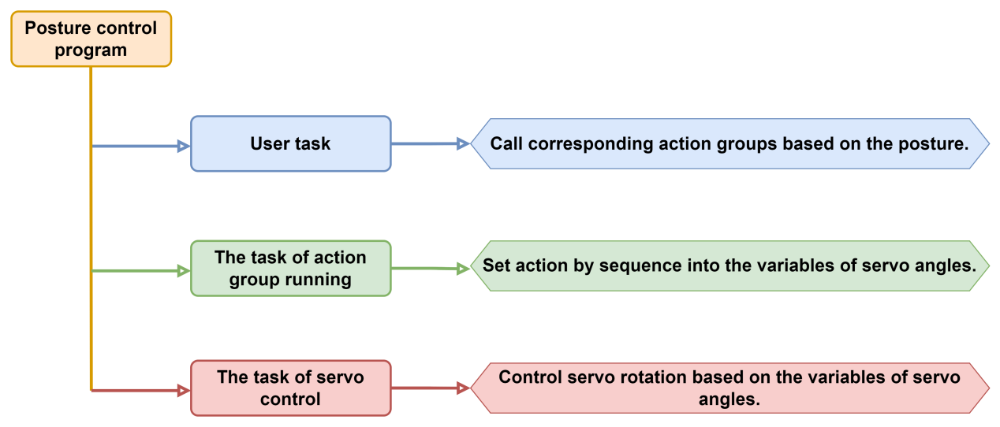

### 7.6.2 Acceleration **Sensor**

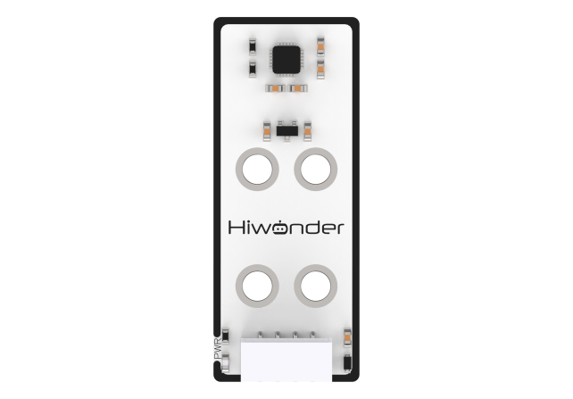

This sensor relies on the MPU6050 sensor component, which integrates a 3-axis MEMS gyroscope, a 3-axis MEMS accelerometer, and a configurable Digital Motion Processor (DMP).

* **Wiring**

Connect the acceleration sensor to any I2C interface on the expansion board with the 4Pin wire.

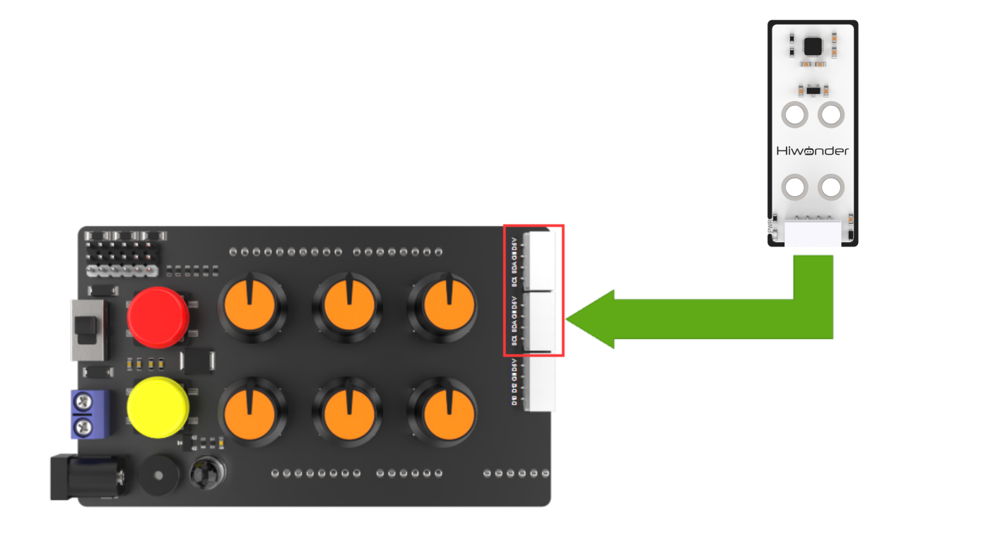

### 7.6.3 Program Download 

[uhand_IMU](../_static/source_code/uhand_IMU.zip)

:::{Note}

- The Bluetooth module must be removed before downloading the program, otherwise the program download will fail due to serial interface conflict.

- Please turn the switch of the battery box to "**OFF**" when connecting the Type-B download cable in case the download cable touches the power pin of the expansion board by mistake, which may cause a short circuit.

  :::

(1\) Locate and open the [uhand_IMU.ino](../_static/source_code/uhand_IMU.zip) program file in the same directory as this section.

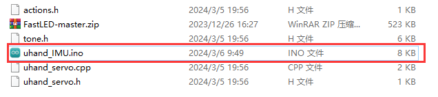

(2) Connect the Arduino to the computer through a UNO cable (Type-B).


(3\) Click the **"Select Board"**, and the software will automatically detect current Arduino serial interface. Then click to connect.


(4) Click  to download the program to the Arduino, and then wait for the download to complete.


### 7.6.4 Program **Outcome**

(1) After powering on, the robotic hand returns to the initial position with five fingers spread out, and the RGB light on the expansion board lights up green.

(2) When the value of X on the acceleration sensor is larger than 40 (with the acceleration sensor as the first view and tilted downward), the hand will be clenched.

(3) When the value of Y on the acceleration sensor is larger than 50 (with the acceleration sensor as the first view and tilted to the left), the hand's pan-tilt will rotate to the left, and the fingers will spread out.

(4) When the value of Y on the acceleration sensor is less than -50 (with the acceleration sensor as the first view and tilted to the right), the pan-tilt will rotate to the right, and the fingers will spread out.

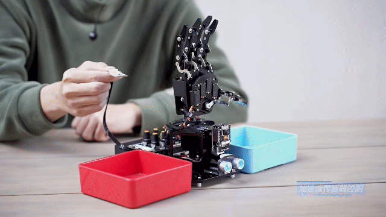

### 7.6.5 Brief Program Analysis

[uhand_IMU](../_static/source_code/uhand_IMU.zip)

* **Import Library File**

Import RGB control library, servo control library, tone library of buzzer, MPU6050 gyroscope (acceleration sensor) library and action group task library file required for this program.

{lineno-start=8}

```
#include <FastLED.h> //导入LED库(import LED library)
#include <Servo.h> //导入舵机库(import servo library)
#include "tone.h" //音调库(tone library)
#include <MPU6050.h>
#include "uhand_servo.h"
```

* **Define Pin and Create Object**

(1) Declare variables associated with MPU6050 sensor firstly, and define MPU6050 gyroscope, storage accelerometer, gyroscope and variables of inclination.

{lineno-start=14}

```
MPU6050 accelgyro;
int16_t ax, ay, az;
int16_t gx, gy, gz;
float ax0, ay0, az0;
float gx0, gy0, gz0;
float ax1, ay1, az1;
float gx1, gy1, gz1;

float dx;
float dz;
int ax_offset, ay_offset, az_offset, gx_offset, gy_offset, gz_offset;
float radianX;
float radianY;
float radianZ;
float radianX_last; //最终获得的X轴倾角(the final obtained inclination of the X-axis)
float radianY_last; //最终获得的Y轴倾角(the final obtained inclination of the Y-axis)


const static uint16_t DOC5[] = { TONE_C5 };
const static uint16_t DOC6[] = { TONE_C6 };
```

(2) Next, define the Arduino pins used for hardware connections, mainly consisting of six servo pins, one buzzer pin, and one RGB light pin.

{lineno-start=35}

```
/* 引脚定义(define pins) */
const static uint8_t servoPins[6] = { 7, 6, 5, 4, 3, 2 };
const static uint8_t buzzerPin = 11;
const static uint8_t rgbPin = 13;
```

(3) After that, define variables used for controlling RGB light, servo and action group.

{lineno-start=40}

```
//动作组控制对象(action group control object)
HW_ACTION_CTL action_ctl;
//RGB灯控制对象(RGB light control object)
static CRGB rgbs[1];
//舵机控制对象(servo control object)
Servo servos[6];

// 舵机角度相关变量(variables related to the servo angles)
static float servo_angles[6] = { 130,130,130,130,130,90 };  /* 舵机实际控制的角度数值(the actual angle values controlled by servos) */
```

(4) In `uhand_servo.h`  file, `extended_func_angles` array is used for storing desired angle for each servo, and "**action_num**" is used for controlling action group to be run currently.

{lineno-start=5}

```
class HW_ACTION_CTL{
  public:
    uint8_t extended_func_angles[6] = { 130,130,130,130,130, 90 }; /* 二次开发例程使用的角度数值(angle values used for secondary development) */
    //控制执行动作组(contorl to execute action group)
    void action_set(int num);
    int action_state_get(void);
    void action_task(void);
    
  private:
    //动作组控制变量(action group contorl variable)
    int action_num = 0;
};
```

(5) In `actions.h` file, macro definition `action_count` is used for setting the quantity of current action group. As a three-dimensional array, `action` is used for storing three action groups of the hand, which are hand grasp, placement to the left and placement to the right.

{lineno-start=3}

```
#define action_count 3 //动作组数量(number of action groups)

static uint8_t action[action_count][20][7] = 
    {
      //动作组1-抓握(action group 1 - grasping)
      {{1,130,130,130,130,130,90},{1,20,40,40,40,40,90},{0,0,0,0,0,0}},
      //动作组2-向右分拣(action group 2 - sorting to the right)
      {{1,20,40,40,40,40,180},{1,130,130,130,130,130,180},{1,130,
      130,130,130,130,180},{1,130,130,130,130,130,90},{0,0,0,0,0,0}},
      //动作组3-向左分拣(action group 3 - sorting to the left)
      {{1,20,40,40,40,40,0},{1,130,130,130,130,130,0},{1,130,
      130,130,130,130,0},{1,130,130,130,130,130,90},{0,0,0,0,0,0}}
    };
```

For the expected and actual values, you can see the "**servo_control**" function called in the loop main function.

If you want the servo close to the target position gradually, you need to call this line of code `servo_angles[i] = servo_angles[i] * 0.90 + extended_func_angles[i] * 0.10` in the control task function.

This causes the servo to move each time by 90% of the actual value and 10% of the desired value, so that the actual value gets progressively closer to the desired value. When they are equal, the robot hand stop moving.

{lineno-start=245}

```
void servo_control(void) {
  static uint32_t last_tick = 0;
  if (millis() - last_tick < 20) {
    return;
  }
  last_tick = millis();
  for (int i = 0; i < 6; ++i) {
    servo_angles[i] = servo_angles[i] * 0.90 + action_ctl.extended_func_angles[i] * 0.10;
    servos[i].write(i == 0 || i == 5 ? 180 - servo_angles[i] : servo_angles[i]);
  }
}
```

(6) Define variables used for controlling buzzer, and declare task function to perform different control task. For example, the `servo_control` function is used for controlling servo; the `play_tune` function is used for controlling buzzer sounds; the `tune_task` function is used for performing buzzer task; the `user_task` function is used for testing the state of acceleration sensor, perform grasp or placement; and the `update_mpu6050` function is used for updating inclination data of acceleration sensor.

{lineno-start=51}

```
// 蜂鸣器相关变量(variable related to the buzzer)
static uint16_t tune_num = 0;
static uint32_t tune_beat = 10;
static uint16_t *tune;

static void servo_control(void); /* 舵机控制(servo control) */
void play_tune(uint16_t *p, uint32_t beat, uint16_t len); /* 蜂鸣器控制接口(buzzer control interface) */
void tune_task(void); /* 蜂鸣器控制任务(buzzer control task) */
void user_task(void); /* 用户任务(user task) */

void update_mpu6050(void); /*更新倾角传感器数据(update inclination sensor data)*/
```

* **Initial Setting**

(1) Initialize related hardware equipment in `setup()` function. The first is serial interface, set the baud rate of communication to 115200 and the timeout for reading data to 500ms.

{lineno-start=64}

```
void setup() {
  Serial.begin(115200);
  // 设置串行端口读取数据的超时时间(set the timeout for serial port reading data)
  Serial.setTimeout(500);
```

(2) Assign the servo IO port to facilitate the control through pin.

{lineno-start=70}

```
  for (int i = 0; i < 6; ++i) {
    servos[i].attach(servoPins[i],500,2500);
  }
```

(3) Use the FastLED library to initialize RGB lights on expansion board, and connect it to RGB pin. Then set the color to blue by `rgbs[0] = CRGB(0, 0, 100)` and use  `FastLED.show`  function to display the set color.

{lineno-start=74}

```
  //RGB灯初始化并控制(initialize RGB LED to control it)
  FastLED.addLeds<WS2812, rgbPin, GRB>(rgbs, 1);
  rgbs[0] = CRGB(0, 100, 0);
  FastLED.show();
```

(4) Set the pin of buzzer to output mode and stop activating the buzzer after a short sound.

{lineno-start=79}

```
  //蜂鸣器初始化并鸣响一声(initialize buzzer and make it sound once)
  pinMode(buzzerPin, OUTPUT);
  tone(buzzerPin, 1000);
  delay(100);
  noTone(buzzerPin);
```

(5) Initialize I2C communication and MPU6050 sensor. Set the range of gyroscope and accelerometer. The gyroscope is realized by transmitting parameter 3, and the accelerometer is realized by transmitting parameter 1.

{lineno-start=85}

```
  //MPU6050 配置(configure MPU6050) 
  Wire.begin();
  accelgyro.initialize();  
  accelgyro.setFullScaleGyroRange(3); //设定角速度量程(set the angular velocity range)
  accelgyro.setFullScaleAccelRange(1); //设定加速度量程(set the acceleration range)
  delay(200);
```

(6) Read sensor data for subsequent calibration process.

{lineno-start=91}

```
  accelgyro.getMotion6(&ax, &ay, &az, &gx, &gy, &gz);  //获取当前各轴数据以校准(obtain the current data of each axis for calibration)
```

(7) Calibrate data to eliminate errors due to sensor unlevel installation or electronic offset.

{lineno-start=92}

```
  ax_offset = ax;  //X轴加速度校准数据(calibration data for the acceleration along the X-axis)
  ay_offset = ay;  //Y轴加速度校准数据(calibration data for the acceleration along the Y-axis)
  az_offset = az - 8192;  //Z轴加速度校准数据(calibration data for the acceleration along the Z-axis)
  gx_offset = gx; //X轴角速度校准数据(calibration data for the angular velocity along the X-axis)
  gy_offset = gy; //Y轴角速度校准数据(calibration data for the angular velocity along the Y-axis)
  gz_offset = gz; //Z轴教书的校准数据(calibration data for the angular velocity along the Z-axis)
```

(8) Output the **"Start"** string through serial interface to indicate that the sensor is ready to start transmitting data.

{lineno-start=86}

```
  Wire.begin();
  accelgyro.initialize();  
  accelgyro.setFullScaleGyroRange(3); //设定角速度量程(set the angular velocity range)
  accelgyro.setFullScaleAccelRange(1); //设定加速度量程(set the acceleration range)
  delay(200);
  accelgyro.getMotion6(&ax, &ay, &az, &gx, &gy, &gz);  //获取当前各轴数据以校准(obtain the current data of each axis for calibration)
  ax_offset = ax;  //X轴加速度校准数据(calibration data for the acceleration along the X-axis)
  ay_offset = ay;  //Y轴加速度校准数据(calibration data for the acceleration along the Y-axis)
  az_offset = az - 8192;  //Z轴加速度校准数据(calibration data for the acceleration along the Z-axis)
  gx_offset = gx; //X轴角速度校准数据(calibration data for the angular velocity along the X-axis)
  gy_offset = gy; //Y轴角速度校准数据(calibration data for the angular velocity along the Y-axis)
  gz_offset = gz; //Z轴教书的校准数据(calibration data for the angular velocity along the Z-axis)

  delay(1000);
  Serial.println("start");
}
```

* **Call Subfunction in a Loop**

After initialization, enter the loop main function, call the "**user_task**" function in turn, test the state of acceleration sensor and perform grasp and placement. Then call the `tune_task` function to perform buzzer task; call the `servo_control` function to control servo; call the `action_ctl.action_task`function to call action group; call the `update_mpu6050` function to update inclination data of acceleration sensor.

{lineno-start=103}

```
void loop() {
  // 用户任务(user task)
  user_task();
  // 蜂鸣器鸣响任务(buzzer sound task)
  tune_task();
  // 舵机控制(servo control)
  servo_control();
  // 动作组运动任务(action group running task)
  action_ctl.action_task();

  update_mpu6050();
}
```

* **Acceleration Sensor State Detection**

Define the `user_task` function to detect the state of the acceleration sensor. If the acceleration sensor is tilted forward, action group for grasping is executed. If it is tilted to the left, the action group for placing the left is executed. If it is tilted to the right, the action group for placing the right is executed.

{lineno-start=117}

```
void user_task(void)
{
  static uint32_t last_tick = 0;
  static uint8_t step = 0;
  static uint8_t act_num = 0;
  static uint32_t delay_count = 0;
  int color = 0;
  
  // 时间间隔100ms(time interval 100ms)
  if (millis() - last_tick < 100) {
    return;
  }
  last_tick = millis();
```

(1) Firstly, define the `last_tick` variable to record the timestamp of the last execution. Second, define `step` variable to track the current stage of task execution. Thirdly, define the `act_num` variable to store action group number to be executed. Last, define the `delay_count` variable to set the colors of LED light.

{lineno-start=117}

```
void user_task(void)
{
  static uint32_t last_tick = 0;
  static uint8_t step = 0;
  static uint8_t act_num = 0;
  static uint32_t delay_count = 0;
  int color = 0;
```

(2) You can set the program to return if the time since last execution is less than 100ms to avoid too frequent execution of task. Then, the `millis()` function is called to update the point in time when the last task was performed.

{lineno-start=125}

```
  // 时间间隔100ms(time interval 100ms)
  if (millis() - last_tick < 100) {
    return;
  }
  last_tick = millis();
```

(3) Call respective action group according to the tilt direction and angle of the acceleration sensor.

{lineno-start=132}

```
  switch(step)
  {
    case 0:
      if(radianX_last > 40) //抓取(grasp)
      {
        rgbs[0].r = 100; //红色(red)
        rgbs[0].g = 0;
        rgbs[0].b = 0;
```

Case 0: detect whether the X-axis direction of acceleration sensor is larger than 40. If it is, set LED to red, play sound, set action group number to 1 and transfer to the next state. If it isn't, turn off the LED.

{lineno-start=132}

```
  switch(step)
  {
    case 0:
      if(radianX_last > 40) //抓取(grasp)
      {
        rgbs[0].r = 100; //红色(red)
        rgbs[0].g = 0;
        rgbs[0].b = 0;
        FastLED.show();
        play_tune(DOC6, 300u, 1u);
        // 需要运行动作组1(action group 1 needs to be executed)
        act_num = 1;
        step++;
      }else{ //若没识别到(if no recognition is detected)
        rgbs[0].r = 0;
        rgbs[0].g = 100; //绿色(green)
        rgbs[0].b = 0;
        FastLED.show();
      }
      break;
```

Case 1: wait for 1 second and then call `action_ctl.action_set()` function to set action group number to previously saved `act_num`.

{lineno-start=152}

```
    case 1: //等待1s(wait for 1s)
      delay_count++;
      if(delay_count > 5)
      {
        delay_count = 0;
        // 运行动作组1-抓握(run action group 1-grasp)
        action_ctl.action_set(act_num);
        act_num = 0;
        step++;
      }
      break;
```

Case 2: wait for the action state to be reset to original, and then call the `action_ctl.action_state_get()` function to get the current action group `action_num`. If `action_num`  shows 0, turn to next state.

{lineno-start=163}

```
    case 2: //等待动作状态清零(wait for the action state to be cleared)
      if(action_ctl.action_state_get() == 0)
      {
        step++;
      }
      break;
```

Case 3: detect whether the Y-axis direction of the acceleration is larger than 50. If it is, set LED to green, play sound, and set action group number to 2 through `action_ctl.action_set()` function. Then turn to next state.

{lineno-start=169}

```
    case 3:
      if(radianY_last > 50) //右边(right)
      {
        rgbs[0].r = 0; 
        rgbs[0].g = 100;//绿色(green)
        rgbs[0].b = 0;
        FastLED.show();
        play_tune(DOC6, 300u, 1u);
        // 需要运行动作组2进行分拣(run action group 2 to perform sorting)
        action_ctl.action_set(2);
        step++;
```

If the Y-axis direction of acceleration is less than -50, set LED to blue, play sound and set action group number to 3. Then turn to next state.

{lineno-start=180}

```
else if(radianY_last < -50) //左边(left)
      {
        rgbs[0].r = 0; 
        rgbs[0].g = 0;
        rgbs[0].b = 100;//蓝色(blue)
        FastLED.show();
        play_tune(DOC6, 300u, 1u);
        // 需要运行动作组3(the action group 3 needs to be executed)
        action_ctl.action_set(3);
        step++;
      }
      break;
```

Case 4: wait for the action state to be reset to original again. If `action_num` shows 0, turn off all LEDs and reset state machine to initial state.

{lineno-start=192}

```
    case 4: //等待动作状态清零(wait for the action state to be cleared)
      if(action_ctl.action_state_get() == 0)
      {
        FastLED.clear();
        step = 0;
      }
      break;
    default:
      step = 0;
      break;
```

* **Update the Inclination Data of Acceleration Sensor**

Read acceleration and angular velocity from the MPU6050 sensor to filter and calibrate, and then use these data to calculate and update the inclination of the X-axis and Y-axis.

{lineno-start=206}

```
void update_mpu6050(void)
{
  static uint32_t timer_u;
  if (timer_u < millis())
  {
    // put your main code here, to run repeatedly:
    timer_u = millis() + 20;
    accelgyro.getMotion6(&ax, &ay, &az, &gx, &gy, &gz);
```

(1) Define timer variable "**timer_u**" firstly.

{lineno-start=206}

```
void update_mpu6050(void)
{
  static uint32_t timer_u;
```

(2) Then check whether variable `timer_u` is less than current time. If it is, execute the code in parentheses.

{lineno-start=209}

```
  if (timer_u < millis())
  {
    // put your main code here, to run repeatedly:
    timer_u = millis() + 20;
    accelgyro.getMotion6(&ax, &ay, &az, &gx, &gy, &gz);
```

(3) Update the timer by setting `timer_u` to the current time plus 20 milliseconds, which means that the `update_mpu6050` function execute every 20 milliseconds. Then reading sensor data. Read 6 motion parameters from accelgyro (taking an instance of the MPU6050 gyroscope as an example): 3 acceleration values (ax, ay, az) and 3 angular velocity values (gx, gy, gz).

{lineno-start=212}

```
    timer_u = millis() + 20;
    accelgyro.getMotion6(&ax, &ay, &az, &gx, &gy, &gz);
```

(4) The acceleration data is filtered to smooth the noise in the data. A simple RC filter is used here.

{lineno-start=215}

```
    ax0 = ((float)(ax)) * 0.3 + ax0 * 0.7;  //对读取到的值进行滤波(filter the read value)
    ay0 = ((float)(ay)) * 0.3 + ay0 * 0.7;
    az0 = ((float)(az)) * 0.3 + az0 * 0.7;
```

(5) Subtract filtered acceleration data from offset, and divide by 8192 (the scale factor of sensor data) to convert it to a multiple of gravitational acceleration.

{lineno-start=218}

```
    ax1 = (ax0 - ax_offset) /  8192.0;  // 校正，并转为重力加速度的倍数(calibrating and converting it to multiples of gravitational acceleration)
    ay1 = (ay0 - ay_offset) /  8192.0;
    az1 = (az0 - az_offset) /  8192.0;
```

(6) Filter the read angular velocity data.

{lineno-start=222}

```
    gx0 = ((float)(gx)) * 0.3 + gx0 * 0.7;  //对读取到的角速度的值进行滤波(filter the read value of the angular velocity)
    gy0 = ((float)(gy)) * 0.3 + gy0 * 0.7;
    gz0 = ((float)(gz)) * 0.3 + gz0 * 0.7;
```

(7) Subtract the filtered angular velocity data from offset.

{lineno-start=225}

```
    gx1 = (gx0 - gx_offset);  //校正角速度(calibarate the angular velocity)
    gy1 = (gy0 - gy_offset);
    gz1 = (gz0 - gz_offset);
```

(8) Calculate the inclination of X-axis and Y-axis (radian) by using `atan2` function. Convert radian value to angle value.

{lineno-start=231}

```
    radianX = atan2(ay1, az1);
    radianX = radianX * 180.0 / 3.1415926;
    float radian_temp = (float)(gx1) / 16.4 * 0.02;
    radianX_last = 0.8 * (radianX_last + radian_temp) + (-radianX) * 0.2;
```

(9) To obtain a more stable inclination, a simple complementary filter is used to muse angular velocity data with inclination data.

{lineno-start=237}

```
    radianY = atan2(ax1, az1);
    radianY = radianY * 180.0 / 3.1415926;
    radian_temp = (float)(gy1) / 16.4 * 0.01;
    radianY_last = 0.8 * (radianY_last + radian_temp) + (-radianY) * 0.2;
  }
}
```

* **Running Action Group**

(1) According to the value of `action_num`, take the corresponding action group data from `action` array, then execute action according to the specified steps and wait for its completion. After all actions are executed, reset the relevant variables to prepare the next action execution.

{lineno-start=11}

```
void HW_ACTION_CTL::action_task(void){
  static uint32_t last_tick = 0;
  static uint8_t step = 0;
  static uint8_t num = 0 , delay_count = 0;
```

(2) Declare variables. The `last_tick` variable is used for storing timestamp of the last task execution. The "**step**" variable represents current action execution step. There are three steps: 0 indicates to run the action, 1 indicates to wait for the action to run, and other values will be reset to 0. The "**num**" and "**delay_count**" variables are used for counting during action execution.

{lineno-start=12}

```
  static uint32_t last_tick = 0;
  static uint8_t step = 0;
  static uint8_t num = 0 , delay_count = 0;
```

(3) Enter to the action group processing program if the value of `action_num` is between 1 and 3 (including 1 and 3). The `action_num` variable means the number of the action group currently to be executed.

{lineno-start=15}

```
  if(action_num != 0 && action_num <= action_count)
  {
```

(4) Use the `millis()` function to get the current timestamp and to compare with `last_tick` function. You can set the program to return if the interval between two executions is less than 150 milliseconds to avoid too frequent execution of task.

{lineno-start=18}

```
    if (millis() - last_tick < 150) {
      return;
    }
    last_tick = millis();
```

Case 0: represents that an action needs to be executed. Take the joint angle data of the current action (specified by "**num**") of the current action group from "**action**" array and store it to "**extended_func_angles**" array.

If the joint angle data of current action is not 0 at all (that means the action has not been completed), set "**step**" to 1, which indicates the next step needs to wait for the execution of the action.

{lineno-start=26}

```
        if(action[action_num-1][num][0] != 0)
        {
          extended_func_angles[0] = action[action_num-1][num][1];
          extended_func_angles[1] = action[action_num-1][num][2];
          extended_func_angles[2] = action[action_num-1][num][3];
          extended_func_angles[3] = action[action_num-1][num][4];
          extended_func_angles[4] = action[action_num-1][num][5];
          extended_func_angles[5] = action[action_num-1][num][6];

          step = 1;
```

If the joint angle data of current action is 0, this action group has finished execution. Reset `num` and  `action_num`  to 0, which means no action group needs to be executed.

{lineno-start=37}

```
        }else{ //若运行完毕(if the running is completed)
          num = 0;
          // 清空动作组变量(clear action group variable)
          action_num = 0;
          
        }
```

Case 1: means that you need to wait for current action to complete.

Use `delay_count` for simple delay, with an increment of 1 each time. When "**delay_count**" is greater than 2, increase "**num**" by 1 to indicate the next action. Reset  `delay_count` to 0 and reset "**step**" to 0, which are indicated that new actions can be executed.

{lineno-start=44}

```
      case 1: //等待动作运行(wait for the action to be executed)
        delay_count++;
        if(delay_count > 2)
        {
          num++;
          delay_count = 0;
          step = 0;
        }
        break;
```

Reset the value of `step`  to 0 if it is not 0 or 1.

{lineno-start=}

```
      default:
        step = 0;
        break;
```

* **Servo Control**

If you want the servo to move closer to the target position, call the `servo_angles[i] = servo_angles[i] * 0.90 + extended_func_angles[i] * 0.1` line of the code in the control task function.

This causes the servo to move each time by 90% of the actual value and 10% of the desired value, so that the actual value progressively closer to the desired value. When they are equal, the robot hand stop moving.

{lineno-start=245}

```
void servo_control(void) {
  static uint32_t last_tick = 0;
  if (millis() - last_tick < 20) {
    return;
  }
  last_tick = millis();
  for (int i = 0; i < 6; ++i) {
    servo_angles[i] = servo_angles[i] * 0.90 + action_ctl.extended_func_angles[i] * 0.10;
    servos[i].write(i == 0 || i == 5 ? 180 - servo_angles[i] : servo_angles[i]);
  }
}
```

* **Buzzer Control**

Control the buzzer to play a melody according to specified rhythm and tone array.

{lineno-start=258}

```
void tune_task(void) {
  static uint32_t l_tune_beat = 0;
  static uint32_t last_tick = 0;
  // 若未到定时时间 且 响的次数跟上一次的一样(if it is not yet the scheduled time and the ringing duration is the same as the previous time)
  if (millis() - last_tick < l_tune_beat && tune_beat == l_tune_beat) {
    return;
  }
```

(1) Declare variables. The `l_tune_beat` variable is used for storing the interval between the last played tones (in milliseconds). The `last_tick` variable is used for storing timestamp of last function execution. Control the buzzer to play a melody according to specified rhythm and tone.

{lineno-start=259}

```
  static uint32_t l_tune_beat = 0;
  static uint32_t last_tick = 0;
```

(2) Determine whether the tone needs to be played by using `millis()` function to get current timestamp and to compare with `last_tick`. You can set the program to return and do not perform any operation if the interval between current time and last played time is less than "**l_tune_beat**", and the value of `tune_beat` does not change (i.e. "**tune_beat**" is equal to "**l_tune_beat**"). This is to prevent the same tone from being played repeatedly in the same interval.

{lineno-start=262}

````
  if (millis() - last_tick < l_tune_beat && tune_beat == l_tune_beat) {
    return;
  }
  l_tune_beat = tune_beat;
  last_tick = millis();
````

(3) Update variables. Assign the `tune_beat` value to `l_tune_beat` and update `last_tick` to current timestamp.

{lineno-start=262}

```
  if (millis() - last_tick < l_tune_beat && tune_beat == l_tune_beat) {
    return;
  }
  l_tune_beat = tune_beat;
  last_tick = millis();
```

(4) If `tune_num` is larger than 0, it means that there are still tones need to be played. Then use `tone()` function to play current tone in buzzer pin.

{lineno-start=267}

```
  if (tune_num > 0) {
    tune_num -= 1;
    tone(buzzerPin, *tune++);
```

(5) If `tune_num` is not more than 0, it means all tones have been played. Use `noTone()` function to stop buzzer from sounding, and reset `tune_beat` and `l_tune_beat` to 10 (probably default playback interval) in preparation for the next playback of the melody.

{lineno-start=270}

```
  } else {
    noTone(buzzerPin);
    tune_beat = 10;
    l_tune_beat = 10;
  }
}
```

* **Buzzer Sound**

Specify the tone array , the interval between the tones and the number of tones to be played.

{lineno-start=278}

```
void play_tune(uint16_t *p, uint32_t beat, uint16_t len) {
  tune = p;
  tune_beat = beat;
  tune_num = len;
}
```

`tune = p;` sets variable "**tune**" (a pointer to an array of tone) to the value of the passed parameter p. In this way, "**tune**" points to an array of tones provided by the user.

`tune_beat = beat;` sets variable "**tune_beat**" (it means the interval between tones to be played) to the value of the passed parameter "**beat**", which determines the tempo of the tone.

`tune_num = len;` sets variable "**tune_num**" (it means the number of tones to be played) to the value of the passed parameter "**len**", which determines the length of the playlist.

### 7.6.6 Function Extension

Let's modify the condition below to "**if(radianX_last \< -40)**". This will enable the grasping action when the acceleration sensor is tilted towards the negative direction of the X-axis.

{lineno-start=132}

```
  switch(step)
  {
    case 0:
      if(radianX_last > 40) //抓取(grasp)
      {
        rgbs[0].r = 100; //红色(red)
        rgbs[0].g = 0;
        rgbs[0].b = 0;
        FastLED.show();
        play_tune(DOC6, 300u, 1u);
        // 需要运行动作组1(action group 1 needs to be executed)
        act_num = 1;
        step++;
      }else{ //若没识别到(if no recognition is detected)
        rgbs[0].r = 0;
        rgbs[0].g = 100; //绿色(green)
        rgbs[0].b = 0;
        FastLED.show();
      }
      break;
```

### 7.6.7 FAQ

Q:after uploading the code, the gyroscope acceleration sensor has no reaction when being rotated.

A:please ensure that you have connected the 4-pin wire to the correct I2C interface and turned the knob on the expansion board to the initial position.

Q:the gyroscope of the acceleration sensor is tilted but not responding.

A:please place the sensor in a horizontal position before powering it on.

## 7.7 APP Remote Control

This section mainly explains the function realization for the control program of the robotic hand. Therefore, you can better understand and write the program.

### 7.7.1 Program Flowchart

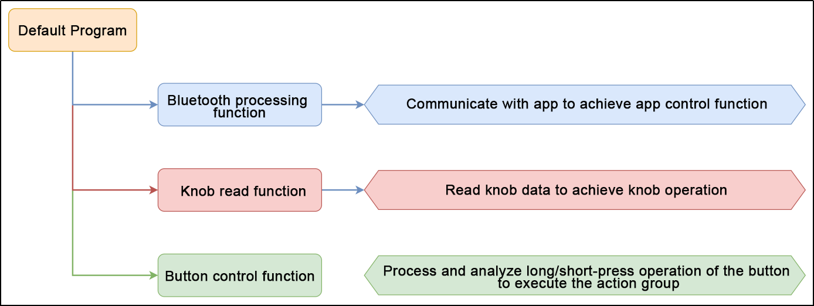

### 7.7.2 Program Download

[uhand](../_static/source_code/uhand.zip)

:::{Note}
- Remove the Bluetooth module before downloading the program. Or the program will fail to download because of the serial port conflict.
- Please switch the battery box to the "**OFF**" when connecting the Type-B cable. This action prevents the download cable from accidentally touching the power pins of the expansion board, which may cause a short circuit.
:::

(1) Locate and open [uHand/uHand.ino](../_static/source_code/uhand.zip) program file in the same directory as this section.


(2) Connect Arduino to the computer with the UNO data cable (Type-B).

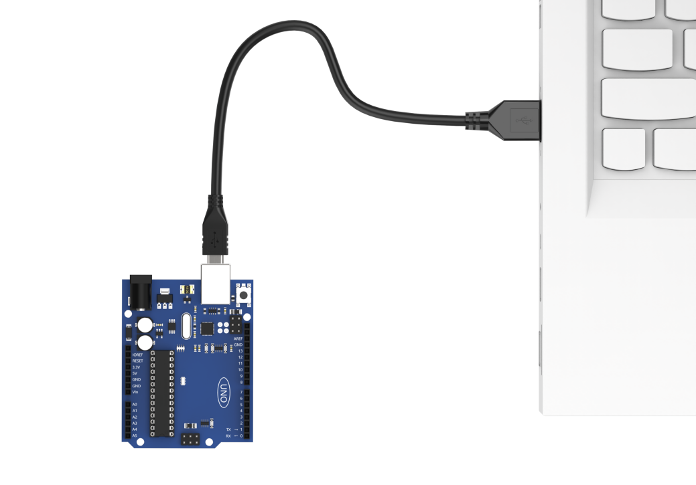

(3) Click **"Select Board"**, and the software will automatically detect the current Arduino serial port. Next, click to connect.

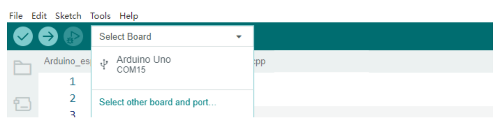

(4) Click to download the program into Arduino. Then just wait for it to complete.


###  7.7.3 Program Outcome 

(1) When powered on, the robotic hand open and its pan-tilt returns to the initial position. At the same time, the RGB light on the expansion board turns white, which is the neutral position program.

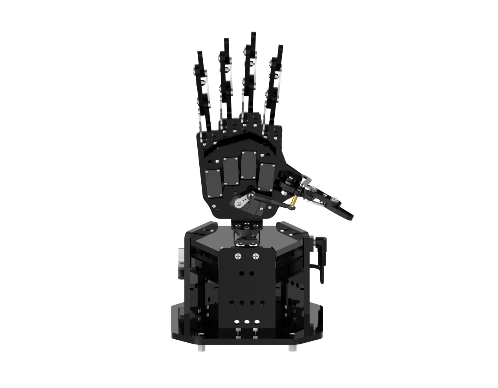

(2) Press both buttons simultaneously for 1 second until RGB light turns green. This indicates that uHand UNO has unlocked the neutral position function and entered the knob control game.

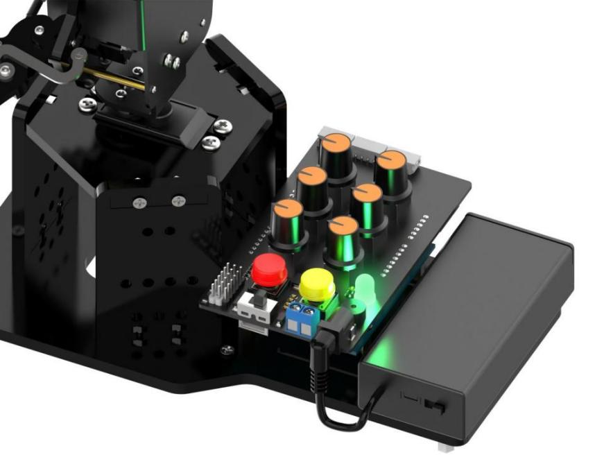

(3) Long press K1 to clear the previous action group first and enter the action group editing mode. Then use the knob to control the position of the robotic hand and press K1 to record the current position into action group. Next, long press K1 to exit the action group editing mode and save the edited action group into **"Falsh"**. Then short press K2 to execute the action group.

The button instructions are shown below:

|                         Mode                          |                            Button                            |                           Outcome                            |
| :---------------------------------------------------: | :----------------------------------------------------------: | :----------------------------------------------------------: |
|      Neutral position (white light is steady on)      | Automatically enter the mode after powered on. Simultaneously hold down "**K1, K2**" to exit. |              ID1-6 servos are at 90 ° position.              |
|        Normal mode (green light is steady on)         |                   Long press the red "**K1**".                   | Enter the editing action group mode to clear the original action group. |
|                                                       |                 Short press the yellow "**K2**".                 | Enter the running action group mode to run the saved action group once. |
|                                                       |                 Long press the yellow "**K2**".                  | Enter the running action group mode and loop run the saved action group. |
|  Editing action group mode (red light is steady on)   |                  Short press the red "**K1**".                   |                         Save action.                         |
|                                                       |                   Long press the red "**K1**".                   | Save the editing action group and exit to switch to the normal mode. |
| Running action group mode (yellow light is steady on) |                  Short press the red "**K1**".                   | Stop the running action group and switch to the normal mode. |

(4) When you plug in the Bluetooth module and connect it to the app, the robotic hand enters the Bluetooth control game.

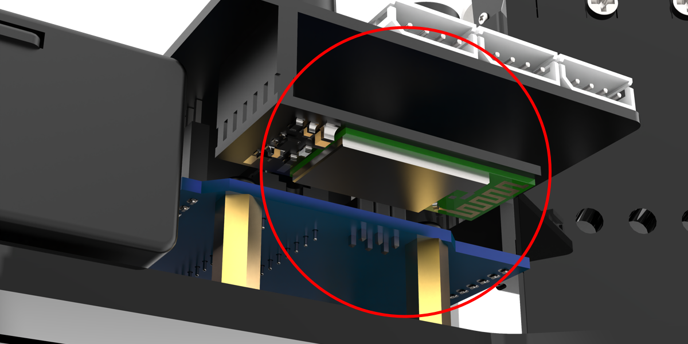

### 7.7.4 Brief Program Analysis 

[uhand](../_static/source_code/uhand.zip)

* **Servo Neutral Position Function "servos_middle( )"**

The  `servos_middle()`  is a function that makes all servos in the neutral position. Running the `set()` function is to create an installation environment of the neutral position for your installation, which can be deleted in the follow-up program.

The program is as follows:

① Set all servo angles to 90 degrees.

② Enter a loop. Detect the state of 2 buttons in the loop.

When 2 buttons are pressed simultaneously and exceeds 10 times, it jumps out of the loop. Jumps out of the function.

When 2 buttons are not pressed simultaneously or the pressing is less than 10 times, the count is cleared and the loop continues.

{lineno-start=109}

```
void servos_middle(void)
{
  // Set the servo to the center angle
  for(int i = 0 ; i < 6 ; i++)
  {
    servos[i].write(90);
  }
  uint16_t count = 0;
  /* Loop detection, if two buttons are pressed simultaneously for 1 second, 
  exit the middle position task */
  while(true)
  {
    if(!digitalRead(keyPins[0]))
    {
      if(!digitalRead(keyPins[1]))
      {
        delay(100);
        count++;
        if(count > 10)
          return;
      }else{
        count = 0;
      }
    }else{
      count = 0;
    }
  }
}
```

* **Bluetooth Processing Function "recv_handler( )"**

The `recv_handler( )` is a processing function. It receives Bluetooth serial port information to analysis and control the robotic hand. When the Bluetooth sends analysis to:

Read the serial port information until '\$', and judge the first character:

① When the first character is 'A' ~ 'F', control the corresponding servo's movement.

{lineno-start=138}

```
void recv_handler(void) {
  while (Serial.available() > 0) {
    String cmd = Serial.readStringUntil('$');
    Serial.println(cmd);
    switch (cmd[0]) {
      case 'A':
        app_angles[0] = atoi(cmd.c_str() + 1);
        g_mode = MODE_APP;
        break;
      case 'B':
        app_angles[1] = atoi(cmd.c_str() + 1);
        g_mode = MODE_APP;
        break;
      case 'C':
        app_angles[2] = atoi(cmd.c_str() + 1);
        // Serial.println(app_angles[2]);
        g_mode = MODE_APP;
        break;
      case 'D':
        app_angles[3] = atoi(cmd.c_str() + 1);
        g_mode = MODE_APP;
        break;
      case 'E':
        app_angles[4] = atoi(cmd.c_str() + 1);
        g_mode = MODE_APP;
        break;
      case 'F':
        app_angles[5] = atoi(cmd.c_str() + 1);
        g_mode = MODE_APP;
        break;
```

② When it is 'G' ~ 'J', the color of RGB light is controlled.

{lineno-start=}

```
      case 'G':
        g_mode = MODE_APP;
        rgbs[0].r = atoi(cmd.c_str() + 1);
        break;
      case 'H':
        g_mode = MODE_APP;
        rgbs[0].g = atoi(cmd.c_str() + 1);
        break;
      case 'I':
        g_mode = MODE_APP;
        rgbs[0].b = atoi(cmd.c_str() + 1);
        break;
      case 'J':
        g_mode = MODE_APP;
        FastLED.show();
        break;
```

③ When it is 'Z', control the buzzer to make a sound.

{lineno-start=184}

```
      case 'Z':
        {
          g_mode = MODE_APP;
          if (cmd[1] == '1') {
            play_tune(DOC6, 10000u, 1u);
          }
          if (cmd[1] == '0') {
            play_tune(DOC6, 1u, 0u);
          }
          break;
        }
      default:
        break;
    }
  }
  if ((g_mode_old != MODE_APP)&&(g_mode == MODE_APP)) {
    rgbs[0].r = 0;
    rgbs[0].g = 0;
    rgbs[0].b = 255;
    FastLED.show();
  }
  g_mode_old = g_mode;
```

* **Knob Read Function "knob_update()"**

The `knob_update()` function is the value that reads the six knob potentiometers, and controls the position of corresponding servos according to the value.

The program logic is as follows:

① Read the analog value of each potentiometer to obtain desired value through the weighted calculation.

② Map the button's desired value in the servo range of 0 ~ 180 degrees. Read the current value and save.

③ If the difference-value between the current and previous knob value is more than 5 and the uHand UNO is not in the knob mode, it will switch to the knob mode. (APP mode will also enter the knob mode.)

④ If it is the knob mode, map current knob values to the servo angles to assign to the servos. At this time, the servos rotate to the corresponding angles.

{lineno-start=207}

```
void knob_update(void) { /* Read knob Function*/
  static uint32_t last_tick = 0;
  static float values[6];
  float angle = 0;
  if (millis() - last_tick < 10) {
    return;
  }
  last_tick = millis();
  values[0] = values[0] * 0.7 + analogRead(A0) * 0.3;
  values[1] = values[1] * 0.7 + analogRead(A1) * 0.3;
  values[2] = values[2] * 0.7 + analogRead(A2) * 0.3;
  values[3] = values[3] * 0.7 + analogRead(A3) * 0.3;
  values[4] = values[4] * 0.7 + analogRead(A4) * 0.3;
  values[5] = values[5] * 0.7 + analogRead(A5) * 0.3;
  for (int i = 0; i < 6; ++i) {
    angle = map(values[i], 0, 1023, 0, 180);
    angle = angle < 0 ? 0 : (angle > 180 ? 180 : angle);
    if (fabs(angle - knob_angles[i]) > 5 && g_mode != MODE_KNOB) { 
      /* When it is found that the knob has been rotated beyond the threshold,
      the knob control mode will be restored 
      (it may currently be in the mobile app control mode) */
      g_mode = MODE_KNOB;
      action_group_running_step = 0;
      rgbs[0].r = 0;
      rgbs[0].g = 255;
      rgbs[0].b = 0;
      FastLED.show();
    }
```

* **Servo Control function "servo_control()"**

The `servo_control ()` is a function of actual control servo. Enter the function every 25 ms. According to the different game modes, it calculates the actual value of each servo, and assign actual angle value to the PWM control function to control the servo's rotating angle.

Since the mechanical angles of the No.0 and No.5 servos are opposite to other servos, it needs another rotating.

{lineno-start=245}

```
void servo_control(void) {
  static uint32_t last_tick = 0;
  if (millis() - last_tick < 25) {
    return;
  }
  last_tick = millis();
  for (int i = 0; i < 6; ++i) {
    if (g_mode == MODE_APP) {
      servo_angles[i] = servo_angles[i] * 0.85 + app_angles[i] * 0.15;
    } else if (g_mode == MODE_KNOB) {
      servo_angles[i] = servo_angles[i] * 0.85 + knob_angles[i] * 0.15;
    } else if (g_mode == MODE_EXTENDED) {
      servo_angles[i] = servo_angles[i] * 0.85 + extended_func_angles[i] * 0.15;
    } else{
      servo_angles[i] = servo_angles[i] * 0.85 + action_angles[i] * 0.15;
    }
    servos[i].write(i == 0 || i == 5 ? 180 - servo_angles[i] : servo_angles[i]);
  }
}
```

* **Buzzer Corresponding Function**

\(1\) The `tune_task()` is the buzzer-sounding task function, which is an array of tones set in sequence sounding according to the relevant parameters set by the `play_tune()` function.

{lineno-start=265}

```
void tune_task(void) {
  static uint32_t l_tune_beat = 0;
  static uint32_t last_tick = 0;
  /* If the scheduled time is not reached and 
  the number of beeps is the same as the previous one */
  if (millis() - last_tick < l_tune_beat && tune_beat == l_tune_beat) {
    return;
  }
  l_tune_beat = tune_beat;
  last_tick = millis();
  if (tune_num > 0) {
    tune_num -= 1;
    tone(buzzerPin, *tune++);
  } else {
    noTone(buzzerPin);
    tune_beat = 10;
    l_tune_beat = 10;
  }
}
```

\(2\) The `play_tune()` is a function interface to set the buzzer sounding. You can call it to set the buzzer sounding. Parameter 1 is the tone array that needs to sound, parameter 2 is the time of each tone sounding, and parameter 3 is the numbers of tones contained in the tone array.

{lineno-start=285}

```
void play_tune(uint16_t *p, uint32_t beat, uint16_t len) {
  tune = p;
  tune_beat = beat;
  tune_num = len;
}
```

* **Running Action Group Function "action_group_task()"**

The `action_group_task()` is a function that performs the action group of the robotic hand, running in a "**loop()**" loop.

The function logic is as below:

① When the `action_group_running_step` is 0, the action group does not run .

② When the `action_group_running_step` is 1 or 2, the action group starts to run. Read out all the actions in the action group first. Then, judge whether there is any action in the action group. If there is, assign the "**action_group_running_step**" to 3 to 5 and jump to the next step to run the action group.

{lineno-start=301}

```
  switch (action_group_running_step) {
    case 0:
      break;
    case 1:
    case 2:
      {
        g_mode = MODE_ACTIONGROUP;
        action_index = 0;
        action_num = 0;
        for (int i = 0; i < 16; ++i) {
          eeprom_read_buf[i] = EEPROM.read(i);
        }
        if (strcmp(eeprom_read_buf, EEPROM_START_FLAG) == 0) {
          action_num = EEPROM.read(EEPROM_ACTION_NUM_ADDR);
          if (action_num > 0) {
            tick_wait = 1000;
            action_index = 0;
            if (action_group_running_step == 1) {
              action_group_running_step = 3;
            }
            if (action_group_running_step == 2) {
              action_group_running_step = 4;
            }
          } else {
            action_group_running_step = 0;
          }
        } else {
          action_group_running_step = 0;
        }
        break;
      }
```

③ Run each action in the read action group separately until the action group run is complete. Then assign `action_group_running_step` to 6 and jump to the next step.

{lineno-start=332}

```
    case 3:
    case 4:
    case 5:
      {
        memset(eeprom_read_buf, 0, 16);
        for (int i = 0; i < EEPROM_ACTION_UNIT_LENGTH; ++i) {
          eeprom_read_buf[i] = EEPROM.read(EEPROM_ACTION_START_ADDR + EEPROM_ACTION_UNIT_LENGTH * action_index + i);
        }
        for (int i = 0; i < 6; ++i) {
          action_angles[i] = eeprom_read_buf[i];
        }
        action_index += 1;
        if (action_index >= action_num) {
          if (action_group_running_step == 4) {
            action_group_running_step = 4;
            action_index = 0;
          } else {
            action_group_running_step = 6;
          }
        }
        break;
      }
```

④ Turn RGB light green to jump back the first step. Then the action group stops.

{lineno-start=354}

```
    case 6:
      action_group_running_step = 0;
      tick_wait = 50;
      rgbs[0].r = 0;
      rgbs[0].g = 255;
      rgbs[0].b = 0;
      FastLED.show();
      break;
    default:
      break;
  }
}
```

* **Key Processing Function "key_scan()"** 

The `key_scan()` is a function that scans and processes the key signals to call the corresponding game function. The program process is as follows:

① Read the status of the key, then enter the state machine for calling the corresponding state.

{lineno-start=378}

```
    uint16_t io = digitalRead(keyPins[i]);
```

② If the buttons is in the released state, then no action is performed.

{lineno-start=382}

```
        case 0:
          { /* Release in normal state */
            if (state) {
              key_step[i] = 1;
              pressed_tick[i] = last_tick;
            }
            break;
          }
```

③ When K1 is pressed briefly, it checks whether it's in the action group editing mode. If it is, a new action is add, accompanied by a beep sound. If not, it stops the action group's execution and emits a long beep.

{lineno-start=394}

```
              if (i == 0)  //K1
              {
                if (learning) { /* Add new action */
                  memcpy(&action_group[action_index++], knob_angles, 6);
                  play_tune(DOC5, 100, 1);
                } else { /* Stop */
                  if (action_group_running_step != 0) {
                    action_group_running_step = 0;
                    play_tune(DOC6, 800, 1);
                    rgbs[0].r = 0;
                    rgbs[0].g = 255;
                    rgbs[0].b = 0;
                    FastLED.show();
                  }
                }
              }
```

When K2 is pressed shortly and not in action group editing mode, it runs the action group and emits a beep sound.

{lineno-start=410}

```
              if (i == 1)  //K2
              {
                if (!learning) { /* Single run action group */
                  if (action_group_running_step == 0) {
                    action_group_running_step = 1;
                    play_tune(DOC6, 100u, 1u);
                    rgbs[0].r = 255;
                    rgbs[0].g = 200;
                    rgbs[0].b = 0;
                    FastLED.show();
                  }
                }
              }
```

④ When K1 is held down for a long press, and it is in the action group editing mode, the action group is saved. If it is not in the action group editing mode, the action group editing mode starts.

{lineno-start=394}

```
              if (i == 0)  //K1
              {
                if (learning) { /* Add new action */
                  memcpy(&action_group[action_index++], knob_angles, 6);
                  play_tune(DOC5, 100, 1);
                } else { /* Stop */
                  if (action_group_running_step != 0) {
                    action_group_running_step = 0;
                    play_tune(DOC6, 800, 1);
                    rgbs[0].r = 0;
                    rgbs[0].g = 255;
                    rgbs[0].b = 0;
                    FastLED.show();
                  }
                }
              }
              if (i == 1)  //K2
              {
                if (!learning) { /* Single run action group */
                  if (action_group_running_step == 0) {
                    action_group_running_step = 1;
                    play_tune(DOC6, 100u, 1u);
                    rgbs[0].r = 255;
                    rgbs[0].g = 200;
                    rgbs[0].b = 0;
                    FastLED.show();
                  }
                }
              }
```

When K2 is held down for a long press, if it is in the action group editing mode, the robotic hand exits the mode and the buzzer makes a sound. If it is not in the mode, the action group runs in a loop.

{lineno-start=410}

```
              if (i == 1)  //K2
              {
                if (!learning) { /* Single run action group */
                  if (action_group_running_step == 0) {
                    action_group_running_step = 1;
                    play_tune(DOC6, 100u, 1u);
                    rgbs[0].r = 255;
                    rgbs[0].g = 200;
                    rgbs[0].b = 0;
                    FastLED.show();
                  }
                }
              }
```