# 8. AI Vision Game Course

## 8.1 Vision Module Development Environment Setup

**Offline Package Installation Steps**

(1) If you installed other versions of ESP32 Package, please delete it before proceeding.

(2) Deletion method: enter **"%LOCALAPPDATA%/Ard ui no15/packages**" in the file manager's address bar, and then press "**Enter**" to navigate the package, and delete the esp32 folder inside.


(3) Double click the [**esp32_package_2.0.11_arduinome.exe**]() to complete the installation.


## 8.2 Introduction to ESP32S3-Cam Vision Module

###  8.2.1 ESP32S3-Cam Introduction 

ESP32-CAM is a small-size camera module that can operate independently as the smallest system. Its is an ideal solution for IoT applications, which is widely applicable in scenarios such as whole-house smart connection, industrial control, smart agriculture, and more. It enables rapid development of solutions, providing users with highly reliable connectivity, and facilitating integration with various hardware terminal devices.


###  8.2.2 ESP32S3-Cam Expansion Board 

Interface Instruction:

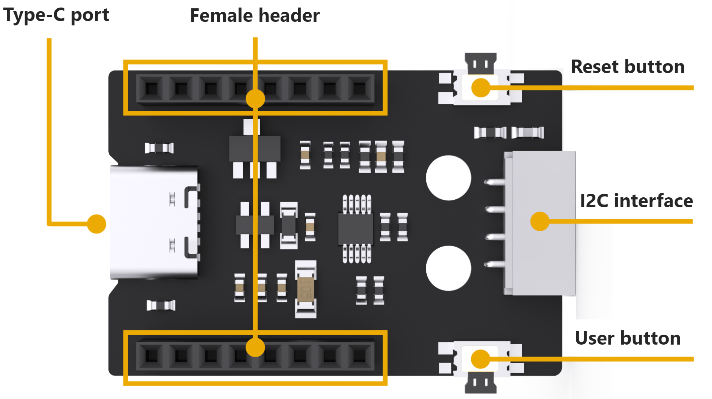

| **Interface Name** |                       **Instruction**                        |
| :----------------: | :----------------------------------------------------------: |
| Type C serial port |            Serial communication, firmware burning            |
|  Female connector  |                 Connect to ESP32-Cam module                  |
|    Reset button    |                 Press to restart the program                 |
|   IIC interface    | Secondary development interface, connecting with the main control. |
|    User button     |            User customized extension development             |

###  8.2.3 Notices 

(1) Ensure the module's input power is at less 5V 2A; otherwise, the ripple patterns may appear in the image.

(2) The module comes with preinstalled firmware before leaving factory, which provides image transmission functionality. If you need to perform vision recognition features, you can flash the corresponding firmware.

## 8.3 ESP32S3-Cam Library File Introduction

This section explains the analysis for the drive library of the ESP32S3-Cam module. This library is used to obtain data on recognized face or color from the ESP32S3-Cam, as well as to control the brightness of the fill light. It includes two files `hw_esp32cam_ctl.h` and `hw_esp32cam_ctl.cpp`.

### 8.3.1 Getting Ready

(1) Open any program in the path of the **"8.AI Vision Game Course"**. Take **"8.5 Color Sorting"** as an example.


(2) In the program, select **"hw_esp32cam_ctl.cpp"**.


### 8.3.2 Brief Program Analysis 

[hw_esp32cam_ctl.cpp]()

(1) Initialize the function of I2C communication: `begin()`.

{lineno-start=7}

```python
void HW_ESP32Cam::begin(void)
{
  Wire.begin();
}
```

(2) Send multiple bytes to esp32Cam: `wireWriteDataArray()`.

{lineno-start=13}

```python
static bool wireWriteDataArray(uint8_t addr, uint8_t reg,uint8_t *val,unsigned int len)
{
    unsigned int i;

    Wire.beginTransmission(addr);
    Wire.write(reg);
    for(i = 0; i < len; i++) 
    {
        Wire.write(val[i]);
    }
    if( Wire.endTransmission() != 0 ) 
    {
        return false;
    }
    return true;
}
```

Parameters:

addr: esp32Cam device address（0x52）

reg: save the address within esp32Cam written target

\*val: send-needing data address

len: send-needing word length

The Arduino master sends the device address via I2C first and the target memory address to esp32Cam. Then it sends the data by bytes according to the data length. Next, it checks if the data has been successfully transmitted using `endTransmission()`. If the return value is 0, it indicates successful data transmission; otherwise, it is fail to send.

(3) Send one byte to esp32Cam: `wireWriteByte()`.

{lineno-start=30}

```python
static bool WireWriteByte(uint8_t val)
{
    Wire.beginTransmission(ESP32CAM_ADDR);
    Wire.write(val);
    if( Wire.endTransmission() != 0 ) {
        return false;
    }
    return true;
}
```

Parameter:

val: content of the sent data

The arduino master directly sends the device address and the data content of the 1 byte to esp32Cam. The `endTransmission()` checks the data sent successfully or not. If the return value is 0, the data is sent successfully. Otherwise it is sent unsuccessfully.

(4) Read the data of multiple bytes from esp32Cam: `wireReadData Array()`.

{lineno-start=40}

```python
static int WireReadDataArray(uint8_t reg, uint8_t *val, unsigned int len)
{
    unsigned char i = 0;
    
    /* Indicate which register we want to read from */
    if (!WireWriteByte(reg)) {
        return -1;
    }
    
    /* Read block data */
    Wire.requestFrom(ESP32CAM_ADDR, len);
    while (Wire.available()) {
        if (i >= len) {
            return -1;
        }
        val[i] = Wire.read();
        i++;
    }   
    return i;
}
```

Parameters:

reg: the address of read-needing data in esp32Cam

\*val: the address used for saving the data in Arduino master

len: Length of data to be read

The Arduino master first sends the address of the data to be read to esp32Cam. If there is no response, it returns -1, indicating a failed connection. Then, it sends the length of data to esp32Cam, and reads the data in bytes via the "**while**" loop and the "**i**" variables to store in the "**val\[\]**" array. During the reading process, if the actual read length exceeds the needed length, it returns to -1, indicating a reading failure. Finally, upon successful reading, it returns "**i**", which represents the actual length of data read (where "**i**" may be less than or equal to "**len**").

(5) Read the result of esp32Cam face detection: `faceDetect()`

{lineno-start=61}

```python
bool HW_ESP32Cam::faceDetect(void)
{
  uint8_t face_info[4];
  Serial.print("face ");
  int num = WireReadDataArray(0x01,face_info,4);
  if((num == 4) && (face_info[2] > 0)) //接收识别到的人脸的x,y,w,h值(receive x, y, w, and h values of the detected face)
  {
      Serial.println(" 1");
      return true;
  }
  Serial.println(" 0");
  return false;
}
```

Define the `face_info[4]` array to save the data. From 0x01address, read four bytes to save into the `face_info[4]` array through `wireReadDataArray()` function. The meaning of each element is as follows:

face_info\[0\] : x (the x-coordinate value identified at the upper-left corner of the face region)

face_info\[1\]: y (the y-coordinate value identified at the upper-left corner of the face region)

face_info\[2\] : w (the identified width of the face region)

face_info\[3\]: h (the identified height of the face region)

Receive the length of the data by `num` variable. If it is 4 and `face_info[2]`(the value of w) is more than 0, the face is identified to return 'true'. Or return to 'false'.

(6) Read the result of esp32Cam color reorganization: `colorDetect()`

{lineno-start=77}

```python
int HW_ESP32Cam::colorDetect(void)
{
  uint8_t color_info[3][4];
  int num = WireReadDataArray(0x00,color_info[0],4);
  if((num == 4) && (color_info[0][2] > 0)) //接收识别到的颜色的x,y,w,h值(receive x, y, w, and h values of the recognized color)
  {
      return 1;  //红色(red)
  }
  num = WireReadDataArray(0x01,color_info[1],4);
  if(num == 4)
  {
    if(color_info[1][2] > 0) //若w值大于0，则识别到颜色1(If the w value is greater than 0, the color 1 is recognized)
    {
      return 2;  //绿色(green)
    }
  }
  num = WireReadDataArray(0x02,color_info[2],4);
  if(num == 4)
  {
    if(color_info[2][2] > 0) //若w值大于0，则识别到颜色2(If the w value is greater than 0, the color 2 is recognized)
    {
      return 3;  //蓝色(blue)
    }
  }
  return 0;
}
```

Define "**color_info\[2\]\[4\]**" bi-dimensional array to save the data, the meaning of each element is as below:

color_info\[\*\]\[0\] : x (the x-coordinate value identified at the upper-left corner of the color region)

color_info\[\*\]\[1\]: y (the y-coordinate value identified at the upper-left corner of the color region)

color_info\[\*\]\[2\]: w (the identified width of the color region)

color_info\[\*\]\[3\]: h (the identified height of the color region)

So if \* is "**0**", the recognition color is 1. If \* is "**1**", the recognition color is 2.

Using the `wireReadDataArray()` function, read four bytes of data from the address 0x00. These bytes represent the parameter information for color 1 detection and are stored in the "**color_info\[0\]\[4\]**" array. Determine whether color 1 is detected based on the data length received by num and the value of `color_info[0][4]` (i.e., the width of the region where color 1 is detected). If num equals `4` and `color_info[0]\[2]` is greater than 0, color 1 is detected, and the function returns "**1**".

If color 1 is not detected, according to the above steps, read data from the address 0x01 to store in the `color_info[1][4]` array, and then determine whether color 2 is detected. If it is detected, the function returns "**2**".

If none of the above results, the function returns to "**0**".

(7) Read the position of esp32Cam color recognition: `color_position()`

{lineno-start=104}

```python
//读取ESP32Cam识别颜色位置，读取成功返回true和位置数据(read the recognied color position of ESP32Cam, and return true and position data if successfully read)
bool HW_ESP32Cam::color_position(uint8_t *color_info)
{
  int num = WireReadDataArray(0x01,color_info,4);
  if((num == 4) && (color_info[2] > 0)) //接收识别到的颜色的x,y,w,h值(receive x, y, w, and h values of the recognized color)
  {
    return true;
  }
  return false;
}
```

Parameter and meaning are as below:

\*color_info： save the address of the received data

By the `wireReadDataArray ()` function, eight bytes of data read from the address of 0x01 are stored in the address showed by `color_info[0][4]`. Judge whether recognizing the color or not according to the data length received by "**num**" and the value of `color_info[2]` (the recognized width of the color region). If "**num**" equals 8 and `color_info[2]` is greater than 0, it recognizes color to return to "**true**". Or return to "**false**".

## 8.4 Live Camera Feed

In this section, you can learn how to connect to the hotspot generated by the ESP32S3-Cam, and then log into a provided URL to view the live camera feed.

Note: if you are unable to use the live camera feed function or have downloaded other program firmwares, please reflash the image transmission firmware. This allows you to use the live camera feed function.

To download the firmware, please refer to "[**8.4.2 Image Postback Firmware Flashing (Optional)**]()" in this section.

### 8.4.1 ESP32S3-Cam Camera Connection

* **Connection Modes Introduction**

ESP32S3-Cam has two kinds of network modes as follows:

① AP direct connection mode: the development board can open the hotspot to connect with the phone, but it cannot connect to an external network.

② STA LAN mode: the development board can actively connect to a designated hotspot or Wi-Fi, enabling communication with an external network.

The AP direct connection mode is more convenient to operate. We recommend you to first learn the configuration method of the direct connection mode to experience the corresponding functions. The STA LAN mode can be selected according to your needs.

No matter which kind of mode you choose, the game function is the same.

* **Direct Mode Connection (Must Read)**

(1) Make sure the camera is connected to the I2C interface on the expansion board and turn the robotic hand on.


(2) The camera will generate a hotspot named **"HW_ESP32Cam"**. Click to connect.

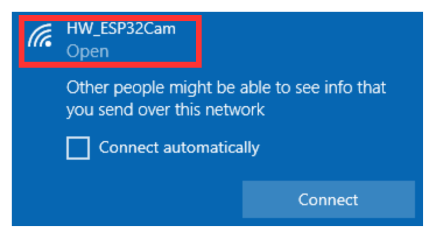


(3) After the connection is completed, enter the address "**192.168.5.1**" in the browser and click  to enter the camera transmission interface.

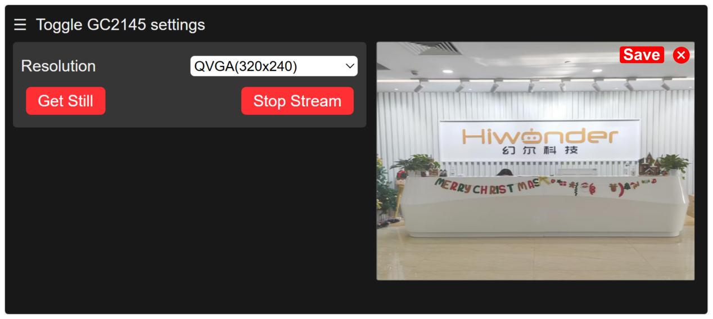

* **LAN Mode Connection (Optional)**

(1) Turn on your phone's hotspot and set the name as **"HiwonderESP"** and the password as **"Hiwonder"**.

:::{Note}

The name and password of the hotspot should be same as of this text, otherwise the connection won't succeed.

:::


(2) Ensure the camera is connected to the I2C interface on the expansion board, power on the robotic hand and wait for a moment. The camera will automatically connect to the phone's hotspot.


(3) After that, connect the camera to the computer with the Type-C cable.

(4) Open the serial port utility tool in the path of "[**Appendix\Serial Port Utility**]() ".


(5) Select a port. Take COM3 as example. The port number may vary.</span> Do not choose COM1 which is the system communication port. Set the baudrate as **"115200"**.

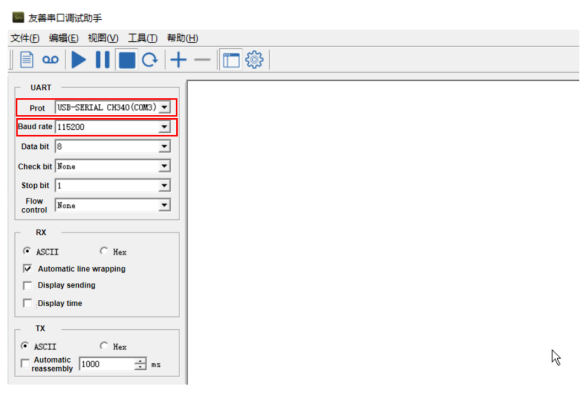

(6) Click  at the upper left of the page to open the serial port communication. Press the **"RST"** button on the ESP32S3-Cam and scroll down to the last line to check your camera's IP address **"192.168.197.226"**. The IP address may vary, please refer to the actual address.</span>

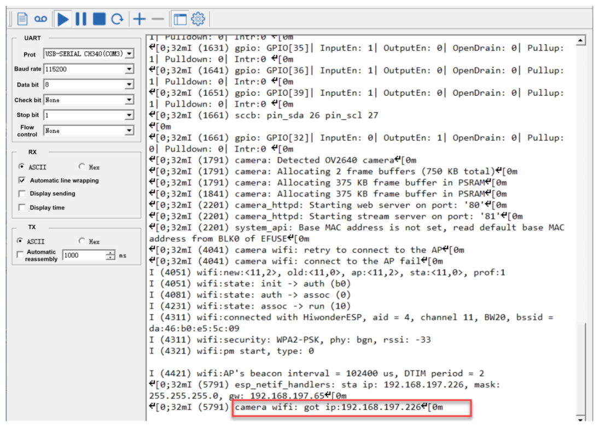

(7) At this time, you can disconnect the Type-C cable</span> and connect the computer to the same hotspot as the camera.


(8) In the browser's research bar, enter the IP address of the camera **"192.168.197.226"** to to access the feedback interface.</span>


### 8.4.2 Image Postback Firmware Flashing (Optional)

(1) Open the [flash_download_tool_3.9.7]() file in the "[Appendix\Firmware Flashing Tool]() ".


(2) Select the **"Chip Type"** as **"ESP32-S3"**, and keep others unchanged. Click "**OK**".


(3) After opening the tool, click "**...**" to select the bin file of the program to be flashed. Take the following live camera feed function firmware as an example:

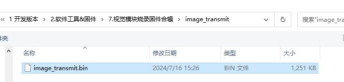

(4) Check the left side box, the rest of the configuration can be configured as shown below. Select the port number of the vision module occupied in the device as the COM port number .

:::{Note}

If you set SPI MODE to DIO as shown in the figure below, and the module cannot work properly after the firmware is flashed, please try setting SPI MODE to DOUT and flashing again.

:::


(5) Click **"ERASE"** to erase the underlayer firmware. You must do this step first. Next, click **"START"** to start flash. Then, wait for the download to be completed.

## 8.5 Color Sorting

In this section, uHand UNO will use the ESP32S3-Cam vision module to recognize red and blue balls, then grasps and places them in their respective positions.

### 8.5.1 Program Flowchart

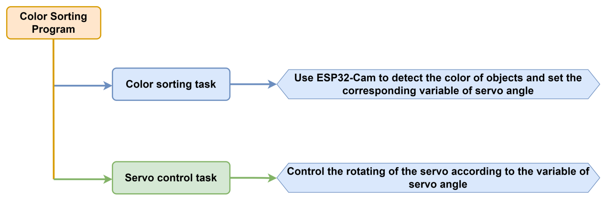

### 8.5.2 ESP32S3-Cam Development Board 


ESP32S3-Cam development board integrates an ESP32 chip and a camera module. After being inserted into the expansion board, it uses the I2C communication interface to read color and face data through I2C communication.

* **Wiring**

Align the pins of ESP32S3-Cam with the pin headers on the camera expansion board, and connect it to an I2C interface on the uHand UNO expansion board with a 4PIN wire.

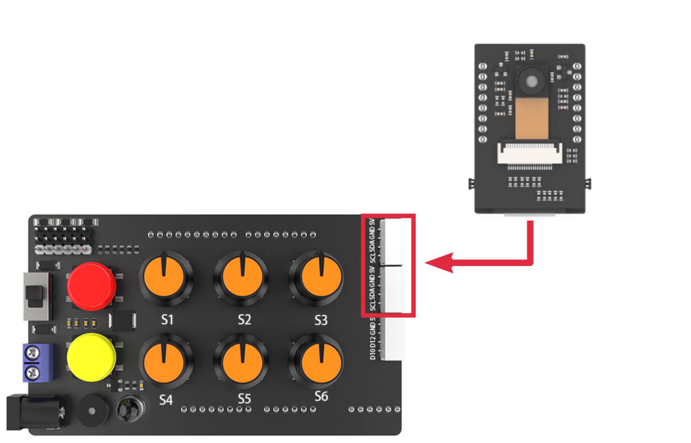

### 8.5.3 Program Download

[ESP32S3-Cam Color Recognition Program]()

[uHand UNO Color Sorting Program]()

:::{Note}

- The Bluetooth module must be removed before downloading the program, otherwise the program download will fail due to serial interface conflict.

- Please turn the switch of the battery box to "**OFF**" when connecting the Type-B download cable in case the download cable touches the power pin of the expansion board by mistake, which may cause a short circuit.

:::

* **Arduino UNO Program Download**

(1) Locate and find [uhand_colors_clamp_esp32cam\uhand_colors\_ clamp_esp32cam.ino]() program file in the same dictionary as this section.

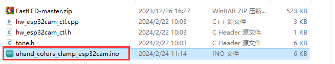

(2) Connect the Arduino to the computer through the UNO cable (Type-B).


(3) Click the **"Select Board"**, and the software will automatically detect current Arduino serial interface. Then click to connect.


(4) Click  to download the program to the Arduino, and then wait for the download to complete.


* **ESP32S3-Cam Program Download**

(1) Connect the ESP32S3-Cam to the computer with a Type-C data cable.

(2) Locate and open the [ColorDetection\ColorDetection.ino]() program file in the same directory as this section.

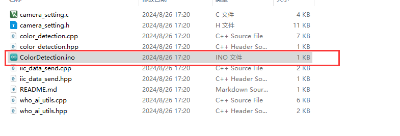

(3) Select the **"ESP32S3 Dev Module"** development board.


(4) Click the **"Tool"** in the menu bar, and select the corresponding configuration for the ESP32S3 development board.

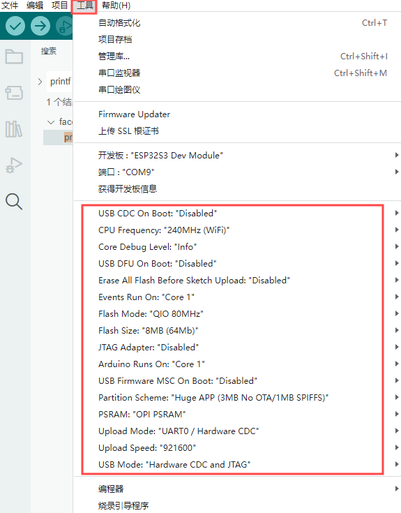

(5) Click to download the program to the ESP32S3-Cam, and then wait for the download to complete.


### 8.5.4 Program Outcome

(1) After powering on, the robotic hand returns to the initial position with five fingers spread out, and the RGB light on the expansion board lights up green.

(2) When the blue ball is identified, the RGB lights up blue, the hand grasps ball and places it to the left.

(3) When the red ball is identified, the RGB lights up red, the hand grasps ball and places it to the right.

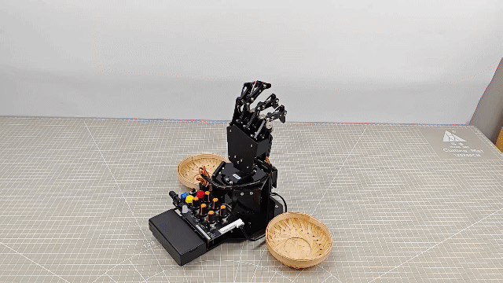

### 8.5.5 Brief Program Analysis

[ESP32S3-Cam Color Recognition Program]()

[uHand UNO Color Sorting Program]()

* **Import Library File**

(1) Import the RGB control library, servo control library, ESP32Cam communication library, and buzzer zone library file required for this program.

{lineno-start=7}

```python
#include <FastLED.h> //导入LED库(import LED library)
#include <Servo.h> //导入舵机库(import servo library)
#include "hw_esp32cam_ctl.h" //导入ESP32Cam通讯库(import ESP32S3-Cam communication library)
#include "tone.h" //导入音调库(import tone library)
```

(2) Define tone constant and color constant.

{lineno-start=12}

```python
const static uint16_t DOC5[] = { TONE_C5 };
const static uint16_t DOC6[] = { TONE_C6 };

#define COLOR_1   3
#define COLOR_2   1
```

* **Define Pin and Create Objects**

(1) Firstly, define the Arduino pins used for hardware connections, mainly consisting of six servo pins, one buzzer pin, and one RGB light pin.

{lineno-start=19}

```python
const static uint8_t servoPins[6] = { 7, 6, 5, 4, 3, 2 };
const static uint8_t buzzerPin = 11;
const static uint8_t rgbPin = 13;
```

(2) Next, define the variables used for controlling RGB lights, ESP32Cam communication and servos. The "**extended_func_angles**" array is used for storing desired angle for each servo. The "**servo_angles**" array is used for storing actual angle of servo, and the range is 0~180. The initial position of the hand is set to open.

{lineno-start=14}

```python
//RGB灯控制对象(RGB LED control object)
static CRGB rgbs[1];
//ESP32Cam通讯对象(ESP32S3-Cam communication object)
HW_ESP32Cam hw_cam;
//舵机控制对象(servo control object)
Servo servos[6];

// 舵机角度相关变量(variables related to servo angles)
static uint8_t extended_func_angles[6] = { 80, 100, 100, 80, 70, 95 }; /* 二次开发例程使用的角度数值(angle values used for secondary development) */
static uint8_t servo_angles[6] = { 80, 100, 100, 80, 70, 95 };  /* 舵机实际控制的角度数值(angle values for actual servo control) */
```

For the expected and actual values, you can see the "**servo_control**" function called in the loop main function.

If you want the servo to close to the target position gradually, you need to call this line of code `servo_angles[i] = servo_angles[i] * 0.85 + extended_func_angles[i] * 0.15` in the control task function.

This causes the servo to move each time by 85% of the actual value and 15% of the desired value, so that the actual value gets progressively closer to the desired value. When they are equal, the robot hand stop moving.

{lineno-start=205}

```python
//舵机控制任务(servo control task)
void servo_control(void) {
  static uint32_t last_tick = 0;
  if (millis() - last_tick < 40) {
    return;
  }
  last_tick = millis();
  for (int i = 0; i < 6; ++i) {
    servo_angles[i] = servo_angles[i] * 0.85 + extended_func_angles[i] * 0.15;
    servos[i].write(i == 0 || i == 5 ? 180 - servo_angles[i] : servo_angles[i]);
  }
}
```

(3) Thirdly, define the variable used for controlling buzzer, and declare task function to perform different control tasks. The `servo_control` function is used for controlling servos; the `play_tune` function is used for controlling buzzer sound; the `tune_task` function is used for executing buzzer task; and the `espcam_task` function is used for handling ESP32S3-Cam-related communication.

{lineno-start=33}

```python
static uint16_t tune_num = 0;
static uint32_t tune_beat = 10;
static uint16_t *tune;

static void servo_control(void); /* 舵机控制(servo control) */
void play_tune(uint16_t *p, uint32_t beat, uint16_t len); /* 蜂鸣器控制接口(buzzer control interface) */
void tune_task(void); /* 蜂鸣器控制任务(buzzer control task) */
void espcam_task(void); /* esp32cam通讯任务(ESP32S3-Cam communication task) */
```

* Initial Settings

(1) Initialize related hardware equipment in `setup()` function. The first is serial interface, which sets the baud rate of communication to 115200 and the timeout for reading data to 500ms.

{lineno-start=44}

```python
void setup() {
  Serial.begin(115200);
  // 设置串行端口读取数据的超时时间(set timeout for serial port reading data)
  Serial.setTimeout(500);
```

(2) Assign the servo IO port to facilitate the control through pin.

{lineno-start=42}

```python
  for (int i = 0; i < 6; ++i) {
    servos[i].attach(servoPins[i],500,2500);
  }
```

(3) Initialize the communication connector of ESP32S3-Cam and set the fill light brightness to 10 (within the range of 0 to 255).

{lineno-start=46}

```python
  hw_cam.begin(); //初始化与ESP32Cam通讯接口(initialize ESP32S3-Cam communication interface)
```

(4) Use the FastLED library to initialize RGB lights on expansion board, and connect it to RGB pin. Then set the color to blue by `rgbs[0] = CRGB(0, 0, 100)` and use `FastLED.show` function to display the set color.

{lineno-start=57}

```python
  FastLED.addLeds<WS2812, rgbPin, GRB>(rgbs, 1);
  rgbs[0] = CRGB(0, 255, 0);
  FastLED.show();
```

(5) Set the pin of buzzer to output mode and stop activating the buzzer after a short sound.

{lineno-start=62}

```python
  pinMode(buzzerPin, OUTPUT);
  tone(buzzerPin, 1000);
  delay(100);
  noTone(buzzerPin);

  delay(2000);
  Serial.println("start");
}
```

(6) Output the `Start` string through a serial interface to indicate that the sensor is ready to start transmitting data.

{lineno-start=62}

```python
  pinMode(buzzerPin, OUTPUT);
  tone(buzzerPin, 1000);
  delay(100);
  noTone(buzzerPin);

  delay(2000);
  Serial.println("start");
}
```

* **Call Subfunctions in a Loop**

After initializing, enter the loop main function, call the `espcam_task` function in turn, detect color identification and perform grasp and placement. Then call the `tune_task` function to execute buzzer task; call the `servo_control` function to control servo.

{lineno-start=71}

```python
void loop() {
  // esp32cam通讯任务(ESP32S3-Cam communication task)
  espcam_task();
  // 蜂鸣器鸣响任务(buzzer sound task)
  tune_task();
  // 舵机控制(servo control)
  servo_control();
}
```

* **ESP32S3-Cam Communication Task**

(1) Define the `espcam_task`  function, which begins by defining six variables: `last_tick` records the timestamp of the last task execution; `posi` defines the angle of pan-tilt servo; "**step**" tracks the current stage of task execution; `delay_count` sets counting unit for the demonstration; while `color_state` manages the color state; and `color` stores detection result from the camera.

{lineno-start=80}

```python
void espcam_task(void)
{
  static uint32_t last_tick = 0;
  static int posi = 90;
  static uint8_t step = 0;
  static uint8_t delay_count = 0;
  static uint8_t color_state = 0;
  int color = 0;
  
  if (millis() - last_tick < 100) {
    return;
  }
  last_tick = millis();
```

(2) The `last_tick` variable, combined with `millis()`, is used for time delay operations. First, the current program runtime is obtained by using the `millis()` function. If the difference is less than 100, the function exist. If the difference is greater than or equal to 100, it means a delay of 100ms has occurred. Then the current time is assigned to the "**last_tick**" variable for next delay.

{lineno-start=80}

```python
void espcam_task(void)
{
  static uint32_t last_tick = 0;
  static int posi = 90;
  static uint8_t step = 0;
  static uint8_t delay_count = 0;
  static uint8_t color_state = 0;
  int color = 0;
  
  if (millis() - last_tick < 100) {
    return;
  }
  last_tick = millis();
```

(3) Perform tasks based on the detected color, such as controlling RGB LED, buzzer and the angle of servo. Here is the analysis of this "**switch**" code snippet:

**Case 0:** use `hw_cam.colorDetect()` to detect color. If blue is detected, RGB lights up blue and buzzer sounds to enter the next state. If red is detected, same as this way.

{lineno-start=96}

```python
    case 0:
      color = hw_cam.colorDetect(); //获取颜色(obtain color)
      if(color == COLOR_1)
      {
        rgbs[0].r = 0;
        rgbs[0].g = 0;
        rgbs[0].b = 250;
        FastLED.show();
        play_tune(DOC6, 300u, 1u);
        step++;
```

Turn off the RGB light if no target color is detected.

{lineno-start=114}

```python
      }else{
        rgbs[0].r = 0;
        rgbs[0].g = 0;
        rgbs[0].b = 0;
        FastLED.show();
      }
```

Update `color_state` variable to store detected color.

{lineno-start=120}

```python
      color_state = color;
```

**Case 1:** wait for a period of time before proceeding to the next state, giving the camera enough time to complete the color detection.

{lineno-start=122}

```python
    case 1:  //等待(wait)
      delay_count++;
      if(delay_count > 10)
      {
        step++;
        delay_count = 0;
      }
      break;
```

**Case 2:** grasp the ball and set the `delay_count` to 0 to turn to the next state.

{lineno-start=130}

```python
    case 2://抓取(grasp)
      extended_func_angles[0] = 11;
      extended_func_angles[1] = 31;
      extended_func_angles[2] = 56;
      extended_func_angles[3] = 43;
      extended_func_angles[4] = 29;
      delay_count = 0;
      step++;
      break;
```

**Case 3:** wait for a period time before entering to next state.

{lineno-start=139}

```python
    case 3: //等待(wait)
      delay_count++;
      if(delay_count > 5)
      {
        step++;
      }
      break;
```

**Case 4:** if color 1 (For example, blue.) is identified, rotate the pan-tilt servo to the 180° position, otherwise rotate it to the 0° position.

{lineno-start=146}

```python
    case 4: //转动(rotate)
      if(color_state == COLOR_1) //COLOR_1转到180°(COLOR_1 rotates to 180°)
      {
        posi += 10;
        if(posi >= 180)
          posi = 180;
      }else{ //COLOR_2转到0°(COLOR_2 rotates to 0°)
        posi -= 10;
        if(posi <= 0)
          posi = 0;
      }
      extended_func_angles[5] = posi;
```

After the action is complete, go to next state and reset the `delay_count`.

{lineno-start=146}

```python
    case 4: //转动(rotate)
      if(color_state == COLOR_1) //COLOR_1转到180°(COLOR_1 rotates to 180°)
      {
        posi += 10;
        if(posi >= 180)
          posi = 180;
      }else{ //COLOR_2转到0°(COLOR_2 rotates to 0°)
        posi -= 10;
        if(posi <= 0)
          posi = 0;
      }
      extended_func_angles[5] = posi;
      //等待转动结束，并等待(wait for the rotation to be completed and wait)
      delay_count++;
      if(delay_count >= 25)
      {
        step++;
        delay_count = 0;
      }
      break;
```

**Case 5:** release the ball and wait for some time to enter the next state.

{lineno-start=166}

```python
    case 5: //放开(release)
      extended_func_angles[0] = 80;
      extended_func_angles[1] = 100;
      extended_func_angles[2] = 100;
      extended_func_angles[3] = 80;
      extended_func_angles[4] = 70;
      delay_count++;
      if(delay_count >= 10)
      {
        step++;
        delay_count = 0;
      }
      break;
```

**Case 6:** rotate the pan-tilt servo to the 95°position. Then wait for a period time to reset the state.

{lineno-start=178}

```python
    case 6: //回到中位(return to the neutral position)
      if(color_state == COLOR_1) //COLOR_1 180°->90°
      { 
        posi -= 10;
        if(posi <= 90)
          posi = 90;
      }else{ //COLOR_2 0°->90°
        posi += 10;
        if(posi >= 90)
          posi = 90;
      }
      extended_func_angles[5] = posi;
      //等待转动结束，并等待(wait for the rotation to be completed and wait)
      delay_count++;
      if(delay_count >= 18)
      {
        step = 0;
        delay_count = 0;
      }
      break;
    default:
      step = 0;
      break;
  }
```

* **Servo Control**

If you want the servo close to the target position, call 5 lines of code `servo_angles[i] = servo_angles[i] * 0.85 + extended_func_angles[i] * 0.1` in the control task function.

This causes the servo to move each time by 85% of the actual value and 15% of the desired value, so that the actual value gets progressively closer to desired value. When they are equal, the robot hand stop moving.

{lineno-start=206}

```python
void servo_control(void) {
  static uint32_t last_tick = 0;
  if (millis() - last_tick < 40) {
    return;
  }
  last_tick = millis();
  for (int i = 0; i < 6; ++i) {
    servo_angles[i] = servo_angles[i] * 0.85 + extended_func_angles[i] * 0.15;
    servos[i].write(i == 0 || i == 5 ? 180 - servo_angles[i] : servo_angles[i]);
  }
}
```

* **Buzzer Control**

Control the buzzer to play a melody according to specified rhythm and tone array.

{lineno-start=219}

```python
void tune_task(void) {
  static uint32_t l_tune_beat = 0;
  static uint32_t last_tick = 0;
  // 若未到定时时间 且 响的次数跟上一次的一样(if it is not yet the scheduled time and the ringing duration is the same as the previous time)
  if (millis() - last_tick < l_tune_beat && tune_beat == l_tune_beat) {
    return;
  }
```

(1) Declare variables. The `l_tune_beat` variable is used for storing the interval between the last played tones (in milliseconds); the "**last_tick**" variable is used for storing timestamp of last function execution. Control the buzzer to play a melody according to specified rhythm and tone.

{lineno-start=220}

```python
  static uint32_t l_tune_beat = 0;
  static uint32_t last_tick = 0;
```

(2) Determine whether the tone needs to be played. Using the `millis()` function to get current timestamp and to compare with the `last_tick`. You can set the function to return and do not perform any operation if the interval between current time and last played time is less than `l_tune_beat`, and the value of `tune_beat` does not change (i.e. "**tune_beat**" is equal to "**l_tune_beat**"). This is to prevent the same tone from being played repeatedly in the same interval.

{lineno-start=223}

```python
  if (millis() - last_tick < l_tune_beat && tune_beat == l_tune_beat) {
    return;
  }
```

(3) Update variables. Assign the value of `tune_beat` to `l_tune_beat`, and update the `last_tick` as the current timestamp.

{lineno-start=226}

```python
  l_tune_beat = tune_beat;
  last_tick = millis();
```

(4) If `tune_num` is larger than 0, it means that there are still tones need to be played. Then use the `tone()` function to play current tone in buzzer pin.

{lineno-start=228}

```python
  if (tune_num > 0) {
    tune_num -= 1;
    tone(buzzerPin, *tune++);
```

(5) If `tune_num` is not more than 0, it means all tones have been played. Use `noTone()` function to stop buzzer from sounding, and reset `tune_beat` and `l_tune_beat` to 10 (that is, the buzzer task runs at an interval of 10ms) in preparation for the next playback of the melody.

{lineno-start=231}

```python
  } else {
    noTone(buzzerPin);
    tune_beat = 10;
    l_tune_beat = 10;
  }
}
```

* **Buzzer Sound**

Specify the tone array, the interval between the tones and the number of tone to be played.

{lineno-start=239}

```python
void play_tune(uint16_t *p, uint32_t beat, uint16_t len) {
  tune = p;
  tune_beat = beat;
  tune_num = len;
}
```

`tune = p;` sets variable `tune` (a pointer to an array of tone) to the value of the passed parameter p. In this way, `tune` points to an array of tones provided by the user.

`tune_beat = beat;` sets variable `tune_beat` (it means the interval between tones to be played) to the value of the passed parameter `beat`, which determines the tempo of the tone.

`tune_num = len;` sets variable `tune_num` (it means the number of tones to be played) to the value of the passed parameter `len`, which determines the length of the playlist.

### 8.5.6 Function **Extension**

How to modify the recognized color of ESP32S3-Cam? You can refer to the following steps:

(1) Locate and open the "[**ESP32S3-Cam Color Recognition program\HSV\HSV.dist\HSV.exe**]()" program file in the same path as this lesson.

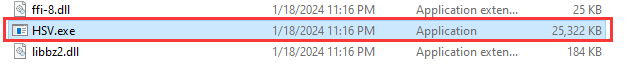

(2) Select the image file to be imported. The imported image needs to be stored in the "**img**" folder.


(3) Drag the slider to segment the image with HSV threshold, and adjust it to the appropriate HSV threshold range. You can refer to the following color range table.

:::{Note}

Image stretching due to resolution does not affect threshold debugging.

:::

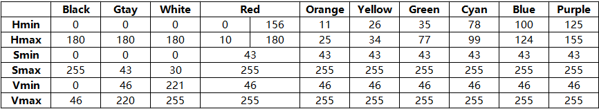

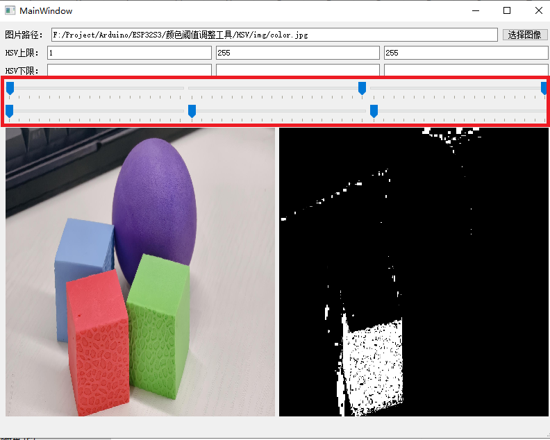

(4) Save the HSV threshold. Locate and open the "[**ESP32S3-Cam Color Recognition Program\ColorDetection\color_detection.cpp**]()" file. Modify the color data to the saved HSV array. Next, refer to "[**8.5.3 Program download -> ESP32S3-Cam Program Download**]() " to flash the modified program into ESP32S3-Cam.

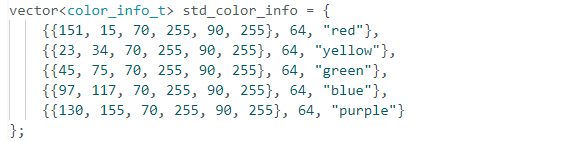

:::{Note}

The elements of the array are separated with commas.

:::

(5) Once the flashing is completed, the ESP32S3-Cam can recognize the object with other colors.

### 8.5.7 FAQ

Q:Since the code was upload, the color can not be recognized.

A: ① Please check that you have connected the 4-pin cable to the I2C interface and turn the knob on the expansion board to the initial position. 

② Please check if knobs S5 and S6 are rotated to the neutral position. This action can avoid interference, because the I2C interface shares the same interface with the knobs S5 and S6.

Q:Why is the color recognized by the camera inaccurate or even incorrect?

A:Please try to minimize the complexity of the background. You can use a single color or a simple environment as the background.

## 8.6 Color Tracking

In this section, uHand UNO will use the ESP32S3-Cam to recognize a blue ball and simultaneously track its movement, turning left and right  accordingly.

### 8.6.1 Program Flowchart


### 8.6.2 ESP32S3-Cam Development Module 

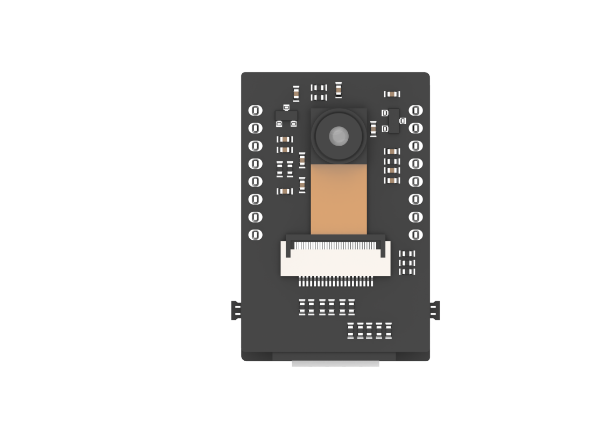

ESP32S3-Cam development board integrates an ESP32 chip and a camera module. After being inserted into the expansion board, it uses the I2C communication interface to read color and face data through I2C communication.

* **Wiring**

Align the pins of ESP32S3-Cam with the pin headers on the camera expansion board, and connect it to an I2C interface on the uHand UNO expansion board with a 4PIN wire.


### 8.6.3 Program Download 

[ESP32S3-Cam Color Recognition Program]()

[uHand UNO Color Tracking Program]()

:::{Note}

- Remove the Bluetooth module before downloading the program. Or the program will fail to download because of the serial port conflict.

- Please switch the battery box to the "**OFF**" when connecting a Type-B cable. This action prevents the cable from accidentally touching the power pins on the expansion board, which may cause a short circuit.

  :::

* **Arduino UNO Program Download**

(1) Locate and open [**uhand_colors_trace_esp32cam\uhand_colors\_ trace_esp32cam.ino**]()  program file in the same directory of this section.

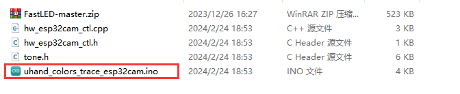

(2) Connect Arduino to the computer with the UNO cable (Type-B).


(3) Click **"Select Board"**, and the software will automatically detect the current Arduino serial port. Next, click to connect.


(4) Click  to download the program into Arduino. Then just wait for it to complete.


* **ESP32S3-Cam Program Download**

(1) Connect the ESP32S3-Cam to the computer with a Type-C data cable.

(2) Locate and open the [ColorDetection\ColorDetection.ino]() program file in the same directory as this section.


(3) Select the **"ESP32S3 Dev Module"** development board.


(4) Click the **"Tool"** in the menu bar, and select the corresponding configuration for the ESP32S3 development board.


(5) Click to download the program to the ESP32S3-Cam, and then wait for the download to complete.


### 8.6.4 Program Outcome

(1) When powered on, the uHand UNO's fingers open and its pan-tilt returns to the initial position. At the same time, the RGB light on the expansion board turns green.

(2) When you place the blue ball in front of the ESP32S3-Cam camera and move it left and right, the robotic hand follows the ball turning to left and right.

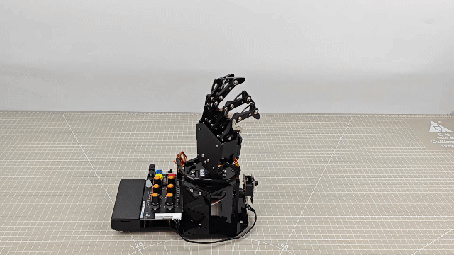

### 8.6.5 Brief Program Analysis

[ESP32S3-Cam Color Recognition Program]()

[uHand UNO Color Tracking Program]()

* **Import Library File**

<span class="mark">Import the required libraries for RGB control, servo control, buzzer tone control and the ESP32Cam library files for the game.</span>

{lineno-start=1}

```python
#include <FastLED.h> //导入LED库(import LED library)
#include <Servo.h> //导入舵机库(import servo library)
#include "hw_esp32cam_ctl.h" //导入ESP32Cam通讯库(import ESP32S3-Cam communication library)
#include "tone.h" //导入音调库(import tone library)
```

* **Pin Definition and Object Creation**

(1) Initially, the buzzer's tone and pins are defined, including the servo pins, buzzer pins, and RGB LED pins.

{lineno-start=6}

```python
const static uint16_t DOC5[] = { TONE_C5 };
const static uint16_t DOC6[] = { TONE_C6 };

/* 引脚定义(define pins) */
const static uint8_t servoPins[6] = { 7, 6, 5, 4, 3, 2 };
const static uint8_t buzzerPin = 11;
const static uint8_t rgbPin = 13;
```

(2) And the control objects for RGB LED and the servos and the communication object for ESP32Cam are created.

{lineno-start=14}

```python
//RGB灯控制对象(RGB LED control object)
static CRGB rgbs[1];
//ESP32Cam通讯对象(ESP32S3-Cam communication object)
HW_ESP32Cam hw_cam;
//舵机控制对象(servo control object)
Servo servos[6];
```

(3) Next, define the correlation variables controlling servo angles. The array`extended_func_angles[6]` is the expected angles used to uniformly rotate servos to their designated positions. And the `servo_angles\[6]` is the actual angles, indicating the current actual angles of the servos.

(4) And define the correlation variables controlling the buzzer. The `tune_num` is the buzzer's sounding times. The `tune_beat` is the interval between each sound, which is the frequency of the buzzer. And `*tune` is the buzzer pointer indicating a buzzer's tone variable. 

(5) Finally, declare the functions of the servo's control and the buzzer sounding, and the task of the buzzer control and the ESP32Cam communication.

{lineno-start=21}

```python
// 舵机角度相关变量(variables related to servo angles)
static uint8_t extended_func_angles[6] = { 80, 100, 100, 80, 70, 95 }; /* 二次开发例程使用的角度数值(angle values used for secondary development) */
static float servo_angles[6] = { 80, 100, 100, 80, 70, 95 };  /* 舵机实际控制的角度数值(angle values for actual servo control) */

// 蜂鸣器相关变量(variable related to the buzzer)
static uint16_t tune_num = 0;
static uint32_t tune_beat = 10;
static uint16_t *tune;

static void servo_control(void); /* 舵机控制(servo control) */
void play_tune(uint16_t *p, uint32_t beat, uint16_t len); /* 蜂鸣器鸣响接口(buzzer control interface) */
void tune_task(void); /* 蜂鸣器控制任务(buzzer control task) */

void espcam_task(void); /* esp32cam通讯任务(ESP32S3-Cam communication task) */
```

Regarding the desired and actual values, you can check the `servo_control` function called in the "**loop**" main function.

If you want the servo to gradually move towards the target position, you need to call `servo_angles[i] = servo_angles[i] * 0.90 + extended_func_ angles[i] * 0.1` in the control task function.

This allows the servos to move each time at 90% of the actual and 10% of the desired values. So that the actual value will incrementally approaches the desired value.The hand stops moving once both are equal.

{lineno-start=94}

```python
void servo_control(void) {
  static uint32_t last_tick = 0;
  if (millis() - last_tick < 40) {
    return;
  }
  last_tick = millis();
  for (int i = 0; i < 6; ++i) {
    servo_angles[i] = servo_angles[i] * 0.85 + extended_func_angles[i] * 0.15;
    servos[i].write(i == 0 || i == 5 ? 180 - servo_angles[i] : servo_angles[i]);
  }
}
```

* **Initialization Setting**

(1) The `setup ()` function mainly initializes associated hardware devices. Starting with the serial port, which sets baudrate as 115200 and a read timeout as 500ms.

{lineno-start=37}

```python
  Serial.begin(115200);
  // 设置串行端口读取数据的超时时间(set timeout for serial port reading data)
  Serial.setTimeout(500);
```

(2) Assign servo IO port and you can control via pins easily.

{lineno-start=41}

```python
  // 绑定舵机IO口(bind servo IO port)
  for (int i = 0; i < 6; ++i) {
    servos[i].attach(servoPins[i],500,2500);
  }
```

(3) Use `FastLED` library to initialize the RGB light on the expansion board and connect it to the `rgbPin` .Set the color of RGB as blue by `rgbs[0] = CRGB(0, 0, 100)`. And use `FastLED.show` function to display the set color.

{lineno-start=49}

```python
  FastLED.addLeds<WS2812, rgbPin, GRB>(rgbs, 1);
  rgbs[0] = CRGB(0, 255, 0);
  FastLED.show();
```

(4) Set the pin of the buzzer as output mode to control the buzzer and make a short sound.

{lineno-start=54}

```python
  pinMode(buzzerPin, OUTPUT);
  tone(buzzerPin, 1000);
  delay(100);
  noTone(buzzerPin);
```

(5)  Use the serial port to output the `Start` string to indicate the sensor is ready and data transmission has commenced.

{lineno-start=59}

```python
  delay(500);
  Serial.println("start");
}
```

* **Call Subfunction in a Loop**

After finishing the initialization, enter the `loop` main function. First call the `espcam_task` function which is used to communicate with esp32Cam for the result of color recognition to execute the uhand UNO rotating. Then, call `tune_task` function to execute the buzzer task. Finally, call `servo_control` function to control the servos.

{lineno-start=63}

```python
void loop() {
  // esp32cam通讯任务(ESP32S3-Cam communication task)
  espcam_task();
  // 蜂鸣器鸣响任务(buzzer sound task)
  tune_task();
  // 舵机控制(servo control)
  servo_control();
}
```

* **ESP32Cam Communication Task**

(1\) Define the "**espcam_task**" function. First, two variables are defined. The `last_tick` variable and "**millis()**" are used for delay operation. Specifically, use the "**millis()**" function to obtain the running time of the program minus the "**last_tick**" variable. If the difference is less than 75, the function will return; if the difference is greater than or equal to 75, it indicates the task has been delayed by 75ms. And then the current time is assigned to the "**last_tick**" variable for the next delay operation.

The "**color_info\[4\]**" array is used to store the return data of the esp32cam. The data corresponding to the subscript is: \[0\] is the x-coordinate of the upper left corner of the recognized color, \[1\] is the y-coordinate of the upper left corner of the recognized color, \[2\] is the width of the recognized color range and \[3\] is the height of the recognized color range.

{lineno-start=73}

```python
// esp32cam通讯任务(ESP32Cam communication task)
void espcam_task(void)
{
  static uint32_t last_tick = 0;
  uint8_t color_info[4];

  // 时间间隔(time interval)
  if (millis() - last_tick < 75) {
    return;
  }
  last_tick = millis();
```

(2\) Next, use the "**color_position()**" function to determine if blue is recognized. If it is recognized, calculate the center point of the blue block. Map the position of the center point to the corresponding servo angle and then control the servo's movement tracking.

{lineno-start=84}

```python
  if(hw_cam.color_position(color_info)) //若识别到颜色(if a color is recognized)
  {
    uint16_t num = color_info[0] + color_info[2]/2; //计算颜色块中心(calculate the center of the color block)
    uint16_t angle = map(num , 0 , 320 , 60 , 120); //映射到对应的舵机角度(map to the corresponding servo angles)
    extended_func_angles[5] = angle; //控制舵机运动追踪(control servo motion tracking)
  }
```

* **Servo Control Task**

Use the **"last_tick"** variable to delay for 40ms. Use a **"for"** loop to transmit the angle values to each servo through the servo port to control their rotation.

{lineno-start=94}

```python
//舵机控制任务(servo control task)
void servo_control(void) {
  static uint32_t last_tick = 0;
  if (millis() - last_tick < 40) {
    return;
  }
  last_tick = millis();
  for (int i = 0; i < 6; ++i) {
    servo_angles[i] = servo_angles[i] * 0.85 + extended_func_angles[i] * 0.15;
    servos[i].write(i == 0 || i == 5 ? 180 - servo_angles[i] : servo_angles[i]);
  }
}
```

* **Buzzer Task**

Control the buzzer to play a melody according to the specified rhythm and tone arrays.

{lineno-start=107}

```python
// 蜂鸣器任务(buzzer task)
void tune_task(void) {
  static uint32_t l_tune_beat = 0;
  static uint32_t last_tick = 0;
  // 若未到定时时间 且 响的次数跟上一次的一样(if it is not yet the scheduled time and the ringing duration is the same as the previous time)
  if (millis() - last_tick < l_tune_beat && tune_beat == l_tune_beat) {
    return;
  }
```

Note that the `l_tune_beat` variable used to store the intervals (in milliseconds) between the previous and current playing tones. The "**last_tick**" variable is used to store the timestamp of last function executing. And control the buzzer to play a melody in the specified rhythm and tone arrays.

{lineno-start=109}

```python
  static uint32_t l_tune_beat = 0;
  static uint32_t last_tick = 0;
```

(1) Determine if it is needed to play the tone, and use the `millis ()` function to get the current timestamp and compare it to `last_tick`. If the interval between the current and the previous playing is less than `l_tune_beat`, and the value of `tune_beat` has no change (that is, `tune_beat` equals to "**l_tune_beat**"), the function returns without doing anything. This prevents repeating the same tone at the same interval.

{lineno-start=112}

```python
  if (millis() - last_tick < l_tune_beat && tune_beat == l_tune_beat) {
    return;
  }
```

(2) Update the variable. Assign the value of the `tune_beat` to the `l_tune_beat` to update the `last_tick` to the current timestamp.

{lineno-start=115}

```python
  l_tune_beat = tune_beat;
  last_tick = millis();
```

(3) If the `tune_num` is more than 0, there are additional tones need to be played. Use the `tone ()` function to play the current tone on the `buzzerPin`.

{lineno-start=117}

```python
  if (tune_num > 0) {
    tune_num -= 1;
    tone(buzzerPin, *tune++);
```

(4) If the `tune_num` is not greater than 0, it indicates that all tones have been played. Use `noTone ()` function to stop the buzzer sounding. And reset the `tune_beat` and the `l_tune_beat` as 10 (that is, the running interval of the buzzer task is 10) to prepare for the next tune.

{lineno-start=120}

```python
  } else {
    noTone(buzzerPin);
    tune_beat = 10;
    l_tune_beat = 10;
  }
}
```

* **Buzzer Sound**

Specify the tone array, the interval between the tones and the number of tone to be played.

{lineno-start=129}

```python
void play_tune(uint16_t *p, uint32_t beat, uint16_t len) {
  tune = p;
  tune_beat = beat;
  tune_num = len;
}
```

`tune = P` sets variable `tune` (a pointer to an array of tone) as the value of the passed parameter P. In this way, "**tune**" points to the user-provided tone array.

`tune_beat = beat` sets variable `tune_beat` (it means the interval between the tones to be played) as the value of the passed parameter "**beat**", which determines the rhythm of the tone.

`tune_num = len` sets variable `tune_num` (it means the number of tones to be played) as the value of the passed parameter "**len**", which determines the length of the playlist.

### 8.6.6 Function Extension

How to modify the tracked color of uHand UNO from blue to another color? Take red as an example, please refer to the following steps:

(1) Locate and open the "[**uHand UNO Color Tracking program\uhand_colors_trace_esp32cam\uhand_colors_trace_esp32cam**]()" program file in the same path as this lesson.

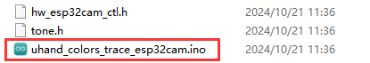

(2) Modify the register address of the color to be recognized to "**0x00**". This address obtains the coordinate data of red.

(3) Refer to the "3.1 Arduino UNO Program Download" to flash the program into the development board. Once the flashing is completed, uHand UNO can track the red object.

### 8.6.7 FAQ

Q:Since the code was upload, the color can not be recognized.

A: Please check that you have connected the 4-pin cable to the I2C interface and turn the knob on the expansion board to the initial position.

Q:Why is the color recognized by the camera inaccurate or even incorrect?

A:Please try to minimize the complexity of the background. You can use a single color or a simple environment as the background.

## 8.7 Face Detection

In this section, the uHand UNO will use the ESP32S3-Cam vision module to recognize faces, then perform a waving gesture after a face is detected.

### 8.7.1 Program Flowchart

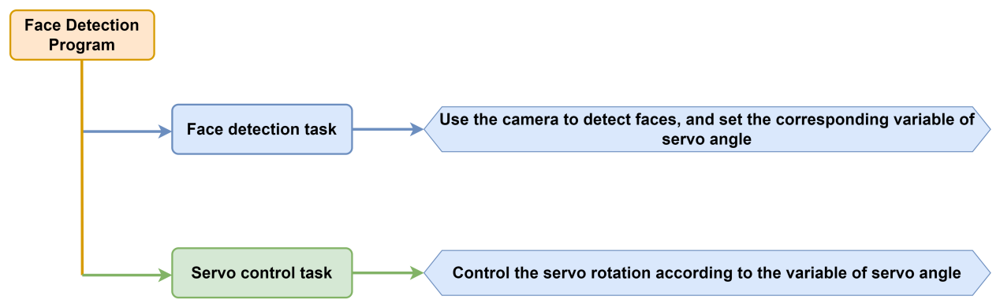

### 8.7.2 ESP32S3-Cam Development Module 


ESP32S3-Cam development board integrates an ESP32 chip and a camera module. After being inserted into the expansion board, it uses the I2C communication interface to read color and face data through I2C communication.

* **Wiring**

Align the pins of ESP32S3-Cam with the pin headers on the camera carrier board, and connect it to an I2C interface on the uHand UNO expansion board with a 4PIN wire.


### 8.7.3 Program Download

[ESP32S3-Cam Face Detection Program]()

[uHand UNO Face Detection Program]()

:::{Note}

- The Bluetooth module must be removed before downloading the program, otherwise the program download will fail due to serial interface conflict.

- Please turn the switch of the battery box to "**OFF**" when connecting the Type-B download cable in case the download cable touches the power pin of the expansion board by mistake, which may cause a short circuit.

:::

* **Arduino UNO Program Download**

(1) Locate and open the [uhand_face_esp32cam\uhand_face\_ esp32cam. ino]() program file in the same directory as this section.

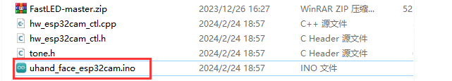

(2) Connect the Arduino to the computer through a UNO cable (Type-B).


(3) Click the **"Select Board"**, and the software will automatically detect the current Arduino serial interface. Then click to connect.


(4) Click  to download the program to Arduino, and then wait for the download to complete.


* **ESP32S3-Cam Firmware Burning**

(1) Connect the ESP32S3-Cam to the computer with a Type-C data cable.

(2) Locate and open the [**ESP32S3-Cam Face Detection Program\\ FaceDetection\FaceDetection.ino**]() program file .


(3) Select the **"ESP32S3 Dev Module"** development board.


(4) Click the **"Tool"** in the menu bar, and select the corresponding configuration for the ESP32S3 development board.


(5) Click to download the program to the ESP32S3-Cam, and then wait for the download to complete.


### 8.7.4 Program Outcome

(1) After powering on, the robotic hand returns to the initial position with five fingers spread out, and the RGB light on the expansion board lights up green.

(2) When a face is detected, the hand makes a waving action.

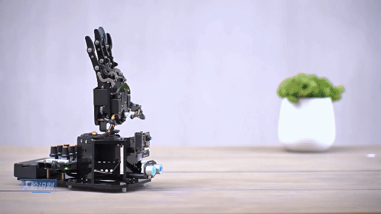

### 8.7.5 Brief Program Analysis

[ESP32S3-Cam Face Detection Program]()

[uHand UNO Face Detection Program]()

* **Import Library File**

(1) Import the RGB control library, servo control library, ESP32Cam communication library and buzzer tone library file required for this program.

{lineno-start=7}

```python
#include <FastLED.h> //导入LED库(import LED library)
#include <Servo.h> //导入舵机库(import servo library)
#include "hw_esp32cam_ctl.h" //导入ESP32Cam通讯库(import ESP32S3-Cam communication library)
#include "tone.h" //导入音调库(import tone library)
```

(2) Define the tone constant.

{lineno-start=12}

```python
const static uint16_t DOC5[] = { TONE_C5 };
const static uint16_t DOC6[] = { TONE_C6 };
```

* **Define Pins and Create Objects**

(1) Firstly, define Arduino pins used for connecting hardware, mainly consisting of six servo pins, one buzzer pin and one RGB light pin.

{lineno-start=16}

```python
const static uint8_t servoPins[6] = { 7, 6, 5, 4, 3, 2 };
const static uint8_t buzzerPin = 11;
const static uint8_t rgbPin = 13;
```

(2) Next, define buzzer-related variable.

{lineno-start=31}

```python
static uint16_t tune_num = 0;
static uint32_t tune_beat = 10;
static uint16_t *tune;
```

(3) Then, define variables used for controlling RGB light, ESP32Cam communication and servo. The `extended_func_angles` array is used for storing desired angle of each servo. The `servo_angles` array is used for storing actual angle of servo, and the range is 0~180. The initial position of the hand is set to open here.

{lineno-start=20}

```python
//RGB灯控制对象(RGB LED control object)
static CRGB rgbs[1];
//ESP32Cam通讯对象(ESP32S3-Cam communication object)
HW_ESP32Cam hw_cam;
//舵机控制对象(servo control object)
Servo servos[6];

// 舵机角度相关变量(variables related to servo angles)
static uint8_t extended_func_angles[6] = { 80, 100, 100, 80, 70, 95 }; /* 二次开发例程使用的角度数值(angle values used for secondary development) */
static float servo_angles[6] = { 80, 100, 100, 80, 70, 95 };  /* 舵机实际控制的角度数值(angle values for actual servo control) */
```

For the expected and actual value, you can see the "**servo_control**" function called in the loop main function.

If you want the servo to close to the target position gradually, you need to call this line of code `servo_angles[i] = servo_angles[i] * 0.85 + extended_func_angles[i] * 0.15` in the control task function.

This causes the servo to move each time by 85% of the actual value and 15% of the desired value, so that the actual value gets progressively closer to the desired value. When they are equal, the robot hand stop moving.

{lineno-start=183}

```python
//舵机控制任务(servo control task)
void servo_control(void) {
  static uint32_t last_tick = 0;
  if (millis() - last_tick < 40) {
    return;
  }
  last_tick = millis();
  for (int i = 0; i < 6; ++i) {
    servo_angles[i] = servo_angles[i] * 0.85 + extended_func_angles[i] * 0.15;
    servos[i].write(i == 0 || i == 5 ? 180 - servo_angles[i] : servo_angles[i]);
  }
}
```

(4) Fourthly, define the variable used for controlling servo, and declare task function to perform different control task. The `servo_control` function is used for controlling servo; the `play_tune` function is used for controlling buzzer sound; the `tune_task` function is used for performing buzzer task; and the `espcam_task` function is used for handling ESP32S3-Camrelated communication.

{lineno-start=31}

```python
static uint16_t tune_num = 0;
static uint32_t tune_beat = 10;
static uint16_t *tune;

static void servo_control(void); /* 舵机控制(servo control) */
void play_tune(uint16_t *p, uint32_t beat, uint16_t len); /* 蜂鸣器鸣响接口(buzzer control interface) */
void tune_task(void); /* 蜂鸣器控制任务(buzzer control task) */

void espcam_task(void); /* esp32cam通讯任务(ESP32S3-Cam communication task) */
```

* **Initial Settings**

(1) Initialize related hardware equipment in the `setup()` function. The first is serial interface, which sets the baud rate of communication to 115200 and the timeout for reading data to 500ms.

{lineno-start=42}

```python
  Serial.begin(115200);
  // 设置串行端口读取数据的超时时间(set timeout for serial port reading data)
  Serial.setTimeout(500);
```

(2) Assign the servo IO port to facilitate its control through pin.

{lineno-start=47}

```python
  for (int i = 0; i < 6; ++i) {
    servos[i].attach(servoPins[i],500,2500);
  }
```

(3) Initialize the ESP32S3-Cam communication connector and set the fill light brightness to 0 (within the range of 0 to 255. Turn off the fill light when the brightness is 0.).

{lineno-start=51}

```python
 hw_cam.begin(); //初始化与ESP32Cam通讯接口(initialize ESP32S3-Cam communication interface)
```

(4) Use the `FastLED` library to initialize the RGB light on the expansion board and connect it to the RGB pin. Then set the color to green by `rgbs[0] = CRGB(0, 255, 0)` and use the `FastLED.show` function to show the set color.

{lineno-start=54}

```python
  FastLED.addLeds<WS2812, rgbPin, GRB>(rgbs, 1);
  rgbs[0] = CRGB(0, 255, 0);
  FastLED.show();
```

(5) Set the pin of buzzer to output mode and control the buzzer to stop running after a short sound.

{lineno-start=59}

```python
  pinMode(buzzerPin, OUTPUT);
  tone(buzzerPin, 1000);
  delay(100);
  noTone(buzzerPin);
```

(6) Output the **"Start"** string through a serial interface to indicate that the sensor is ready to start transmitting data.

{lineno-start=64}

```python
  delay(500);
  Serial.println("start");
}
```

* **Call Sub-functions in a Loop**

After initializing, enter the loop main function, call the `espcam_task` function in turn, detect the face and perform waving action. Call the `tune_task` function to execute buzzer task and call the `servo_control` function to control servo.

{lineno-start=68}

```python
void loop() {
  // esp32cam通讯任务(ESP32S3-Cam communication task)
  espcam_task();
  // 蜂鸣器鸣响任务(buzzer sound task)
  tune_task();
  // 舵机控制(servo control)
  servo_control();
}
```

* **ESP32S3-CamCommunication Task**

Define the "**espcam_task**" function to detect face identification and execute the waving action.

(1) Firstly, define 5 variables: `last_tick` records the timestamp last task execution; `posi` defines the angle of pan-tilt servo; `step` tracks the current stage of task execution; `delay_count` sets the counting unit for time-lapse; and `res` stores detection results from camera.

{lineno-start=78}

```python
void espcam_task(void)
{
  static uint32_t last_tick = 0;
  static int posi = 90;
  static uint8_t step = 0;
  static uint8_t delay_count = 0;
  int res = 0;
```

(2) The `last_tick` variable, combined with the `millis()`, is used for time delayed operation. First, the current program runtime is obtained by using the `millis()` function, and then subtract it from the `last_tick` variable. If the difference is less than 100, the function exists. If the difference is greater than or equal to 100, it indicates a delay of 50ms has occurred. Then the current time is assigned to the "**last_tick**" variable for the next delay operation.

{lineno-start=86}

```python
  if (millis() - last_tick < 50) {
    return;
  }
  last_tick = millis();
```

(3) Assign the "**res**" variable to the detection result.

{lineno-start=91}

```python
  res = hw_cam.faceDetect();
```

(4) Execute the waving action as soon as the face is detected. Stay stationary if the face is undetected. Here is the analysis of the "**switch**" code snippet:

{lineno-start=93}

```python
  switch(step)
  {
    case 0:
      if(res != 0) 
      {
        rgbs[0].r = 250;
        rgbs[0].g = 0;
        rgbs[0].b = 0;
```

**Case 0:** detect face according to the `hw_cam.colorDetect()`. If a face is detected, illuminate the RGB light in red, activate the buzzer, and proceed to the next state.

{lineno-start=95}

```python
    case 0:
      if(res != 0) 
      {
        rgbs[0].r = 250;
        rgbs[0].g = 0;
        rgbs[0].b = 0;
        FastLED.show();
        play_tune(DOC6, 300u, 1u);
        Serial.println("find face");
        step++;
```

Turn off the RGB light if the face is undetected.

{lineno-start=105}

```python
      }else{
        rgbs[0].r = 0;
        rgbs[0].g = 100;
        rgbs[0].b = 100;
        FastLED.show();
      }
      break;
```

**Case 1:** wait for 250ms before entering to the next state, giving the camera enough time to complete the face detection.

{lineno-start=112}

```python
    case 1:  //等待(wait)
      delay_count++;
      if(delay_count > 5)
      {
        step++;
        delay_count = 0;
      }
      break;
```

**Case 2:**close the robotic hand hand slightly and set the opening angle of the ID (1~5) servo to 45°. Then set the `delay_count` to 0 and enter to the next state.

{lineno-start=120}

```python
    case 2://闭合(close)
      control_hand(0);
      delay_count = 0;
      step++;
      break;
```

Call the `control_hand()` function, and adjust the rotation angle of servo ID 1~5. The range of the rotation angle is 0~180. 0 represents close, and 180 represents open.

{lineno-start=174}

```python
void control_hand(uint8_t angle)
{
  angle = angle > 180 ? 180 : angle;
  for(int i = 0 ; i < 5 ; i++)
  {
    extended_func_angles[i] = angle;
  }
}
```

**Case 3:** wait for 250ms to complete the action before proceeding to the next state.

{lineno-start=125}

```python
    case 3: //等待(wait)
      delay_count++;
      if(delay_count > 10)
      {
        step++;
      }
      break;
```

**Case 4:** open the robot hand and set the opening angle of the ID (1~5) to 180°. Then set the `delay_count` to 0 and turn to the next state.

{lineno-start=132}

```python
    case 4://张开(open)
      control_hand(180);
      delay_count = 0;
      step++;
      break;
```

**Case 5:** wait for 500ms to complete the action before proceeding to the next state.

{lineno-start=137}

```python
    case 5: //等待(wait)
      delay_count++;
      if(delay_count > 15)
      {
        step++;
      }
      break;
```

**Case 6~9** repeat preceding steps.

{lineno-start=144}

```python
    case 6://闭合(close)
      control_hand(0);
      delay_count = 0;
      step++;
      break;
    case 7: //等待(wait)
      delay_count++;
      if(delay_count > 15)
      {
        step++;
      }
      break;
    case 8://张开(open)
      control_hand(180);
      delay_count = 0;
      step++;
      break;
    case 9: //等待(wait)
      delay_count++;
      if(delay_count > 15)
      {
        step = 0;
      }
      break;
```

After execute the actions, set the state value to 0 and restart a new detection.

{lineno-start=168}

```python
    default:
      step = 0;
      break;
  }
}
```

* **Servo Control**

If you want the servo to close to the target position, call this line of code `servo_angles[i] = servo_angles[i] * 0.85 + extended_func_angles[i] * 0.15` in the control task function.

This causes the servo to move each time by 85% of the actual value and 15% of the desired value, so that the actual value gets progressively closer to the desired value. When they are equal, the robot hand stop moving.

{lineno-start=184}

```python
void servo_control(void) {
  static uint32_t last_tick = 0;
  if (millis() - last_tick < 40) {
    return;
  }
  last_tick = millis();
  for (int i = 0; i < 6; ++i) {
    servo_angles[i] = servo_angles[i] * 0.85 + extended_func_angles[i] * 0.15;
    servos[i].write(i == 0 || i == 5 ? 180 - servo_angles[i] : servo_angles[i]);
  }
}
```

* **Buzzer Control**

Control the buzzer to play a melody according to specified tempo and tone array.

{lineno-start=197}

```python
void tune_task(void) {
  static uint32_t l_tune_beat = 0;
  static uint32_t last_tick = 0;
  // 若未到定时时间 且 响的次数跟上一次的一样(if it is not yet the scheduled time and the ringing duration is the same as the previous time)
  if (millis() - last_tick < l_tune_beat && tune_beat == l_tune_beat) {
    return;
  }
```

(1) Declare variables. The `l_tune_beat` variable is used for storing the interval between the last played tones (in milliseconds). The `last_tick` variable is used for storing the timestamp of last function execution. Control the buzzer to play a melody according to the specified tempo and tone.

{lineno-start=198}

```python
  static uint32_t l_tune_beat = 0;
  static uint32_t last_tick = 0;
```

(2) Determine whether the tone needs to be played. Using the `millis()` function to get the current timestamp, and compare with the `last_tick`. You can set the function to return and do not perform any operation if the interval between the current time and last played time is less than the `l_tune_beat`, and the value of the `tune_beat` does not change (i.e. `tune_beat` is equal to `l_tune_beat`). This is to prevent the same tone from being played repeatedly in the same interval.

{lineno-start=201}

```python
  if (millis() - last_tick < l_tune_beat && tune_beat == l_tune_beat) {
    return;
  }
```

(3) Update variables. Assign the value of the `tune_beat` to `l_tune_beat`, and update the `last_tick` as the current timestamp.

{lineno-start=204}

```python
  l_tune_beat = tune_beat;
  last_tick = millis();
```

(4) If the `tune_num` is larger than 0, it means that there are additional tones need to be played. Then use the `tone()` function to play current tone in the buzzer pin.

{lineno-start=206}

```python
  if (tune_num > 0) {
    tune_num -= 1;
    tone(buzzerPin, *tune++);
```

(5) If the `tune_num` is not more than 0, it means all tones have been played. Use the `noTone()` function to stop buzzer from sounding, and reset `tune_beat` and `l_tune_beat` to 10 (that is, the buzzer task runs at an interval of 10ms) in preparation for the next playback of the melody.

{lineno-start=209}

```python
  } else {
    noTone(buzzerPin);
    tune_beat = 10;
    l_tune_beat = 10;
  }
}
```

* **Buzzer Sound**

Specify the tone array, the interval between the tones and the number of tone to be played.

{lineno-start=217}

```python
void play_tune(uint16_t *p, uint32_t beat, uint16_t len) {
  tune = p;
  tune_beat = beat;
  tune_num = len;
}
```

`tune = p;` sets variable `tune` (a pointer to an array of tone) to the value of the passed parameter p. In this way, variable "**tune**" points to an array of tones provided by the user.

`tune_beat = beat;` sets variable `tune_beat` (it means the interval between tones to be played) to the value of the passed parameter "**beat**", which determines the tempo of the tone.

`tune_num = len;` sets variable `tune_num` (it means the number of tones to be played) to the value of the passed parameter "**len**", which determines the length of the playlist.

### 8.7.6 FAQ

Q:Since the code was upload, the face can not be recognized. What should I do?

A:Please check if the 4PIN wire is correctly connected to the I2C interface.

Q:Ask: Why the camera cannot recognize when I face it, but it can recognize When flipped upside down?

A:Please flash another "**bin**" file to make the face recognized.