# 9. Wireless Glove Control Course

<p id="anchor_9_1"></p>

## 9.1 Wireless Glove Introduction and Wearing 

The wireless glove consists of five potentiometers and uses a Bluetooth module to communicate with devices.

### 9.1.1 Structure Introduction


**Potentiometers**: There are five potentiometers on the back of the wireless glove, which are key components that control the opening and closing of the uHand UNO.

**Gyroscope Acceleration Sensor (MPU6050)**: It can obtain the acceleration and tile angle of the wireless glove in the x,y, and z axes. You can control the uHand UNO by rotating the wireless glove for more operations.

**Bluetooth Module**: It is mainly used for communication between the wireless glove and the uHand UNO.

**Function Keys**: The functions of these two keys are as follows:

**(1) DEL:** Clear the history of Bluetooth connections.

**(2) K3:** Switch the control mode of the wireless glove.

**(3) Reset Key:** Restart the wireless glove.

**(4) LED Indicators:** Display the control mode of the wireless glove.

**(5) USB Port:** Used to connect to a PC for debugging and downloading programs.

**(6) Power Port:** Connect to a lithium battery to power the wireless glove, with a standard voltage of 7.4V.

### 9.1.2 Wearing Method

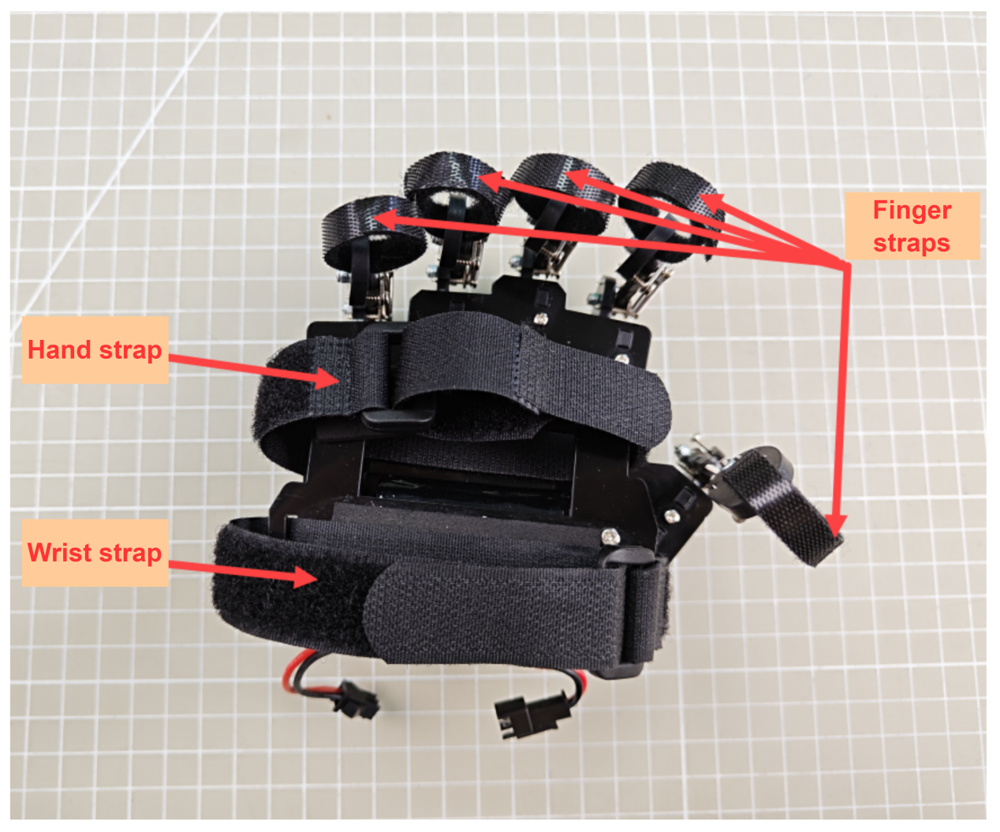

Open all straps. First, tie the finger straps at the last knuckles of each finger, and then tie the hand strap and wrist strap at the hand and wrist respectively. The final wearing effect is as follows (please refer to the video in the same path as this document for details):

<p class="common_img" style="text-align:center;">

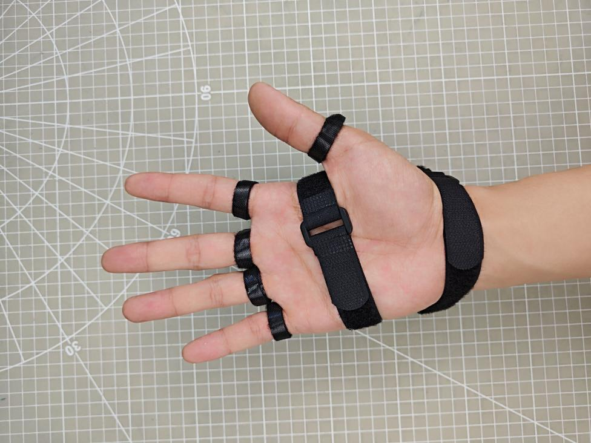


</p>

Front Back

### 9.1.3 Device Pairing

(1) First, switch on the controlled device and ensure it is connected to the Bluetooth module.

(2) Wear the wireless glove on the right hand, and make a fist with the palm facing down. Then power on the wireless glove and its LED indicators will light up.

<p class="common_img" style="text-align:center;">


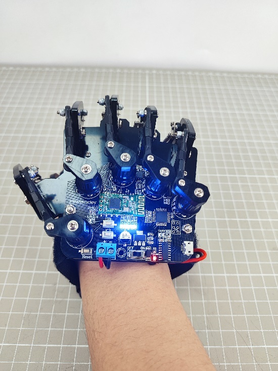

</p>

(3) After the LED indicators go off, stretch your hand. When the LEDs complete the second flashing, it means that the initialization of the wireless glove is completed. (This process must be done every time you restart the glove.)

<p class="common_img" style="text-align:center;">
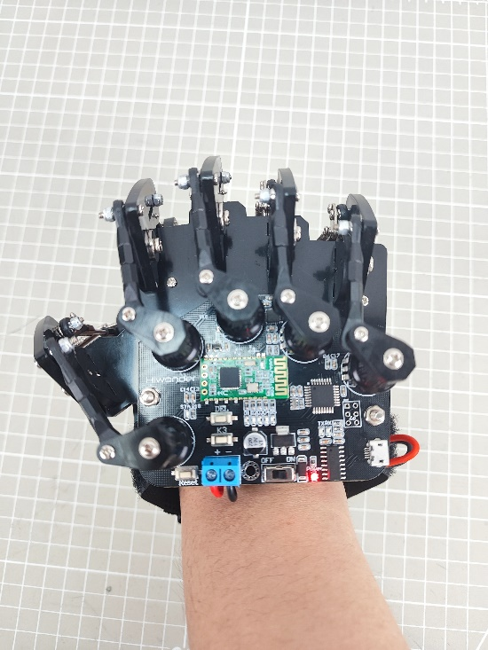
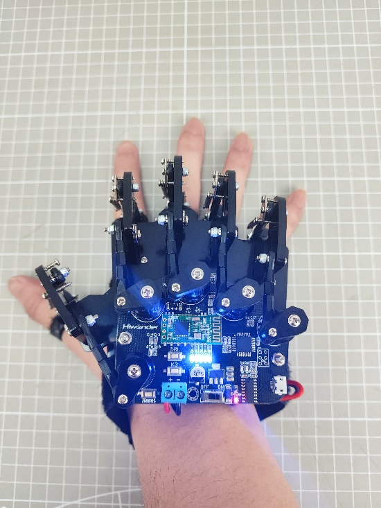
</p>

(4) Press the **'DEL'** key to clear the history of the Bluetooth connections.

(5) After the clear is completed, the **'STA'** indicator starts to flash, and the wireless glove will automatically connect to the device. When the connection is successful, the "**STA**" indicator stays on.

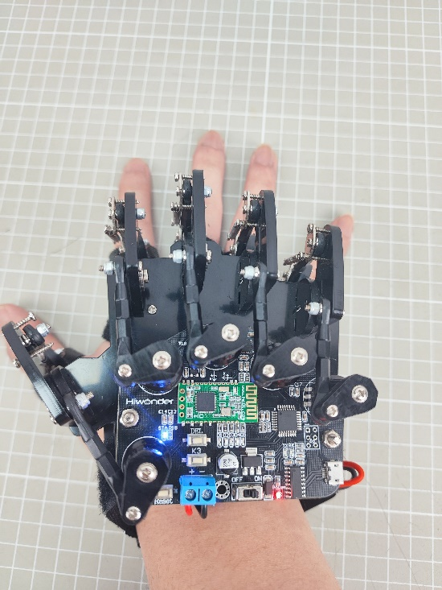

### 9.1.4 Control Modes Switching

You can press the **'K3'** key on the wireless glove to switch control modes. The LEDs (D1 to D5) will provide feedback on the currently selected mode.

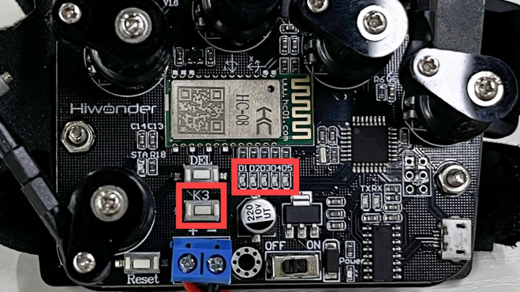

The corresponding relationship between the LED status and the mode is shown in the following table:

|     LED status(D1-D5)     |                    Mode                     |
| :-----------------------: | :-----------------------------------------: |
|          All off          |            Biorobot Control Mode            |
|         1 on (D1)         |   Robotic Hand Control Mode (Right Hand)    |
|       2 on (D1, D2)       | Tank Control Mode |
|     3 on (D1, D2, D3)     | Robotic Arm Control Mode (PWM Servo Drive)  |
|   4 on (D1, D2, D3, D4)   |    Robotic Hand Control Mode (Left Hand)    |
| 5 on (D1, D2, D3, D4, D5) | Robotic Arm Control Mode (Bus Servo Drive)  |

### 9.1.5 Control Mode Instruction

The wireless glove has four control modes, which are used for controlling products in the biorobot series, robotic hand series, tank robot series, and robotic arm series with a built-in Bluetooth module. The specific control methods for each type of product are shown in the table below:

|                Product Type                 |                           Examples                           |
| :-----------------------------------------: | :----------------------------------------------------------: |
|               Biorobot Series               | Narrow-footed robot, Cross-footed robot, Spiderbot |
| Tank Robot Series |                           Tankbot                            |
|             Robotic Hand Series             |                       uHand, uHand UNO                       |
|             Robotic Arm Series              |                   LeArm, xArm 1S, MiniArm                    |

* **Biorobot**

The control of biorobot is mainly achieved through gesture control to make the robot perform a set of action groups:

<div class="wy-table-responsive">
<table border="1" class="docutils">
<thead>
<tr>
<th style="text-align: center;">Gesture Description</th>
<th style="text-align: center;width:180px;">Gesture Image</th>
<th style="text-align: center;">Biorobot Feedback Action(from the robot's view)</th>
</tr>
</thead>
<tbody>
<tr>
<td style="text-align: center;">Extend your middle finger, crook your ring finger, and tilt the palm to the right.</td>
<td style="text-align: center;">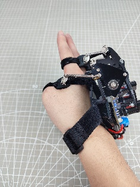</td>
<td style="text-align: center;">Turn right</td>
</tr>
<tr>
<td style="text-align: center;">Extend your middle finger, crook your ring finger, and tilt the palm to the left.</td>
<td style="text-align: center;">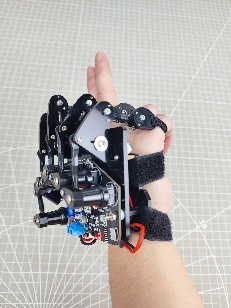</td>
<td style="text-align: center;">Turn left</td>
</tr>
<tr>
<td style="text-align: center;">Make a fist with the palm facing down.</td>
<td style="text-align: center;">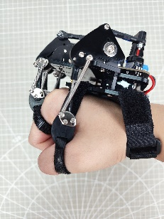</td>
<td style="text-align: center;">Stop</td>
</tr>
<tr>
<td style="text-align: center;">Stretch your hand (straighten your middle finger) with the palm facing down.</td>
<td style="text-align: center;">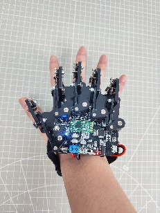</td>
<td style="text-align: center;">Move forward</td>
</tr>
<tr>
<td style="text-align: center;">Crook your middle finger, and straighten your little finger with the palm facing up (Spider-Man gesture).</td>
<td style="text-align: center;">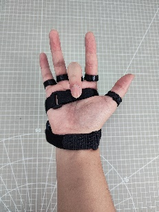</td>
<td style="text-align: center;">Move backward</td>
</tr>
<tr>
<td style="text-align: center;">Stretch your hand with the palm facing up.</td>
<td style="text-align: center;">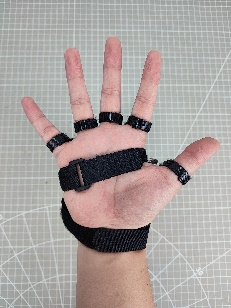</td>
<td style="text-align: center;">Stop</td>
</tr>
</tbody>
</table>
</div>

* **Tank Robot**

You can control the tank robot by making specific gestures. The following table shows the available gestures and their corresponding feedback actions from the tank:

<table class="docutils-nobg"  style="text-align: center;" border="1">
  <thead>
    <tr>
      <th>Initial Gesture</th>
      <th>Gesture Description (from your perspective)</th>
      <th style="width:180px;">Gesture Image</th>
      <th>Feedback Action from the Tank Robot (from the tank robot's perspective)</th>
    </tr>
  </thead>
  <tbody>
    <tr>
      <td rowspan="4">Straighten your index and middle fingers, with the palm facing down (other fingers crooked in).</td>
      <td>Raise your wrist, that is, your straightened fingers point forward and upward.</td>
      <td>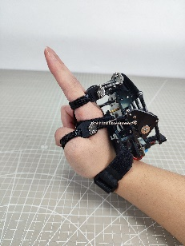</td>
      <td>Move forward</td>
    </tr>
    <tr>
      <td>Bend your wrist downward, that is, your straightened fingers point forward and downward.</td>
      <td>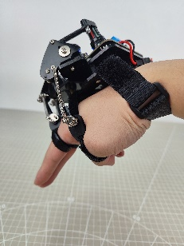</td>
      <td>Move backward</td>
    </tr>
    <tr>
      <td>Bend your wrist clockwise, that is, the palm faces to the left.</td>
      <td>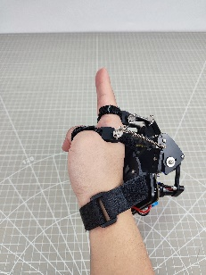</td>
      <td>Rotate clockwise in place.</td>
    </tr>
    <tr>
      <td>Bend your wrist counterclockwise, that is, the palm faces to the right.</td>
      <td>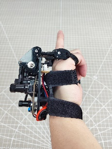</td>
      <td>Rotate counterclockwise in place.</td>
    </tr>
    <tr>
      <td colspan="3">Other Gestures</td>
      <td>Stop</td>
    </tr>
  </tbody>
</table>


* **Robotic Hand**

By bending or straightening your fingers, you can control the bending or straightening of the robotic hands' corresponding fingers:

<table class="docutils-nobg"  style="text-align: center;" border="1">
    <thead>
        <tr>
            <th>Potentiometer Position</th>
            <th>Gesture Image</th>
            <th>Servo Controlled</th>
        </tr>
    </thead>
    <tbody>
        <tr>
            <td colspan="2">Thumb</td>
            <td>Servo 1</td>
        </tr>
        <tr>
            <td colspan="2">Index Finger</td>
            <td>Servo 2</td>
        </tr>
        <tr>
            <td colspan="2">Middle Finger</td>
            <td>Servo 3</td>
        </tr>
        <tr>
            <td colspan="2">Ring Finger</td>
            <td>Servo 4</td>
        </tr>
        <tr>
            <td colspan="2">Little Finger</td>
            <td>Servo 5</td>
        </tr>
        <tr>
            <td>Stretch your hand with the palm facing down, and your wrist rotates clockwise.</td>
            <td>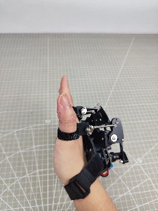</td>
            <td>The Pan-tilt rotates counterclockwise (from the perspective of the robotic hand).</td>
        </tr>
        <tr>
            <td>Stretch your hand with the palm facing down, and the wrist rotates counterclockwise.</td>
            <td>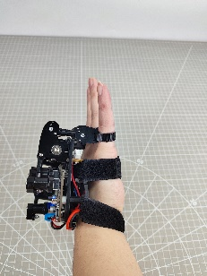</td>
            <td>The Pan-tilt rotates clockwise (from the perspective of the robotic hand).</td>
        </tr>
    </tbody>
</table>


* **Robotic Arm**

You can control the robotic arm servos by making specific gestures. The following table shows the available gestures and the corresponding servo numbers they control:

<table class="docutils-nobg" style="text-align: center;" border="1">
    <thead>
        <tr>
            <th>Initial Gesture</th>
            <th>Gesture Description</th>
            <th>Gesture Image</th>
            <th>Servo Controlled</th>
        </tr>
    </thead>
    <tbody>
        <tr>
            <td rowspan="5">The palm faces down.</td>
            <td>Extend your index finger and tilt to the left or right.</td>
            <td>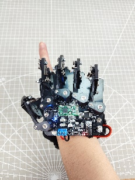</td>
            <td>Servo 1</td>
        </tr>
        <tr>
            <td>Extend your index and middle fingers, and tilt to the left or right.</td>
            <td>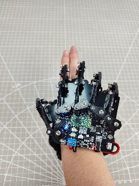</td>
            <td>Servo 2</td>
        </tr>
        <tr>
            <td>Extend your middle, ring, and little fingers, and tilt to the left or right.</td>
            <td>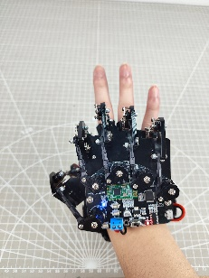</td>
            <td>Servo 3</td>
        </tr>
        <tr>
            <td>Extend your four fingers, and tilt to the left or right.</td>
            <td>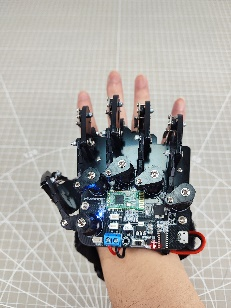</td>
            <td>Servo 4</td>
        </tr>
        <tr>
            <td>Stretch your hand with the palm facing down, and tilt to the left or right.</td>
            <td>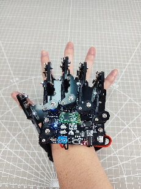</td>
            <td>Servo 5</td>
        </tr>
        <tr>
            <td>The palm faces down.</td>
            <td>Make a fist with the palm facing down, and tilt to the left or right.</td>
            <td>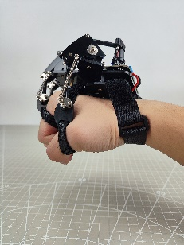</td>
            <td>Servo 6</td>
        </tr>
    </tbody>
</table>


## 9.2 Wireless Glove Control

In this section, you can learn how to control the robot hand through five potentiometers of the wireless glove.

### 9.2.1 Getting Ready

(1) Connect the Bluetooth module to the robotic hand.


(2) Put the wireless glove on according to the "[**9.1 Wireless Glove Introduction and Wearing**](#anchor_9_1)".

<p class="common_img" style="text-align:center;">

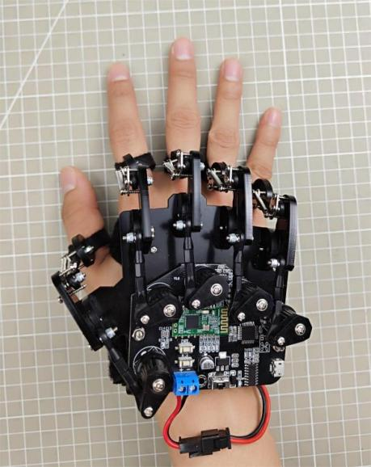


</p>

(3) According to the ["**9.1 Wireless Glove Introduction and Connection**"](#anchor_9_1), connect the wireless glove to the robotic hand.

### 9.2.2 Program Download

* **uHand Client Program Download**

:::{Note}

The Bluetooth must be removed before downloading the program, otherwise the download will fail due to the serial port conflict.

:::

(1) Locate and find the uHand client program in the same directory as this section, and open the [blue_uhand.ino](../_static/source_code/blue_uhand.zip) program file.

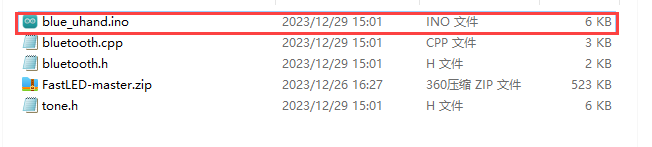

(2) Connect the Arduino to the computer through a UNO cable (Type-B).


(3) Click the **"Select Board"**, the software will automatically detect the current Arduino serial interface, then click to connect.


(4) Click  to download the program to Arduino, and then wait for the download to complete.


* **Wireless Glove Program Download**

The program is preloaded onto the wireless glove at the factory, so this section is for information purposes only.

(1) Locate and open the [lehand.ino](../_static/source_code/lehand.zip) program file in the same directory as this section.

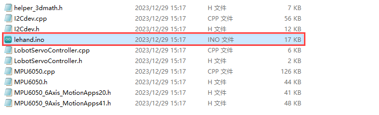

(2) Connect the wireless glove to the computer through micro USB cable.

(3) Click the **"Select Board"**, the software will automatically detect the current Arduino port. Then click to connect.


(4) Click  to download the program to Arduino, and then wait for the download to complete.


### 9.2.3 Program Outcome

After connecting the wireless glove to the robot hand, the rotation of the robot hand servo can be controlled through the potentiometer of glove, and the pan-tilt servo rotation can be controlled through robot wrist. Specific information can be found in the following table.

|                    Potentiometer Position                    |                        Servo Control                         |
| :----------------------------------------------------------: | :----------------------------------------------------------: |
|                            Thumb                             |                          Servo No.1                          |
|                         Index finger                         |                          Servo No.2                          |
|                        Middle finger                         |                          Servo No.3                          |
|                         Ring finger                          |                          Servo No.4                          |
|                            Pinkie                            |                          Servo No.5                          |
|    Rotate your wrists clockwise with the palm facing down    | Pan-tilt servo rotates anticlockwise. Take hand as the first view. |
| Rotate your wrists counterclockwise with the palm facing down | Pan-tilt servo rotates clockwise. Take hand as the first view. |

### 9.2.4 Brief Program Analysis

[uHand UNO Program](../_static/source_code/lehand.zip)

Below is the analysis of the program of the robotic hand [blue_uhand.ino](../_static/source_code/blue_uhand.zip), and wireless glove [lehand.ino](../_static/source_code/lehand.zip).

* **Robot Hand Program Analysis**

(1) Import Library File

Import the RGB control library, servo control library, Bluetooth reception and other library files required for this program.

{lineno-start=1}

```
#include <FastLED.h> //RGB控制库（需要导入库）(RGB control library(need to import libraries))
#include <Servo.h> //舵机库(servo library)
#include "tone.h" //音调库(tone library)
#include "bluetooth.h" //蓝牙接收库(Bluetooth receiving library)
```

(2) Define Pins and Create Objects

Firstly, define Arduino pins used for connecting hardware, mainly consisting of six servo pins, one buzzer pin and one RGB light pin.

{lineno-start=13}

```
//按键引脚(button pin)
const static uint8_t keyPins[2] = { 8, 9 };
// 舵机引脚(servo pin)
const static uint8_t servoPins[6] = { 7, 6, 5, 4, 3, 2 };
// 蜂鸣器引脚(buzzer pin)
const static uint8_t buzzerPin = 11;
// RGB灯引脚(RGB LED pin)
const static uint8_t rgbPin = 13;
```

Next, define the variables used for controlling RGB light and servo. The "**extended_func_angles**" array is used for storing desired angle of each servo. The "**servo_angles**" array is used for storing actual angle of servo.

{lineno-start=22}

```
// RGB灯颜色对象(RGB LED color object)
static CRGB rgbs[1];

// 舵机角度相关变量 （舵机下标对应的位置： 0-大拇指 1-食指 2-中指 3-无名指 4-小指 5-云台）(variables related to servo angles (the corresponding relationship between the servos and the robotic hand: 0-thumb, 1-index finger, 2-middle finger, 3-ring finger, 4-pinky finger, and 5-pan-tilt))
static uint8_t extended_func_angles[6] = { 90, 90, 90, 90, 90, 90 }; /* 二次开发例程使用的角度数值(angle values used for secondary development) */
static uint8_t servo_angles[6] = { 90, 90, 90, 90, 90, 90 };  /* 舵机实际控制的角度数值(angle values for actual servo control) */
```

As the desired value may differ from the actual value during servo rotation control, the control functions should execute the following line of code: `servo_angles[i] = servo_angles[i] * 0.85 + extended_func_angles[i] * 0.15`. This will allow the servo to gradually approach the target position.

The calling will add the pulse width by a fraction of the desired value to the current position prior to servo movement. Once the motion concludes, the current data will be updated with a new value. This mechanism facilitates the stop of the robot hand upon reaching the target position.

{lineno-start=130}

```
// 舵机控制任务(servo control task)
void servo_control(void) {
  static uint32_t last_tick = 0;
  // 间隔25毫秒(interval 25 microseconds)
  if (millis() - last_tick < 25) {
    return;
  }
  last_tick = millis();
  // 对6个舵机分别赋值(assign values to the six servos individually)
  for (int i = 0; i < 6; ++i) {
    servo_angles[i] = servo_angles[i] * 0.85 + extended_func_angles[i] * 0.15;
    servos[i].write(i == 0 || i == 5 ? 180 - servo_angles[i] : servo_angles[i]);
  }
}
```

Create servo control objects, Bluetooth receiving objects and Bluetooth receiving storage variables for proceeding control and reading data. Declare task function to perform different control tasks. The `servo_control` function is used for controlling servo; `tune_task` is used for controlling buzzer; `blue_task` is used for controlling the Bluetooth module.

{lineno-start=34}

```
// 创建舵机控制对象(create servo control object)
Servo servos[6];

// 创建蓝牙接收对象(create Bluetooth receiving object)
blue_controller blue_ctl;

// 创建蓝牙接收存储变量(create Bluetooth receiving storage variable)
struct uHand_Servo uhand_servos;

// 舵机控制任务(servo contorl task)
static void servo_control(void);
// 蜂鸣器鸣响函数(buzzer sound function)
void play_tune(uint16_t *p, uint32_t beat, uint16_t len);
// 蜂鸣器任务(buzzer task)
void tune_task(void);
// 蓝牙控制任务(Bluetooth control task)
void blue_task(void);
```

(3) Initial Settings

Set up the necessary hardware equipment in the  `setup()` function. Firstly, initialize the serial interface, configuring the baud rate for communication to 9600 and setting the timeout for date reading to 500ms.

{lineno-start=53}

```
  // 初始化串口并设置速率(initialize serial port and set velocity)
  Serial.begin(9600);
  // 设置串行端口读取数据的超时时间(set timeout for serial port reading data)
  Serial.setTimeout(500);
```

Set the pin of buzzer to output mode.

{lineno-start=60}

```
  // 初始化蜂鸣器引脚(initialize buzzer pin)
  pinMode(buzzerPin, OUTPUT);
```

Assign the servo IO port to facilitate the control through pin.

{lineno-start=62}

```
  // 绑定舵机IO口(bind servo IO port)
  for (int i = 0; i < 6; ++i) {
    servos[i].attach(servoPins[i]);
  }
```

Use the `FastLED` library to initialize the RGB light on the expansion board, and connect it to the RGB pin. Then set the color to green through `rgbs[0] = CRGB(0, 255, 0)`, and use the `FastLED.show` function to illuminate the set color at last.

{lineno-start=66}

```
  // 初始化RGB控制对象(initialize RGB control object)
  FastLED.addLeds<WS2812, rgbPin, GRB>(rgbs, 1);
  // 初始化颜色对象(initialize color object)
  rgbs[0] = CRGB(0, 255, 0);
  // 根据颜色发光(light up based on the color)
  FastLED.show();
```

Use the `tone` and `noTone` functions to set the buzzer to emit a short sound at a frequency of 1000Hz before turning off.

{lineno-start=73}

```
 tone(buzzerPin, 1000);
  // 延时(delay)
  delay(100);
  // 蜂鸣器停止(the buzzer stops)
  noTone(buzzerPin); //将TOUCH配置为输入(输入状态一般是将要读取这个引脚的状态，即读取传感器的反馈值）(configure the TOUCH pin as an input (input state is typically used to read the status of this pin, i.e., to read the feedback value from the sensor))
```

(4) Bluetooth Control

The Bluetooth task function `blue_task` is mainly used for receiving Bluetooth signal and controlling the rotation of robot hand servo.

Firstly the program obtains the information of the servo position through Bluetooth controller `blue_ctl`, and stores it in the `uhand_servos`.

{lineno-start=93}

```
// 蓝牙控制任务(Bluetooth control task)
void blue_task(void)
{
  // 获取蓝牙信息(obtain Bluetooth information)
  bool rt = blue_ctl.get_servos(&uhand_servos);
  // 若成功(if it is successful)
```

If the information is obtained successfully, the variable "**rt**" is set to "**True**", and the program proceeds to the next step. Utilize a "**for**" loop to iterate over all servo information, with different controls executed based on the mapping of the five potentiometers on the glove to their corresponding servo ID numbers.

Case 1 corresponds to the thumb. The servo's rotation angle is inversly proportional to the potentiometer's rotation value. That is to say, when receive the potentiometer position within the range of 1100~1950, the actual rotation angle mapped to the servo is 180~0.

Case 2, case 3, case 4, case 5 corresponds to index finger, middle finger, ring finger and pinkie respectively. These servo rotation angles are also opposite to the corresponding potentiometer value of glove.

Case 6 corresponds to pan-tilt rotation. The threshold range of this portion is 600-2400, and the corresponding rotation angle is 0-180.

{lineno-start=98}

```
  // 若成功(if it is successful)
  if(rt)
  {
    // 将接收到的舵机位置赋值给uHand的对应舵机(assign the received servo position to the corresponding servo of uHand UNO)
    for(int i = 0; i < uhand_servos.num ; i++)
    {
      // 根据ID号赋值(assign values based on the ID number)
      // 注意：ID号是从1开始的，而舵机角度数组下标是从0开始的，赋值需要（ID-1）(Note: The ID number starts from 1, and the servo angle array index starts from 0. Therefore, assigning values requires subtracting 1 from the ID)
      switch(uhand_servos.servos[i].ID)
      {
        case 1: //大拇指，转动角度为相反的(thumb; rotate in the opposite direction)
          extended_func_angles[uhand_servos.servos[i].ID - 1] = map(uhand_servos.servos[i].Position , 1100 , 1950 , 180 , 0);
          break;

        case 2: //食指 ~ 小拇指(index finger - little finger)
        case 3:
        case 4:
        case 5:
          // 将对应的阈值范围映射到[0,180]的范围内，赋值给舵机(Map the corresponding threshold range to the range of 0 to 180, and assign it to the servo)
          extended_func_angles[uhand_servos.servos[i].ID - 1] = map(uhand_servos.servos[i].Position , 1100 , 1950 , 0, 180);
          break;

        case 6: //云台转动(pan-tilt rotates)
          // 将对应的阈值范围映射到[0,180]的范围内，赋值给舵机(Map the corresponding threshold range to the range of 0 to 180, and assign it to the servo)
          extended_func_angles[uhand_servos.servos[i].ID - 1] = map(uhand_servos.servos[i].Position , 600 , 2400 , 0, 180);
          break;
      }
    }
  }
```

* **Wireless Glove Program Analysis**

[Wireless Glove Program](../_static/source_code/blue_uhand.zip)

(1) Import Library File

Import the soft serial library, robot controlling signal library, MPU6050 library and I2C library file required for this program.

{lineno-start=1}

```
#include <SoftwareSerial.h> //软串口库(Software serial library)
#include "LobotServoController.h" //机器人控制信号库(Robot control signal library)
#include "MPU6050.h" //MPU6050库(MPU6050 library)
#include "Wire.h" //IIC库(I2C library)
```

(2) Define Pins and Create Objects

Firstly, set the Bluetooth module RX, TX of wireless glove to 11 and 12. Then limit the range of potentiometer to 0~255, and set the servo position of robot hand to 1500 to facilitate the proceeding map.

Set the calibration flag to "**True**", initialize the Bluetooth communication port and create control object of the robot.

{lineno-start=6}

```
// 蓝牙TX、RX引脚(Bluetooth TX and RX pins)
#define BTH_RX 11
#define BTH_TX 12

// 创建变位器最小值和最大值存储(Create minimum and maximum values for the potentiometers)
float min_list[5] = {0, 0, 0, 0, 0};
float max_list[5] = {255, 255, 255, 255, 255};
// 各个手指读取到的数据变量(Data variables read by each finger)
float sampling[5] = {0, 0, 0, 0, 0}; 
// 手指相关舵机变量(Variables for controlling the servos of each finger)
float data[5] = {1500, 1500, 1500, 1500, 1500};
uint16_t ServePwm[5] = {1500, 1500, 1500, 1500, 1500};
uint16_t ServoPwmSet[5] = {1500, 1500, 1500, 1500, 1500};
// 电位器校准标志位(Flag for potentiometer calibration)
bool turn_on = true;

// 蓝牙通讯串口初始化(Bluetooth communication serial port initialization)
SoftwareSerial Bth(BTH_RX, BTH_TX);
// 机器人控制对象(Robot control object)
LobotServoController lsc(Bth);
```

Next, define mapping function. The mapping function receives five floating-point parameters: "**in**", "**left_in**", "**right_in**", "**left_out**", and "**right_out**". This function maps the input values from the range "**in**" to "**left_in**" to "**right_in**" to the range "**left_out**" to "**right_out**", and returns the mapped values.

{lineno-start=27}

```
// 浮点数映射函数(Float mapping function)
float float_map(float in, float left_in, float right_in, float left_out, float right_out)
{
  return (in - left_in) * (right_out - left_out) / (right_in - left_in) + left_out;
}
```

Declare variables related to the MPU6050 gyroscope. For example, the ax, ay, az are used for storing raw data of accelerometer. The MPU6050, a commonly used six-axis motion tracking sensor, consists of three-axis gyroscope and three-axis accelerometer.

The gx, gy, gz are used for storing the raw data of gyroscope; ax0, ay0, az0 are calibrated values of the accelerometer data; gx0, gy0, gz0 are calibrated value of the gyroscope data, etc. 

In addition, there are some variables related to acceleration calibration, which are used for calibrating sensor data. After reading raw data, subtract offset from these raw data in order to obtain a more accurate result.

{lineno-start=33}

```
// MPU6050相关变量(MPU6050 related variables)
MPU6050 accelgyro;
int16_t ax, ay, az;
int16_t gx, gy, gz;
float ax0, ay0, az0;
float gx0, gy0, gz0;
float ax1, ay1, az1;
float gx1, gy1, gz1;

// 加速度校准变量(Acceleration calibration variables)
int ax_offset, ay_offset, az_offset, gx_offset, gy_offset, gz_offset;
```

(3)  Initial Settings

First, the program will set the baud rate of the serial interface to 9600; set the function key K3 and five potentiometers of wireless glove to output mode; and set the D1~D5 LED light of wireless glove to output mode.

{lineno-start=46}

```
void setup() {
  // put your setup code here, to run once:
  Serial.begin(9600);
  //功能按键初始化(Function key initialization)
  pinMode(7, INPUT_PULLUP);
  //各手指电位器配置(Configuration of potentiometers for each finger)
  pinMode(A0, INPUT);
  pinMode(A1, INPUT);
  pinMode(A2, INPUT);
  pinMode(A3, INPUT);
  pinMode(A6, INPUT);
  //LED 灯配置(LED light configuration)
  pinMode(2, OUTPUT);
  pinMode(3, OUTPUT);
  pinMode(4, OUTPUT);
  pinMode(5, OUTPUT);
  pinMode(6, OUTPUT);
```

Next, to make sure the Bluetooth module activate in correct mode, initialize the Bluetooth port communication and set the baud rate to 9600. Then send two AT orders to the Bluetooth module: one is to set the Bluetooth to main mode, another one is to soft reboot the Bluetooth module.

The I2C communication is initialized at first and then the I2C clock frequency is set in the MPU6050 configuration. After the MPU6050 sensor is initialized, the range of the angular velocity and acceleration are set and the current angular velocity and acceleration data are read for subsequent calibration. At last, the read data store in corresponding offset variables, which could used for calibrating subsequent read date.

{lineno-start=64}

```
  //蓝牙配置(Bluetooth configuration)
  Bth.begin(9600);
  Bth.print("AT+ROLE=M");  //蓝牙配置为主模式(Configure Bluetooth as main mode)
  delay(100);
  Bth.print("AT+RESET");  //软重启蓝牙模块(Soft reset the Bluetooth module)
  delay(250);

  //MPU6050 配置(MPU6050 configuration)
  Wire.begin();
  Wire.setClock(20000);
  accelgyro.initialize();
  accelgyro.setFullScaleGyroRange(3); //设定角速度量程(Set the angular velocity range)
  accelgyro.setFullScaleAccelRange(1); //设定加速度量程(Set the acceletation range)
  delay(200);
  accelgyro.getMotion6(&ax, &ay, &az, &gx, &gy, &gz);  //获取当前各轴数据以校准(Get current axis data for calibration)
  ax_offset = ax;  //X轴加速度校准数据(X-axis acceleration calibration data)
  ay_offset = ay;  //Y轴加速度校准数据(Y-axis acceleration calibration data)
  az_offset = az - 8192;  //Z轴加速度校准数据(Z-axis acceleration calibration data)
  gx_offset = gx; //X轴角速度校准数据(X-axis angular velocity calibration data)
  gy_offset = gy; //Y轴角速度校准数据(Y-axis angular velocity calibration data)
  gz_offset = gz; //Z轴角速度校准数据(Z-axis angular velocity calibration data)
}
```

(4) Getting Data

This content is about getting the data of fingers bending angle. The data is obtained through the `finger` function defined in the main function.

First, define the `timer_sampling` and `timer_init` two static variables. There values are held constant between function calls. The "**init_step**" variable is used for tracking initialization. The `sampling[]" and "data[]` are used for storing read array of sensor data. `min_llist[]` and `max_list[]` are used for storing array of minimum and maximum detected values.

Loop through the "**for**" function to get the finger sensor data. For each finger, in order to minimize the effect of occasional reading errors or outliers, reads simulated value by code and divides it by 2 after adding it to a cumulative value to get obtain a average value.

Then use the `float_map` function to map the average value to a range of 500-2500 pulse-widths for the corresponding servo of robot hand.

{lineno-start=88}

```
void finger() {
  static uint32_t timer_sampling;
  static uint32_t timer_init;
  static uint8_t init_step = 0;
  if (timer_sampling <= millis())
  {
    for (int i = 14; i <= 18; i++)
    {
      if (i < 18)
        sampling[i - 14] += analogRead(i); //读取各个手指的数据(Read data from each finger)
      else
        sampling[i - 14] += analogRead(A6);  //读取小拇指的数据， 因为IIC 用了 A4,A5 口，所以不能从A0 开始连续读取(Read data from the little finger, because I2C uses A4 and A5 pins. It cannot read continuously from A0)
      sampling[i - 14] = sampling[i - 14] / 2.0; //取上次和本次测量值的均值(Take the average of the previous and current measurements)
      data[i - 14 ] = float_map( sampling[i - 14],min_list[i - 14], max_list[i - 14], 2500, 500); //将测量值映射到500-2500， 握紧手时为500， 张开时为2500(Map the measurement value to 500 to 2500, with 500 for gripping and 2500 for opening)
      data[i - 14] = data[i - 14] > 2500 ? 2500 : data[i - 14];  // 限制最大值为2500(Limit the maximum value to 2500)
      data[i - 14] = data[i - 14] < 500 ? 500 : data[ i - 14];   //限制最小值为500(Limit the minimum value to 500)
    }
    //timer_sampling = millis() + 10;
  }
```

Next, initialize glove through judgement condition function "**if**".

{lineno-start=108}

```
 if (turn_on && timer_init < millis())
  {
    switch (init_step)
    {
      case 0:
        digitalWrite(2, LOW);
        digitalWrite(3, LOW);
        digitalWrite(4, LOW);
        digitalWrite(5, LOW);
        digitalWrite(6, LOW);
        timer_init = millis() + 20;
        init_step++;
        break;
      case 1:
        digitalWrite(2, HIGH);
        digitalWrite(3, HIGH);
        digitalWrite(4, HIGH);
        digitalWrite(5, HIGH);
        digitalWrite(6, HIGH);
        timer_init = millis() + 200;
        init_step++;
        break;
```

Since the wireless glove can control the pan-tilt rotation through rotating the wrist, it is necessary to obtain the MPU6050 data of wireless glove and update it in time.

Declare the static variable `timer_u` firstly, which is used for storing the time since the last function call. Then use judgement statement "**if**" to check if enough time has passed. If it is, execute the code within the judgement statement. Use the statement `accelgyro.getMotion6` to get raw acceleration and angular velocity data from the MPU6050sensor.

```
void update_mpu6050()
{
  static uint32_t timer_u;
  if (timer_u < millis())
  {
    // put your main code here, to run repeatedly:
    timer_u = millis() + 20;
    accelgyro.getMotion6(&ax, &ay, &az, &gx, &gy, &gz);
```

As follows, three filtering formulas (such as the `ax0 = ((float)(ax)) * 0.3 + ax0 * 0.7)` filter the raw data to reduce noise.

Acceleration data is converted to a multiple of relative gravity acceleration, which is accomplished by subtracting an offset (ax_offset, ay_offset, etc.) and dividing by the constant light 8192.0.

{lineno-start=233}

```
    ax0 = ((float)(ax)) * 0.3 + ax0 * 0.7;  //对读取到的值进行滤波(Filter the read values)
    ay0 = ((float)(ay)) * 0.3 + ay0 * 0.7;
    az0 = ((float)(az)) * 0.3 + az0 * 0.7;
    ax1 = (ax0 - ax_offset) /  8192.0;  // 校正，并转为重力加速度的倍数(Correct and convert to multiples of gravity acceleration)
    ay1 = (ay0 - ay_offset) /  8192.0;
    az1 = (az0 - az_offset) /  8192.0;

    gx0 = ((float)(gx)) * 0.3 + gx0 * 0.7;  //对读取到的角速度的值进行滤波(Filter the read angular velocity values)
    gy0 = ((float)(gy)) * 0.3 + gy0 * 0.7;
    gz0 = ((float)(gz)) * 0.3 + gz0 * 0.7;
    gx1 = (gx0 - gx_offset);  //校正角速度(Correct the angular velocity)
    gy1 = (gy0 - gy_offset);
    gz1 = (gz0 - gz_offset);
```

Use the `atan2` function and calibrated acceleration data to calculate the inclination of the X and Y axis. Inclination is expressed in radians and then converted to degrees. In addition, use the complementary filter to smooth the inclination readings, which combine the data of gyroscope and accelerometer to obtain more accurate inclination readings.

{lineno-start=248}

```
    //互补计算x轴倾角(Complementary calculation of X-axis inclination angle)
    radianX = atan2(ay1, az1);
    radianX = radianX * 180.0 / 3.1415926;
    float radian_temp = (float)(gx1) / 16.4 * 0.02;
    radianX_last = 0.8 * (radianX_last + radian_temp) + (-radianX) * 0.2;

    //互补计算y轴倾角(Complementary calculation of Y-axis inclination angle)
    radianY = atan2(ax1, az1);
    radianY = radianY * 180.0 / 3.1415926;
    radian_temp = (float)(gy1) / 16.4 * 0.01;
    radianY_last = 0.8 * (radianY_last + radian_temp) + (-radianY) * 0.2;
```

(5) Control Robot Hand

First, define a static floating variable `RadianY_Las` and initialize to 0. Then loop through the `for`function to assign value to each finger servo. The `ServoPwmSet` is a defined array used for storing the PWM value of the servo. Through mapping the "**float_map**" function, the PWM value of servo map the original PWM value to a new range within 1100-1950.

{lineno-start=388}

```
//run1, 控制手掌。(run1 controls the hand)
void run1(int mode)
{
  static float RadianY_Las = 0;
  // 为每个手指的舵机赋值(Assign values to each finger's servo)
  for (int i = 0; i < 5; i++)
  {
    ServoPwmSet[i] = data[i]; 
    ServoPwmSet[i] = float_map(ServoPwmSet[i], 500, 2500, 1100, 1950);
  }
```

Based on the `mode` parameter provided, the function determines whether it is left or right hand in motion. If "**mode**" is 4, it signifies movement of the left hand; otherwise, it is the right hand in motion.

{lineno-start=398}

```
  int pos = 0;
  if(mode == 4) //当为模式4时，为左手掌(When it is mode 4, control the left hand)
    pos = ServoPwmSet[4];
  else //为模式1，右手掌(When it is mode 1, control the right hand)
    pos = 2750 - ServoPwmSet[4];
```

If the Y-axis rotation angle is between -90 to 90 degrees, and the differences between the last Y-axis is greater than 1 degree, then: calculate the position of the pan-tilt servo based on the current Y-axis rotation angle. Use the  `lsc.moveServos`  function to control the position of finger servo.

If no Y-axis rotation (that is, the rotation angle of the Y-axis is not between -90 to 90 degrees), send the servo position of five fingers to the `lsc.moveServos` function.

{lineno-start=403}

```
  // 若有Y轴的旋转，则添加云台舵机的位置(If there is Y-axis rotation, add the position of the pan-tilt servo)
  if (radianY_last < 90 && radianY_last > -90)
  {
    if ( abs(radianY_last - RadianY_Las) > 1)  {
      uint16_t se = 1500 + radianY_last*10;
      lsc.moveServos(6, 30, 1, 3050 - ServoPwmSet[0], 2, ServoPwmSet[1], 3, ServoPwmSet[2], 4, ServoPwmSet[3], 5, pos , 6 , se);//控制每个手指(control every finger)
      return;
    }
  }
  // 若无Y轴选择，则只发五个手指的舵机位置(If there is no Y-axis rotation, only send the servo positions of the five fingers)
  lsc.moveServos(5, 30, 1, 3050 - ServoPwmSet[0], 2, ServoPwmSet[1], 3, ServoPwmSet[2], 4, ServoPwmSet[3], 5, pos);//控制每个手指(control every finger)
}
```
